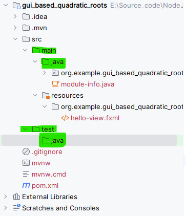

Prepared by: **Chala Urgessa** , Neusoft Institute Technology

---
### White Box Testing (白盒测试)
White Box Testing, also known as structural testing (结构测试), focuses on examining the internal workings of a program. Unlike black box testing, which only examines the program's outputs, white box testing allows us to see "inside" the program, understanding how it operates.

---

#### Path Testing (路径测试)
Path Testing is a technique where specific paths through a program are chosen and tested. This method ensures that all possible paths are covered, leading to a thorough testing process.

This involves:
Creating paths that cover every part of the program.
Finding test cases that will execute each path.

---

#### Flow Graph (流图)
A Flow Graph offers a graphical representation of a program's control flow, with nodes representing actions or decisions, and edges showing the flow from one action to the next. This helps in visualizing and understanding the program's structure.

Example:


                 Fig1:- The basic construct of the flow graph


---
#### Example 1: Quadratic Equation (示例 1: 二次方程)
Consider determining the nature of roots for a quadratic equation. Inputs are three positive integers (a, b, c) within the range [0,100]. The outputs are categorized as:

> [Not a quadratic equation (不是二次方程); Real roots (实根); Imaginary roots (虚根); Equal roots (相等的根)]

Your tasks include drawing the **flow graph**, **DD path graph**, and finding **independent paths** from the DD Path graph.

---
#### Solution: Start With Implementation (解决方案: 从实现开始)
Let's use JavaFX for the GUI implementation, providing a graphical interface for our solution. This approach makes interaction easier and allows for a more intuitive understanding of the program's behavior.

**Steps:**
1. Create a New Project:


                 Fig 2:- Creating JavaFX project

---
> - **Note:** Remember to include FXGL for additional features.


                 Fig 3:- Including Additional library

2. **Click 'Create'** to create a new JavaFX project 


---
3. **Adding Dependencies:** Open the `pom.xml` file and ensure that the following dependencies are included:

> - `javafx-controls` - This module provides classes for JavaFX UI controls, including basic elements like buttons, text fields, labels, and more complex components like tables and trees.
> - `javafx-fxml`: This module enables your application to load FXML files at runtime, separating the UI design from the logic.
> - `junit-jupiter-api`:  Part of JUnit 5 (also known as Jupiter), this library is used for writing and running tests in Java applications. It provides annotations and assertions for defining tests and verifying outcomes.


                 Fig 4:- Maven dependency

---

```xml
<dependency>
	<groupId>org.openjfx</groupId>
	<artifactId>javafx-controls</artifactId>
	<version>21</version>
</dependency>
<dependency>
	<groupId>org.openjfx</groupId>
	<artifactId>javafx-fxml</artifactId>
	<version>21</version>
</dependency>
<dependency>
	<groupId>org.openjfx</groupId>
	<artifactId>javafx-media</artifactId>
	<version>21</version>
</dependency>
<dependency>
	<groupId>com.github.almasb</groupId>
	<artifactId>fxgl</artifactId>
	<version>17.3</version>
	<exclusions>
		<exclusion>
			<groupId>org.openjfx</groupId>
			<artifactId>*</artifactId>
		</exclusion>
	</exclusions>
</dependency>
<dependency>
	<groupId>org.junit.jupiter</groupId>
	<artifactId>junit-jupiter-api</artifactId>
	<version>${junit.version}</version>
	<scope>test</scope>
</dependency>
<dependency>
	<groupId>org.junit.jupiter</groupId>
	<artifactId>junit-jupiter-engine</artifactId>
	<version>${junit.version}</version>
	<scope>test</scope>
</dependency>
```

---

Step 4. **Setting Up Testing Environment:** Inside the `src` directory, create a new folder by navigating to and selecting the `test/java` directory to incorporate it into your project. Follow these steps: `Right-click` on `Src`, choose `New`, and then `left-click` on `Directory`.


<p align="center">
  
</p>

> Write click on test\java

<p align="center">
  
</p>

<p align="center">
  
</p>

> Click **Enter** key to create a folder.

<p align="center">
  
</p>

                 Fig 5:- Creating package for testing

---

5. **Scene Builder Setup:** Download and install Scene Builder from <a href="https://gluonhq.com/products/scene-builder/">Gluon</a>.


<p align="center">
  
</p>

---

6. **Code Implementation:** Within the `src/resources` directory, rename the `.fxml` to match your UI layout.

<p align="center">
  
</p>

                 Fig 6:- Renaming .fxml

- After renaming the file, navigate to the `src/main/java/package directory`, open `HelloApplication.java`, and execute the Java code to launch your GUI.

```java
public class HelloApplication extends Application {
    @Override
    public void start(Stage stage) throws IOException {
        FXMLLoader fxmlLoader = new FXMLLoader(
			HelloApplication.class.getResource("quadratic-gui.fxml"));
        Scene scene = new Scene(fxmlLoader.load(), 500, 350);
        stage.setTitle("Hello!");
        stage.setScene(scene);
        stage.show();
    }

    public static void main(String[] args) {
        launch();
    }
}
```
---


 Fig 7:- Testing HelloApplication GUI

**Congratulations on setting up your first GUI! Continue by designing your UI with Scene Builder, focusing on making it user-friendly and intuitive.**


---
After launching your GUI with a "Hello" button, let's proceed to design the user interface (UI). Open quadratic-gui.fxml in Scene Builder to start. We'll use the AnchorPane layout for our first UI design.

**Choosing the Right JavaFX Layout Pane**
Selecting the appropriate JavaFX layout pane depends on your application's UI needs. Here’s a simplified guide:

1. **Simple, Linear Layouts (简单线性布局)**: `HBox` or `VBox` are perfect for rows of buttons or columns of text fields.
2. **Flexible Grids (灵活的网格)**: Use `GridPane` for layouts needing a grid arrangement, like forms.
3. **Dynamic Wrapping (动态包装)**: `FlowPane` allows elements to flow and wrap naturally, useful for adaptive layouts.
4. **Overlaying Elements (元素叠加)**: `StackPane` enables stacking components, ideal for overlays.
5. **Responsive Design (响应式设计)**: `AnchorPane` provides control for positioning elements, great for responsive UIs.
6. **Traditional Web Layout (传统网页布局)**: `BorderPane` suits web-style layouts with headers, footers, and content areas.
7. **Uniformly Sized Tiles (统一大小的瓦片)**: `TilePane` organizes items into a uniform grid.
8. **Scrollable Content (可滚动内容)**: Use `ScrollPane` for content exceeding display area.
8. **Divisible Areas (可分区域)**: `SplitPane` lets users adjust space between components.
9. **Tabulated Content (分页内容)**: `TabPane` organizes content into tabs for categorized information.

---
Designing your UI carefully will enhance the user experience by making the application intuitive and easy to navigate.

**Example 1 UI Implementation (quadratic-gui.fxml)**
Here's an example of how your quadratic-gui.fxml could look.

<p align="center">
  
</p>

 Fig 8:- GUI for the user input (a,b, and c) values.


---

**`quadratic-gui.fxml`**

<p align="center">
  
</p>


<p align="center">
  
</p>


```xml

<?xml version="1.0" encoding="UTF-8"?>

<?import javafx.scene.control.Button?>
<?import javafx.scene.control.Label?>
<?import javafx.scene.control.TextField?>
<?import javafx.scene.layout.AnchorPane?>
<?import javafx.scene.layout.ColumnConstraints?>
<?import javafx.scene.layout.GridPane?>
<?import javafx.scene.layout.RowConstraints?>

<AnchorPane maxHeight="-Infinity" maxWidth="-Infinity" minHeight="-Infinity" minWidth="-Infinity"
    prefHeight="400.0" prefWidth="600.0" xmlns="http://javafx.com/javafx/21"
    xmlns:fx="http://javafx.com/fxml/1"
    fx:controller="org.example.gui_based_quadratic_roots.QuadraticGUIController">

    <children>
      <GridPane layoutX="194.0" layoutY="125.0">
        <columnConstraints>
          <ColumnConstraints hgrow="SOMETIMES" maxWidth="95.0" minWidth="10.0" prefWidth="56.0" />
          <ColumnConstraints hgrow="SOMETIMES" maxWidth="144.0" minWidth="10.0" prefWidth="144.0" />
        </columnConstraints>
        <rowConstraints>
          <RowConstraints minHeight="10.0" prefHeight="30.0" vgrow="SOMETIMES" />
          <RowConstraints minHeight="10.0" prefHeight="30.0" vgrow="SOMETIMES" />
          <RowConstraints minHeight="10.0" prefHeight="30.0" vgrow="SOMETIMES" />
        </rowConstraints>
         <children>
              <Label text="A value" />
              <Label text="B value" GridPane.rowIndex="1" />
            <Label text="C value" GridPane.rowIndex="2" />
              <TextField fx:id="txtA_input" GridPane.columnIndex="1" />
              <TextField fx:id="txtB_input" prefHeight="25.0" prefWidth="134.0" GridPane.columnIndex="1"
                  GridPane.rowIndex="1" />
            <TextField fx:id="txtC_input" GridPane.columnIndex="1" GridPane.rowIndex="2" />
         </children>
      </GridPane>
        <Button fx:id="onFIndRootButtonClick" layoutX="191.0" layoutY="229.0" mnemonicParsing="false"
            onAction="#onFIndRootButtonClick" prefHeight="25.0" prefWidth="206.0" text="Find # of Roots" />
        
      <Label layoutX="211.0" layoutY="74.0" text="Quadratic # of Root Finder" />
      <Label layoutX="282.0" layoutY="100.0" text="AX^2 + BX + C" />
      <Label layoutX="197.0" layoutY="274.0" text="Number(#) roots:" />
      <Label fx:id="lblOutput" layoutX="300.0" layoutY="274.0" />
    </children>
</AnchorPane>
```


***Implementing HelloApplication.java and QuadraticGUIController.java.***

***HelloApplication.java***

``` java
package org.example.gui_based_quadratic_roots;

import javafx.application.Application;
import javafx.fxml.FXMLLoader;
import javafx.scene.Parent;
import javafx.scene.Scene;
// import javafx.scene.layout.AnchorPane;
import javafx.stage.Stage;

import java.io.IOException;

public class HelloApplication extends Application {
    @Override
    public void start(Stage stage) throws IOException {
        // Create an FXMLLoader instance to load the FXML file.
        // getClass().getResource("quadratic-gui.fxml") locates the FXML file
        // in the same directory as the HelloApplication class.
        FXMLLoader loader = new FXMLLoader(getClass().getResource("quadratic-gui.fxml"));

        // loader.setRoot(mew AnchorPage)  // if the root is not mentioned inside fxml - start with fx.root

        // No need to manually set an AnchorPane as root here because the root element is defined in the FXML file.
        // The load() method processes the FXML file and automatically sets up the root element.
        // This root element is what we've defined inside the FXML with <fx:root>.
        Parent root = loader.load();

        // Create a new Scene with the root element loaded from the FXML file.
        // The dimensions are set to 500x350, but these can be adjusted as needed.
        Scene scene = new Scene(root, 500, 350);

        // Set the title of the application window.
        stage.setTitle("Quadratic Root GUI!");

        // Set the scene for the stage. The scene contains all the visual elements.
        stage.setScene(scene);

        // Display the application window.
        stage.show();
    }

    public static void main(String[] args) {
        // Launch the JavaFX application. This method creates an instance of
        // HelloApplication and calls the start method on the JavaFX Application Thread.
        launch();
    }
}
```

---

***QuadraticGUIController.java***

``` java
package org.example.gui_based_quadratic_roots;

import javafx.fxml.FXML;
import javafx.scene.control.Label;
import javafx.scene.control.TextField;

public class QuadraticGUIController {
    @FXML
    private Label lblOutput;

    @FXML
    private TextField txtA_input;
    @FXML
    private TextField txtB_input;
    @FXML
    private TextField txtC_input;

    @FXML
    protected void onFIndRootButtonClick() {
        lblOutput.setText("Welcome to JavaFX Application, NEU!");
    }
}

```
Execute `HelloApplication.java` to **test** your GUI

<p align="center">
  
</p>

 Fig 9:- GUI test for button `onActionListener` .

---

It's time for the implementation of the `onFindRootButtonClick()` method of Example 1.


|**Algorithm for Quadratic Equation Roots Calculation (二次方程根的计算算法)**|
|----------------------------------------------------------|
|**Input (输入)** Coefficients `(a,b,c)` within the range `[1,100]`. </br> **Output (输出)** # of Roots and Roots of the quadratic equation, or a message indicating no real roots or invalid input. </br> 
**1. Inputs** a, b, c </br> 
**2. variables** isValid=0, D </br> 
**3. if** ((a >= 0) && (a <=100) && (b >= 0) && (b <=100)) </br> 
**4.** &nbsp;&nbsp;&nbsp;&nbsp; &nbsp;&nbsp;&nbsp;&nbsp; isValid = 1  </br>  
**5.** &nbsp;&nbsp;&nbsp;&nbsp; &nbsp;&nbsp;&nbsp;&nbsp; **if (a == 0)** </br> 
**6.** &nbsp;&nbsp;&nbsp;&nbsp; &nbsp;&nbsp;&nbsp;&nbsp; &nbsp;&nbsp;&nbsp;&nbsp; &nbsp;&nbsp;&nbsp;&nbsp; isValid = -1 </br> 
**7.** &nbsp;&nbsp;&nbsp;&nbsp; &nbsp;&nbsp;&nbsp;&nbsp; **end if** </br> 
**8. end if** </br> 
**9. if** (isValid == 1) </br> 
**10.** &nbsp;&nbsp;&nbsp;&nbsp; &nbsp;&nbsp;&nbsp;&nbsp; D = b^2 - 4ac <br>  
**11.** &nbsp;&nbsp;&nbsp;&nbsp; &nbsp;&nbsp;&nbsp;&nbsp; **if (D ==0)**  
**12.** &nbsp;&nbsp;&nbsp;&nbsp; &nbsp;&nbsp;&nbsp;&nbsp;&nbsp;&nbsp;&nbsp;&nbsp; &nbsp;&nbsp;&nbsp;&nbsp; Set Display label `The roots are equal {root}`</br> 
**13.** &nbsp;&nbsp;&nbsp;&nbsp;&nbsp;&nbsp;&nbsp;&nbsp; &nbsp; **else if(D > 0)** 
**14.** &nbsp;&nbsp;&nbsp;&nbsp; &nbsp;&nbsp;&nbsp;&nbsp;&nbsp;&nbsp;&nbsp;&nbsp; &nbsp;&nbsp;&nbsp;&nbsp; Set Display label `The 2 roots are real and r1: {root} and r2: {root}`</br>  
**15.** &nbsp;&nbsp;&nbsp;&nbsp;&nbsp;&nbsp;&nbsp;&nbsp; &nbsp; **else** 
**16.** &nbsp;&nbsp;&nbsp;&nbsp; &nbsp;&nbsp;&nbsp;&nbsp;&nbsp;&nbsp;&nbsp;&nbsp; &nbsp;&nbsp;&nbsp;&nbsp; Set Display label `The 2 roots are imaginary and r1: {root} and r2: {root}`</br> 
**17.** &nbsp;&nbsp;&nbsp;&nbsp;&nbsp;&nbsp;&nbsp;&nbsp;&nbsp;  **end else if** <br> 
**18. else if** (validInput == -1)
**19.** &nbsp;&nbsp;&nbsp;&nbsp; &nbsp;&nbsp;&nbsp;&nbsp; Set Display label `The values do not constitute a Quadratic equation` </br>  
**20. else**  
**21.** &nbsp;&nbsp;&nbsp;&nbsp; &nbsp;&nbsp;&nbsp;&nbsp; Set Display label `The inputs belong to invalid range` </br> 
**22. end else if**| 


---

***Implementing `onFindRootButtonClick()` in QuadraticGUIController.java***


```java
public class QuadraticGUIController {
    @FXML
    private Label lblOutput;

    @FXML
    private TextField txtA_input;
    @FXML
    private TextField txtB_input;
    @FXML
    private TextField txtC_input;

    @FXML
    protected void onFIndRootButtonClick(){

        String a = txtA_input.getText();
        String b = txtB_input.getText();
        String c = txtC_input.getText();

        String result = findRoots(a, b, c);

        lblOutput.setText(result);

    }

    public String findRoots(String a, String b, String c) throws NumberFormatException {
	try {
		
		double A = Double.parseDouble(a);
		double B = Double.parseDouble(b);
		double C = Double.parseDouble(c);
		
		// Implementation


	} catch (NumberFormatException e) {
		// Raise when coonverting from String to Double / Integer
		return "The input must be number";
	}
    }

	public String quadraticRoots(double a, double b, double c) {
	  // Implementation
	}

}
```

---
```java 
1. int isValid = 0; // int a, b, c;
2. double d, D;
3. if ((a >= 0) && (a <= 100) && (b >= 0) && (b <= 100) && (c >= 0) && (c <= 100)) {
4. 	isValid = 1;
5. 	if (a == 0) {
6. 		isValid = -1;
7. 	}
8. }
9. if (isValid == 1) {
10. 	d = b * b - 4 * a * c;
11. 	if (d == 0) {
12. 	    return "One Real Root, r = " + String.format("%.2f", -b / (2*a));
13. 	} 
14. 	else if (d > 0) {
15.	    D = Math.sqrt(d);
16. 	    return "2 Real Roots, r1 = " + String.format("%.2f", (-b + D) / (2 / a)) +
 				" and r2 = " + String.format("%.2f", (-b - D) / (2 / a));
17. 	} 
18. 	else {
19. 		D = Math.sqrt(-1 * d) / (2 * a);
20. 		return "2 Imaginary Roots, r1 = " + String.format("%.2f", -1*b / (2 * a)) + " + " +
 				String.format("%.2f", D) + "i and r2 = " +
 				String.format("%.2f", -1*b / (2 * a)) + " - " +
 				String.format("%.2f", D) + "i";
21. 	}
22. } 
23. else if (isValid == -1) {
24. 	return "The Equation is not a quadratic equation";
25. } 
26. else {
27. 	return "The input is out of range";
28. }
```
---

**Flow graph:**
Visualize the control flow of the above logic using a flow graph. This graphical representation helps in understanding the possible execution paths through the program.


                 Fig 10: Flow graph of example 1

---

#### Decision-to-Decision 决策到决策路径 (DD) Path:

A Decision-to-Decision path in software testing is a control flow path from one decision point to another, excluding loops. It's used in analyzing and understanding the logical flow of a program for creating test cases that cover different paths, enhancing test coverage.


DD paths are crucial for identifying the ***minimum set of paths*** that need to be tested to ensure that all decision points are covered. It's particularly useful in ***cyclomatic complexity***, a metric used to measure the complexity of a program based on the control flow graph's decision points.

**Decision Points and Control Flow**
***Decision Points:*** In a program, decision points are locations where the control flow can diverge, meaning the program can follow one of two or more paths based on some condition (e.g., if-else statements, switch cases).
Control Flow Path: The sequence of execution from one point in a program to another.

**Excluding Loops**
***Loops:*** Constructs like for, while, and do-while that repeatedly execute a block of code as long as a specified condition remains true.

**Excluding Loops in DD Paths:** When defining or analyzing DD paths, we typically focus on the paths that flow directly from one decision point to the next without reiterating the parts of the code within loops. This exclusion is because loops can theoretically extend the path infinitely (or as long as the loop's condition is met), complicating the analysis of control flow for test coverage.


Decision-to-Desicion (DD) graph 

<div style="text-align: center;">
  <figure style="display: inline-block; margin: 10px;">
    
    <figcaption>(a) Data flow graph</figcaption>
  </figure>
  <figure style="display: inline-block; margin: 10px;">
    
    <figcaption>(b) DD - graph</figcaption>
  </figure>
</div>


                 Fig 11: Example 1 flow graph and DD graph

---

The Mapping table for DD path graph is:


| Flow graph nodes | DD path graph corresponding node | Remarks |
|--------------------|------------------------|-----------|
| 1 to 2 | A  | Sequential node |
| 3 | B | Decision node |
| 4 | C | Intermediate node |
| 5 | D | Decision node |
| 6, 7 | E | Sequential node  |
| 8 | F | Two edges are combined here |
| 9 | G | Two edges are combined and decision node |
|10 | H | Intermediate node |
|11 | I | Decision node |
|12, 13| J | Sequential node |
|14 | K | Decision node |
|15, 16, 17 | L | Sequential node |
|18, 19, 20, 21| M | Sequential node |
|22 | N | Three edges are combined |
| 23 |O | Decision node |
| 24, 25 | P | Sequential node | 
|26, 27, 28 | Q | Sequential node |
| 29 | N | Three edges are combined here with exit node |


***Independent Paths:***
(i) ABGOQRS &nbsp;&nbsp;&nbsp;&nbsp;&nbsp;&nbsp;&nbsp;&nbsp;&nbsp;&nbsp;&nbsp;&nbsp;&nbsp;&nbsp; (ii) ABGOPRS
(iii) ABCDFGOQRS &nbsp;&nbsp;&nbsp;&nbsp;&nbsp; (iv) ABCDEFGOPRS
(v) ABGHIJNRS  &nbsp;&nbsp;&nbsp;&nbsp;&nbsp;&nbsp;&nbsp;&nbsp;&nbsp;&nbsp;  (vi) ABGHIKLNRS
(vi) ABGHIKMNRS

---

#### Class Activity
Consider a program given below for the classification of a triangle. Its input is a triple of positive integers (say a,b,c) from the interval [1,100]. The output may be 

> [Scalene, Isosceles, Equilateral, Not a triangle].

Draw the ***flow graph*** & ***DD Path*** graph. Also find the `independent paths` from the DD Path graph.

---

```java

```

---


It's time to create a test case for the example 1. 

<p align="center">
  
</p>


```java
package org.example.gui_based_quadratic_roots;

import org.junit.jupiter.api.Assertions;
import org.junit.jupiter.api.Test;

public class QuadraticGUIControllerTest {

    @Test
    public void path1() {
        
    }
}
```


#### Cyclomatic Complexity (环路复杂度)
McCabe’s cyclomatic metric V(G) = e – n + 2P, measures the number of linearly independent paths through a program's source code. This metric is crucial for determining the thoroughness of the test cases developed based on the control flow graph of the program.

> - P is the number of disconnected components or graphs, typically 1 for a cohesive, single-component program.

For example, a flow graph shown in in Fig below with entry node ‘a’ and exit node ‘f’.

<p align="center">
  
</p>

The value of cyclomatic complexity can be calculated as :
***V(G) = 9 – 6 + 2 = 5***
Here `e = 9`, `n = 6` and `P = 1`
There will be five independent paths for the flow graph illustrated in Fig. 21.
`Path 1 : a c f`
`Path 2 : a b e f`
`Path 3 : a d c f`
`Path 4 : a b e a c f or a b e a b e f`
`Path 5 : a b e b e f`

> Note: ***P*** is the number of `disconnected subgraphs` or `connected components` within the **control flow graph** of the program. For most single, self-contained programs, `P` is typically equal to **1**, indicating one connected component that is the entire program itself. 
> - Therefore, for a single, unified program that doesn't consist of separate disconnected parts, you would use ***P=1*** when calculating cyclomatic complexity using McCabe’s formula.

---
Several properties of cyclomatic complexity are stated below:
> 1. V(G) ≥1 (V(G) 不小于 1)
> 2. V (G) is the maximum number of independent paths in graph G. (独立路径的最大数量)
> 3. Inserting & deleting functional statements to G does not affect V(G).  (增删非决策语句不影响 V(G))
> 4. G has only one path if and only if V(G)=1.  (当 V(G)=1 时，只有一条路径)
> 5. Inserting a new row in G increases V(G) by unity.  (每增加一个决策，V(G)增加1)
> 6. V(G) depends only on the decision structure of G.  (仅取决于决策结构)


---
Two alternate methods are available for the complexity calculations.
1. Cyclomatic complexity V(G) of a flow graph G is equal to the number of predicate (decision) nodes plus one.
	> V(G)= $\prod$ +1
	Where $\prod$ is the number of predicate nodes contained in the flow graph G.
2. Cyclomatic complexity is equal to the number of regions of the flow graph.


***Example 2***
Consider a flow graph given in Fig below and calculate the cyclomatic complexity by all three methods.

<p align="center">
  
</p>

---
Solution
Cyclomatic complexity can be calculated by any of the three methods.
1. V(G) = e – n + 2P
		= 13 – 10 + 2 = 5
2. V(G) = π + 1
		= 4 + 1 = 5
3. V(G) = number of regions = 5
Therefore, complexity value of a flow graph in Fig. above is 5.

---
**Example 3**
Consider the quadratic equation problem given with its DD Path graph. Find the cyclomatic complexity:

--- 

**Solution**
Number of nodes (n) = 19
Number of edges (e) = 24
(i) V(G) = e – n + 2P = 24 – 19 + 2 = 7
(ii) V(G) = π + 1 = 6 + 1 = 7
(iii) V(G) = Number of regions = 7

> - Hence cyclomatic complexity is **7** meaning thereby, ***seven*** independent paths in the DD Path graph.


***Independent Paths:***
(i) ABGOQRS &nbsp;&nbsp;&nbsp;&nbsp;&nbsp;&nbsp;&nbsp;&nbsp;&nbsp;&nbsp;&nbsp;&nbsp;&nbsp;&nbsp; (ii) ABGOPRS
(iii) ABCDFGOQRS &nbsp;&nbsp;&nbsp;&nbsp;&nbsp; (iv) ABCDEFGOPRS
(v) ABGHIJNRS  &nbsp;&nbsp;&nbsp;&nbsp;&nbsp;&nbsp;&nbsp;&nbsp;&nbsp;&nbsp;  (vi) ABGHIKLNRS
(vi) ABGHIKMNRS


Here's a table of test cases designed to cover these independent paths:

|Test Case ID |	Independent Path|	Input Values (a, b, c)| Outcome|
|--------------|------------------|-------------------------|--------|
|TC1|	ABGOQRS|	a=2, b=4, c=2| One Real Root, r = -1.00 |
|TC2|	ABGOPRS|	a=1, b=5, c=6|	2 Real Roots, r1 = -2.00, r2 = -3.00 |
|TC3|	ABCDFGOQRS|	a=0, b=5, c=6| The Equation is not a quadratic equation |
|TC4|	ABCDEFGOPRS|	a=101, b=5, c=6| The input is out of range |
|TC5|	ABGHIJNRS|	a=2, b=4, c=10|	2 Imaginary Roots, r1 = -1.00 + i3.16, r2 = -1.00 - i3.16 |
|TC6|	ABGHIKLNRS|	a=1, b=0, c=-1|	2 Real Roots, r1 = 1.00, r2 = -1.00 |
|TC7|	ABGHIKMNRS|	a=1, b=10, c=100| 2 Imaginary Roots, r1 = -5.00 + i9.49, r2 = -5.00 - i9.49 |

---

#### Class Activity

Write the JUnit implementation of example 1 based on independent paths.

```java

    QuadraticGUIController quadraticController = new QuadraticGUIController();
    
    @Test
    public void inValid_Type_A_Input_Test() {
        // Arrange & Act
        String result = quadraticController.findRoots("N", "4", "2");
        Assertions.assertEquals("The input must be number", result);

    }
    @Test
    public void inValid_Type_B_Input_Test() {
        // Arrange & Act
        String result = quadraticController.findRoots("4", "N", "2");
        Assertions.assertEquals("The input must be number", result);

    }
    @Test
    public void inValid_Type_C_Input_Test() {
        // Arrange & Act
        String result = quadraticController.findRoots("4", "2", "N");
        Assertions.assertEquals("The input must be number", result);

    }
    
    @Test
    public void path1() {
        // arrange
        double a = 2, b =4, c = 2;
        String result = quadraticController.quadraticRoots(a, b, c);
        Assertions.assertEquals("One Real Root, r = -1.00", result);
    }

	// Implementation
```

---

**Class Activity**
Consider the classification of triangle problem given. Find the cyclomatic complexity.


---
#### Graph Matrices

A graph matrix is a square matrix with one row and one column for every node in the graph. The size of the matrix (i.e., the number of rows and columns) is equal to the number of nodes in the flow graph. Some examples of graphs and associated matrices are shown in fig. _.


<p align="center">
  
  
</p>


Fig. 12 (a): Flow graph and graph matrices

---

<p align="center">
  
  
</p>


Fig. 13 (b): Flow graph and graph matrices

---

<p align="center">
  
  
</p>


Fig. 14 (c): Flow graph and graph matrices

---


<p align="center">
  
</p>


Fig. 15 : Connection matrix of flow graph shown in Fig. 24 (c)

---
#### Data Flow Testing

Data flow testing is another from of structural testing. It has nothing to do with data flow diagrams.

>  i. It focuses on the points at which variables receive values 
>  ii. The points at which these values are used or referenced. 
 
> - It detects improper use of data values (data flow anomalies) due to coding errors.

Early data flow analyses often cantered on a set of faults that are known as define / reference anomalies.
 > - A variable that is defined but never used (referenced)
 > - A variable that is used but never defined
 > - A variable that is defined twice before it is used.


 ---

##### Definitions

The definitions refer to a program P that has a program graph G(P) and a set of program variables V. The G(P) has a single entry node and a single exit node. The set of all paths in P is PATHS(P)

> **(i) Defining Node**: Node `n ϵ G(P)` is a defining node of the variable `v ϵ V`,  written as **`DEF (v, n)`**, if the value of the variable `v` is defined at the statement fragment corresponding to node `n`.

> **(ii) Usage Node**: Node `n ϵ G(P)` is a usage node of the variable `v ϵ V`, written as **`USE (v, n)`**, if the value of the variable `v` is used at statement fragment corresponding to node `n`. A usage node `USE (v, n)` is a predicate use (denote as `p`) if statement `n` is a predicate statement otherwise `USE (v, n)` is a computation use (denoted as `c`).

---

> **(iii) Definition use**: A definition use path with respect to a variable **`v (denoted du-path)`** is a path in `PATHS(P)` such that, for some `v ϵ V`, there are define and usage nodes `DEF(v, m)` and `USE(v, n)` such that `m` and `n` are ***initial*** and ***final nodes*** of the path. 

> **(iv) Definition clear** : A definition clear path with respect to a variable **`v (denoted dc-path)`** is a definition use path in `PATHS(P)` with **initial** and **final** nodes `DEF(v, m)` and `USE(v, n)`, such that no other node in the path is a defining node of `v`.

> - The **du-paths** and **dc-paths** describe the flow of data across source statements from points at which the values are **defined** to points at which the values are **used**. 
> - The **du-paths** that are ***not definition clear*** are potential trouble spots.

---
Hence, our objective is to find all du-paths and then identity those du-paths which are not dc-paths. We may like to generate specific test cases for du-paths that are not dc-paths.

> ***Steps for data flow testing:*** 
> Step 1: Draw the program flow graph
> Step 2: Find the DD path graph
> Step 3: Prepare a table for define/usse status of all variable
> Step 4: Find all du-paths
> Step 5: Identify-du pathss that are not dc paths


---

**Example 4**

Consider the program of the determination of the nature of roots of a quadratic equation. Find all **du-paths** and identify those du-paths that are **definition clear**.

---

**Solution**
***Step I:*** The program flow graph is given in **Fig. 11(a).** The variables used in the program are a,b,c,d, validinput, D.

***Step II:*** DD Path graph is given in **Fig. 11(b).** The cyclomatic complexity of this graph is 7 indicating there are seven independent paths.

***Step III:*** **Define/use** nodes for all variables are given below:

| Variable | Defined at node | Used at node |
|----------|-----------------|--------------|
|a| param - 1 |3, 5, 10, 12, 16, 19, 20|
|b| param - 1 |3, 10, 12, 16, 20|  
|c| param - 1 |3, 10|
|d| 10 | 11, 14, 19|
| D| 15, 19 | 16, 20|
|isValid| 1, 4, 6 | 9, 23 |

Step IV: The du-paths are identified and are named by their beginning and endingnodes using **Fig. 11 (a).**

|Variable | Path (beginning, end) nodes | Definition clear ? |
|---------|-----------------------------|--------------------|
| a | param - 1, 3 | Yes |
| a | param - 1, 5 | Yes |
| a | param - 1, 10 | Yes |
| a | param - 1, 12 | Yes |
| a | param - 1, 16 | Yes |
| a | param - 1, 19 | Yes |
| a | param - 1, 20 | Yes |
| b | param - 1, 3 | Yes |
| b | param - 1, 10 | Yes |
| b | param - 1, 12 | Yes |
| b | param - 1, 16 | Yes |
| b | param - 1, 20 | Yes |
| c | param - 1, 3 | Yes |
| c | param - 1, 10 | Yes |
| d | 10, 11 | Yes |
| d | 10, 14 | Yes |
| d | 10, 19 | Yes |
| D | 15, 16 | Yes |
| D | 15, 20 | Path not possible |
| D | 19, 16 | Path not possible |
| D | 19, 20 | Yes |
| isValid | 1, 9 | no |
| isValid | 1, 23 | no |
| isValid | 4, 9 | no |
| isValid | 4, 23 | no |
| isValid | 6, 9 | Yes |
| isValid | 6, 23 | Yes |

Hence total du-paths are 18 out of which four paths are not definition clear

**DU-Paths Test Cases**

For DU-paths, we focus on paths where the definition to use of a ***variable is clear***:

Below is a table format summarizing the test cases based on the DU-paths for your consideration. This table is designed to cover all definition-clear paths from the given DU-path analysis, excluding paths that are not definition-clear or are not possible.

|Test Case |	Variable	| Input Example|	Expected Output	|Purpose|
|----------|----------------|--------------|--------------------|-------|
|TC1|	a|	a=10, b=20, c=5	| Depends on d calculation|	Validates a in the quadratic evaluation.|
|TC2|	a|	a=1, b=2, c=1	| One Real Root, r = -1.00|	Tests a's impact on root calculation for d=0.|
|TC3|	a|	a=1, b=3, c=2|	2 Real Roots, r1 = -1.00 and r2 = -2.00|	Checks a's effect on root calculation for d>0.|
|TC4|	a|	a=1, b=2, c=10|	2 Imaginary Roots, r1 = -1.00 + i and r2 = -1.00 - i|	Evaluates a's influence on imaginary roots calculation.|
|TC5|	b|	Same as TC1-TC4|	Varies |	Focuses on b's role in outcomes.
|TC6|	c|	a=10, b=20, c=5|	Dependent on d calculation|	Tests c's impact on d value and flow.
|TC7|	d|	a=1, b=2, c=1|	One Real Root, r = -1.00|	Direct test for d=0 affecting root type decision.|
|TC8|	d|	a=1, b=3, c=2|	2 Real Roots, r1 = -1.00 and r2 = -2.00|	Direct test for d>0 on real roots calculation.|
|TC9|	D|	a=2, b=8, c=2|	2 Real Roots, r1 = -1.00 and r2 = -2.00|	Used for real root calculation.|
|TC10|	D|	a=1, b=1, c=10|	2 Imaginary Roots, r1 = -0.50 + 3.16i and r2 = -0.50 - 3.16i|	Used for imaginary root calculation.|
|TC11|	isValid|	a=0, b=10, c=5|	The Equation is not a quadratic equation|	Checks for non-quadratic conditions (a==0).|
|TC12|	isValid|	a=101, b=20, c=5|	The input is out of range|	Validates input range for all variables.|

--- 

#### Homework
Write the JUnit implementation for the test cases


**Class Activity**
Consider the program given for the classification of a triangle. Find all du-paths and identify those du-paths that are definition clear.

---