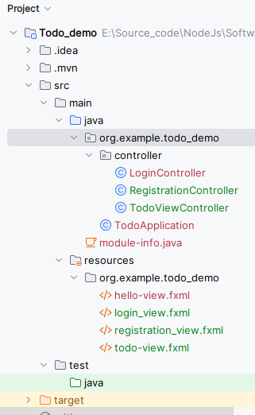
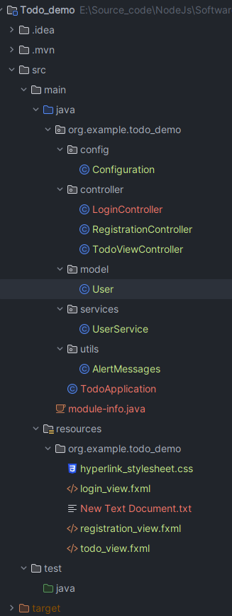

### JUnit

### Table of Contents
1. Introduction to JUnit Testing
1.1. Overview of JUnit
1.2. Introduction to JUnit 5 (Jupiter)
2. Setting Up JUnit with JavaFX
2.1. Overview of JavaFX
2.2. Setting Up a JavaFX Project
2.3. Integrating JUnit 5 into a JavaFX Project
3. Writing Your First JUnit Test
3.1. Anatomy of a JUnit Test
3.2. Writing Simple Unit Tests for a Login Page
4. Advanced JUnit Testing Techniques
4.1. Testing with Assertions
4.2. Grouping and Tagging Tests
4.3. Testing Exceptions
5. Testing Strategies for a Todo Application
5.1. Boundary Value Analysis (BVA) for Password Length
5.2. White Box Testing for Input Validation
5.2.1. Ensuring at Least One Capital Letter
5.2.2. Ensuring at Least One Special Character
5.3. Using Decision Tables for Username and Password Validation
6. Effective Use of JUnit Annotations
6.1. Lifecycle Annotations (@BeforeAll, @AfterAll, @BeforeEach, @AfterEach)
6.2. Using @Disabled to Skip Tests
6.3. Custom Annotations for JUnit Tests
7. Data-Driven Testing (DDT) in JUnit
7.1. Introduction to DDT
7.2. Parameterized Tests with JUnit 5
7.2.1. Using @ValueSource
7.2.2. Using @CsvSource and @CsvFileSource
7.2.3. Using @MethodSource for Complex Parameters
7.3. Advantages of Data-Driven Testing


### 1. Introduction to JUnit Testing
#### 1.1. Overview of JUnit
JUnit is a popular unit testing framework in the Java programming environment. Developed by Kent Beck and Erich Gamma, it has become a standard tool for implementing unit tests in Java projects. JUnit provides annotations to identify test methods, assertions to test expected results, and test runners for running tests.

#### 1.2. Introduction to JUnit 5 (Jupiter)
JUnit 5, also known as Jupiter, is the next generation of the JUnit framework, introducing many new features and improvements over JUnit 4. It is designed to be more flexible and modular, making it easier to write and maintain tests. JUnit 5 is composed of three main subprojects:

> **JUnit Platform:** Launches testing frameworks on the JVM.
**JUnit Jupiter:** Provides new programming and extension models for writing tests and extensions.
**JUnit Vintage:** Provides a test engine for running JUnit 3 and JUnit 4 tests on the JUnit 5 platform.

###### Key Features of JUnit 5
- **Annotations:** JUnit 5 introduces several new annotations, such as `@Nested`, `@DisplayName`, `@Tag`, and `@ExtendWith`, allowing for more descriptive tests and custom extensions.
- **Dynamic Tests:** Tests can be dynamically generated at runtime, offering more flexibility in test design.
- **Parameterized Tests:** Support for parameterized tests has been significantly improved, allowing for more robust data-driven testing.
- **Improved Assertions:** JUnit 5 includes a new Assertions class with better support for asserting conditions in tests.
- **Modularity:** The modular architecture of JUnit 5 makes it easier to integrate with other tools and frameworks.

###### Getting Started with JUnit 5
To start using JUnit 5 in your Java projects, you need to include the JUnit Jupiter API and the JUnit Platform Runner in your project's dependencies. For Maven projects, add the following dependencies to your `pom.xml`:

```xml 
<dependency>
    <groupId>org.junit.jupiter</groupId>
    <artifactId>junit-jupiter-engine</artifactId>
    <version>5.7.0</version>
    <scope>test</scope>
</dependency>
```

For Gradle projects, include:
```gradle
testImplementation 'org.junit.jupiter:junit-jupiter-api:5.7.0'
testRuntimeOnly 'org.junit.jupiter:junit-jupiter-engine:5.7.0'
```

Ensure you have the JUnit 5 setup in your IDE to start writing and running JUnit 5 tests.

---

### 2. Setting Up JUnit with JavaFX
#### 2.1 Overview of JavaFX
JavaFX is a rich client platform for building cross-platform desktop applications in Java. It offers a wide range of functionalities, including 2D and 3D graphics, UI controls, multimedia, and web views. JavaFX applications are known for their high performance and customizable interfaces.

#### 2.2 Setting Up a JavaFX Project
1. **Create a New JavaFX Project:** Use your IDE to **create a new JavaFX** project. Specify the project SDK (Java Development Kit).

2. **Add JavaFX Libraries:** Ensure JavaFX libraries are included in your project's dependencies. For `Maven` and `Gradle` projects, add JavaFX dependencies in your `pom.xml` or `build.gradle` file, respectively.

**For Maven, add**:
```xml
<dependency>
  <groupId>org.openjfx</groupId>
  <artifactId>javafx-controls</artifactId>
  <version>11</version>
</dependency>
```

**For Gradle, add**:
```gradle
implementation 'org.openjfx:javafx-controls:11'
```

3. **Configure the Module-Info.java:** If you're using modules, ensure your **module-info.java** file correctly requires the necessary JavaFX modules. For example:

```java
module your.module.name {
  requires javafx.controls;
  exports your.main.package;
}
```

#### 2.3 Integrating JUnit 5 into a JavaFX Project
With your JavaFX project set up, the next step is to integrate JUnit 5, enabling you to write and run tests.

1. **Add JUnit 5 Dependencies:** Just as in setting up a regular Java project with JUnit 5, add the JUnit Jupiter API and Engine dependencies to your project. Use the dependency snippets provided in Part 1, adjusting the version numbers as necessary to match the latest releases.

2. **Configure Your IDE:** Most modern IDEs support JUnit 5 out of the box. Ensure that your project is configured to use JUnit 5 for testing. This usually involves setting the test framework in your project's testing settings to JUnit 5.

3. **Write a Simple Test:** To verify that JUnit 5 is correctly set up with your JavaFX application, write a simple test case. For instance, you might create a test class for a simple JavaFX controller.

Example test class:
```java
import org.junit.jupiter.api.Test;
import static org.junit.jupiter.api.Assertions.assertTrue;

public class SimpleTest {
    @Test
    void simpleAssertion() {
        assertTrue(true, "The assertion should pass");
    }
}
```
4. **Run Your Test:** Use your IDE's test runner to run the test. Ensure the test passes, indicating that JUnit 5 is correctly set up and ready for more complex test scenarios involving your JavaFX application components.

### 3. Writing Your First JUnit Test
Understanding the structure and components of a JUnit test is crucial for any developer. This section outlines the basics of writing unit tests using JUnit 5, focusing on simple yet essential test cases related to a hypothetical login / registration page in a JavaFX application.

#### 3.1 Anatomy of a JUnit Test
JUnit tests are methods annotated with @Test and are contained within test classes. Here's a breakdown of the typical components in a JUnit test class:

- **Test Methods:** Methods annotated with `@Test` that contain the actual test code.
- **Assertions:** Statements that check if the test conditions are met.
- **Setup and Teardown Methods:** Methods annotated with `@BeforeEach`and `@AfterEach` (or `@BeforeAll` and `@AfterAll`) for setting up test preconditions and cleaning up after tests.
- **Test Class:** Contains test methods and possibly `setup/teardown` methods. Usually named after the class it tests (e.g., `LoginControllerTest` for testing `LoginController`).


#### 3.2 Implementation 
**JavaFX Application Structure**
Your JavaFX application will consist of three **primary scenes**:

> - `Login View`
> - `Registration View`
> - `Todo View`

Each page / view is represented by an FXML file for the layout and a Controller class to handle the user interactions. This separation adheres to the Model-View-Controller (MVC) pattern, enhancing maintainability and testability.




Focusing on a detailed implementation of the **Registration Page** in a JavaFX application, we'll step through creating the **UI** with **FXML**, building the controller, and setting up a comprehensive testing strategy for the registration logic.

**`TodoApplication.java`**
```java
import javafx.application.Application;
import javafx.application.Platform;
import javafx.fxml.FXMLLoader;
import javafx.scene.Scene;
import javafx.stage.Stage;
// import org.example.todo_demo.config.Configuration;

import java.io.IOException;

public class TodoApplication extends Application {
    @Override
    public void start(Stage stage) throws IOException {
        Platform.setImplicitExit(false); // Keep application running in background

//        stage.setResizable(false);
//
//        stage.setOnCloseRequest(event -> {
//            // Prevent the window from closing
//            event.consume();
//
//            // Optionally, minimize the window instead
//            stage.setIconified(true);
//        });
        // Configuration.widowResizeCancelController(stage);
        // Call method to add application to system tray
        // Configuration.addAppToSystemTray(stage);

        FXMLLoader fxmlLoader = new FXMLLoader(TodoApplication.class.getResource("login_view.fxml"));
        Scene scene = new Scene(fxmlLoader.load(), 750, 550);
        stage.setTitle("Todo App");
        stage.setScene(scene);
        stage.show();
    }

    public static void main(String[] args) {
        launch();
    }
}
```

**Step 1: Designing the UI with FXML**

`Registration.fxml`

Create an FXML file named `Registration.fxml`. This file will define the user interface for the registration page, including input fields for the `user's name`, `email`, `password`, and a `registration button`.

```xml
<?xml version="1.0" encoding="UTF-8"?>

<?import javafx.scene.control.Button?>
<?import javafx.scene.control.Label?>
<?import javafx.scene.control.PasswordField?>
<?import javafx.scene.control.TextField?>
<?import javafx.scene.layout.AnchorPane?>
<?import javafx.scene.layout.ColumnConstraints?>
<?import javafx.scene.layout.GridPane?>
<?import javafx.scene.layout.RowConstraints?>
<?import javafx.scene.text.Font?>

<AnchorPane prefHeight="400.0" prefWidth="600.0" xmlns="http://javafx.com/javafx/21" xmlns:fx="http://javafx.com/fxml/1" fx:controller="org.example.todo_demo.controller.RegistrationController">
   <children>
      <GridPane layoutX="54.0" layoutY="103.0" prefHeight="113.0" prefWidth="314.0">
        <columnConstraints>
          <ColumnConstraints hgrow="SOMETIMES" maxWidth="150.0" minWidth="10.0" prefWidth="115.0" />
          <ColumnConstraints hgrow="SOMETIMES" maxWidth="195.0" minWidth="10.0" prefWidth="195.0" />
        </columnConstraints>
        <rowConstraints>
          <RowConstraints minHeight="10.0" prefHeight="30.0" vgrow="SOMETIMES" />
          <RowConstraints minHeight="10.0" prefHeight="30.0" vgrow="SOMETIMES" />
          <RowConstraints minHeight="10.0" prefHeight="30.0" vgrow="SOMETIMES" />
            <RowConstraints minHeight="10.0" prefHeight="30.0" vgrow="SOMETIMES" />
        </rowConstraints>
         <children>
            <Label text="Name" />
            <Label text="Email" GridPane.rowIndex="1" />
            <Label text="Password" GridPane.rowIndex="2" />
            <Label text="Confirm Password" GridPane.rowIndex="3" />
            <PasswordField fx:id="passwordField" GridPane.columnIndex="1" GridPane.rowIndex="2" />
            <PasswordField fx:id="confirmPasswordField" prefHeight="43.0" prefWidth="195.0" GridPane.columnIndex="1" GridPane.rowIndex="3" />
            <TextField fx:id="nameField" GridPane.columnIndex="1" />
            <TextField fx:id="emailField" GridPane.columnIndex="1" GridPane.rowIndex="1" />
         </children>
      </GridPane>
      <Button layoutX="122.0" layoutY="237.0" mnemonicParsing="false" prefHeight="25.0" prefWidth="110.0" text="Register"
      onAction="#handleRegistrationAction"/>
      <Label layoutX="61.0" layoutY="21.0" text="Registration Page">
         <font>
            <Font name="Agency FB" size="56.0" />
         </font>
      </Label>
      <Button fx:id="backButton" layoutX="9.0" layoutY="9.0" mnemonicParsing="false" text="Back" onAction="#onBackClickButton"/>
   </children>
</AnchorPane>
```

---

`Login.fxml`

Create an FXML file named `Login.fxml` to define the user interface for the login page, including input fields for the username and password, and a login button.

```xml
<?xml version="1.0" encoding="UTF-8"?>

<?import javafx.scene.control.Button?>
<?import javafx.scene.control.Hyperlink?>
<?import javafx.scene.control.Label?>
<?import javafx.scene.control.PasswordField?>
<?import javafx.scene.control.TextField?>
<?import javafx.scene.layout.AnchorPane?>
<?import javafx.scene.layout.ColumnConstraints?>
<?import javafx.scene.layout.GridPane?>
<?import javafx.scene.layout.RowConstraints?>

<AnchorPane prefHeight="400.0" prefWidth="600.0" xmlns="http://javafx.com/javafx/21" xmlns:fx="http://javafx.com/fxml/1" fx:controller="org.example.todo_demo.controller.LoginController">
   <children>
      <GridPane layoutX="179.0" layoutY="122.0" prefHeight="61.0" prefWidth="500.0">
        <columnConstraints>
          <ColumnConstraints hgrow="SOMETIMES" maxWidth="94.0" minWidth="10.0" prefWidth="23.0" />
          <ColumnConstraints hgrow="SOMETIMES" maxWidth="233.0" minWidth="10.0" prefWidth="233.0" />
        </columnConstraints>
        <rowConstraints>
          <RowConstraints maxHeight="40.0" minHeight="10.0" prefHeight="34.0" vgrow="SOMETIMES" />
          <RowConstraints maxHeight="63.0" minHeight="10.0" prefHeight="27.0" vgrow="SOMETIMES" />
        </rowConstraints>
         <children>
            <Label text="Email" />
            <Label text="Password" GridPane.rowIndex="1" />
            <TextField fx:id="txtUsername" prefHeight="25.0" prefWidth="241.0" GridPane.columnIndex="1" />
            <PasswordField fx:id="txtPassword" GridPane.columnIndex="1" GridPane.rowIndex="1" />
         </children>
      </GridPane>
      <Button layoutX="179.0" layoutY="200.0" mnemonicParsing="false" onAction="#onSignIn" prefHeight="25.0" prefWidth="328.0" text="Sign In" />
      <Hyperlink layoutX="286.0" layoutY="298.0" onAction="#goToRegistrationPage" stylesheets="@hyperlink_stylesheet.css" text="Register" />
      <Label layoutX="338.0" layoutY="301.0" text="|" />
      <Hyperlink layoutX="343.0" layoutY="298.0" text="Forget Password" />
   </children>
</AnchorPane>
```

---

`Todo.fxml`

Create an FXML file named Todo.fxml to define the user interface for the Todo Page. This interface includes a ListView to display todo items, a TextField to enter new todos, and buttons for adding and deleting todos.

```xml
<?xml version="1.0" encoding="UTF-8"?>

<?import javafx.scene.control.Button?>
<?import javafx.scene.control.ComboBox?>
<?import javafx.scene.control.DatePicker?>
<?import javafx.scene.control.Label?>
<?import javafx.scene.control.ListView?>
<?import javafx.scene.control.TextArea?>
<?import javafx.scene.control.TextField?>
<?import javafx.scene.layout.AnchorPane?>
<?import javafx.scene.layout.ColumnConstraints?>
<?import javafx.scene.layout.GridPane?>
<?import javafx.scene.layout.HBox?>
<?import javafx.scene.layout.RowConstraints?>
<?import javafx.scene.text.Font?>

<AnchorPane prefHeight="642.0" prefWidth="656.0" xmlns="http://javafx.com/javafx/21" xmlns:fx="http://javafx.com/fxml/1" fx:controller="org.example.todo_demo.controller.TodoViewController">
   <children>
      <ListView fx:id="myListView" layoutY="343.0" prefHeight="300.0" prefWidth="656.0" AnchorPane.bottomAnchor="-1.0" AnchorPane.leftAnchor="0.0" AnchorPane.rightAnchor="0.0" AnchorPane.topAnchor="343.0" />
      <Label layoutX="271.0" layoutY="14.0" text="Todo" textAlignment="CENTER">
         <font>
            <Font name="System Bold" size="24.0" />
         </font>
      </Label>
      <HBox alignment="center" spacing="10" />
      <GridPane layoutX="74.0" layoutY="44.0" prefHeight="232.0" prefWidth="539.0">
        <columnConstraints>
          <ColumnConstraints hgrow="SOMETIMES" maxWidth="195.0" minWidth="10.0" prefWidth="72.0" />
          <ColumnConstraints hgrow="SOMETIMES" maxWidth="467.0" minWidth="10.0" prefWidth="467.0" />
        </columnConstraints>
        <rowConstraints>
          <RowConstraints maxHeight="38.0" minHeight="10.0" prefHeight="25.0" vgrow="SOMETIMES" />
          <RowConstraints maxHeight="61.0" minHeight="10.0" prefHeight="33.0" vgrow="SOMETIMES" />
          <RowConstraints maxHeight="60.0" minHeight="10.0" prefHeight="27.0" vgrow="SOMETIMES" />
            <RowConstraints maxHeight="138.0" minHeight="10.0" prefHeight="138.0" vgrow="SOMETIMES" />
        </rowConstraints>
         <children>
            <HBox prefHeight="100.0" prefWidth="200.0" GridPane.columnIndex="1" GridPane.rowIndex="2">
               <children>
                  <Label text="Hour: " />
                  <ComboBox fx:id="hourComboBox" prefWidth="70" />
                  <Label text="              " />
                  <Label text="Minute: " />
                  <ComboBox fx:id="minuteComboBox" prefWidth="70" />
               </children>
            </HBox>
            <DatePicker fx:id="datePicker" GridPane.columnIndex="1" GridPane.rowIndex="1" />
            <TextField GridPane.columnIndex="1" />
            <Label text="Title:" />
            <Label text="Day" GridPane.rowIndex="1" />
            <Label text="Time:" GridPane.rowIndex="2" />
            <TextArea prefHeight="138.0" prefWidth="467.0" GridPane.columnIndex="1" GridPane.rowIndex="3" />
            <Label text="Description:" GridPane.rowIndex="3" />
         </children>
      </GridPane>
      <Button layoutX="194.0" layoutY="293.0" mnemonicParsing="false" prefHeight="39.0" prefWidth="344.0" text="Add New Task">
         <font>
            <Font size="18.0" />
         </font>
      </Button>
      <Button fx:id="logoutButton" layoutX="597.0" layoutY="2.0" mnemonicParsing="false" text="Logout" onAction="#onlogout" />
   </children>

</AnchorPane>

```

---


**Step 2: Implementing the RegistrationController**
The RegistrationController class will handle user input and registration logic.

`RegistrationController.java`

```java
// package your.package;

import javafx.event.ActionEvent;
import javafx.fxml.FXML;
import javafx.fxml.FXMLLoader;
import javafx.scene.Parent;
import javafx.scene.Scene;
import javafx.scene.control.Button;
import javafx.scene.control.PasswordField;
import javafx.scene.control.TextField;
import javafx.stage.Stage;
import org.example.todo_demo.services.UserService;
import org.example.todo_demo.utils.AlertMessages;

import java.io.IOException;
import java.util.regex.Matcher;
import java.util.regex.Pattern;


public class RegistrationController {
    
    @FXML
    private TextField nameField;
    @FXML
    private TextField emailField;
    @FXML
    private PasswordField passwordField;
    @FXML
    private PasswordField confirmPasswordField;

    @FXML
    private Button backButton;

    public void onBackClickButton(ActionEvent actionEvent) throws IOException {
        // Implementation
    }

    @FXML
    protected void handleRegistrationAction(ActionEvent event) {
        String name = nameField.getText();
        String email = emailField.getText();
        String password = passwordField.getText();
        String confirmPassword = confirmPasswordField.getText();
        
        if (!password.equals(confirmPassword)) {
            // Password don't match
            // Show error message
            return;
        }

        if (isValidEmail(email) && isValidPassword(password) && !name.isEmpty()) {
            // Registration successful
            // Navigate to login page or show success message
        } else {
            // Registration failed
            // Show error message
        }
    }
    
    // Validate Email format
     private boolean isValidEmail(String email) {
        /*
        ^: Start of the string.
           [A-Za-z0-9+_.-]+: Matches one or more characters that are alphanumeric (A-Za-z0-9), plus (+), underscore (_), dot (.), or hyphen (-). This part is intended to match the user name part of the email address before the @ symbol.
           @: Matches the @ symbol itself, which is a required character in email addresses.
           [A-Za-z0-9.-]+: Matches one or more characters that are alphanumeric (A-Za-z0-9), dot (.), or hyphen (-). This part is intended to match the domain part of the email address after the @ symbol. It can match domains like example.com or subdomains like sub.example.com.
           $: End of the string.
         */
     }

     // Validate Password complexity
      private boolean isValidPassword(String password) {
        /*
        ^: Start of string.
        (?=.*[0-9]): At least one digit.
        (?=.*[a-z]): Ensures that there is at least one lowercase letter (not explicitly required by your rules but generally considered a good practice for password security).
        (?=.*[A-Z]): At least one uppercase letter.
        (?=.*[@#$%^&+=]): At least one special character from the set specified.
        (?=\\S+$): No whitespace allowed in the entire string.
        .{8,24}$: Between 8 to 24 characters.
         */
      }
}
```


---

---

**Step 3: Implementing the LoginController**
The LoginController class will handle user input for login actions.

`LoginController.java`

```java
// package your.package;

import javafx.event.ActionEvent;
import javafx.fxml.FXML;
import javafx.scene.control.PasswordField;
import javafx.scene.control.TextField;

public class LoginController {
    
    @FXML
    private TextField usernameField;
    
    @FXML
    private PasswordField passwordField;

    @FXML
    protected void onSignIn(ActionEvent actionEvent) {
        if (!authenticateUser(txtUsername.getText(), txtPassword.getText())) {
            // Login Failed
            return;
        }
        // Navigate to MainPage
    }

    @FXML
    public void goToRegistrationPage(ActionEvent actionEvent) {
        try {
            // Go to Registration
        } catch (IOException e) {
            e.printStackTrace(); // Handle the exception as appropriate for your application
        }
    }
    
}
```


---

**Step 4. Implementing the TodoController**
The TodoController class manages the interaction logic for the Todo Page, including adding and deleting todo items.

`TodoController.java`

```java
// package your.package;

import javafx.collections.FXCollections;
import javafx.collections.ObservableList;
import javafx.fxml.FXML;
import javafx.scene.control.ListView;
import javafx.scene.control.TextField;

public class TodoController {
    
    @FXML
    private ListView<String> todoListView;
    
    @FXML
    private TextField todoInputField;
    
    private ObservableList<String> todoItems;

    @FXML
    public void initialize() {
        todoItems = FXCollections.observableArrayList();
        todoListView.setItems(todoItems);
    }

    @FXML
    protected void handleAddTodoAction() {
        String newTodo = todoInputField.getText().trim();
        if (!newTodo.isEmpty()) {
            todoItems.add(newTodo);
            todoInputField.clear();
        }
    }

    @FXML
    protected void handleDeleteTodoAction() {
        String selectedTodo = todoListView.getSelectionModel().getSelectedItem();
        if (selectedTodo != null) {
            todoItems.remove(selectedTodo);
        }
    }
}
```
---



---
***Full Impelementation of RegistrationController.java***

```java
import javafx.event.ActionEvent;
import javafx.fxml.FXML;
import javafx.fxml.FXMLLoader;
import javafx.scene.Parent;
import javafx.scene.Scene;
import javafx.scene.control.Button;
import javafx.scene.control.PasswordField;
import javafx.scene.control.TextField;
import javafx.stage.Stage;
import org.example.todo_demo.model.User;
import org.example.todo_demo.services.UserService;
import org.example.todo_demo.utils.AlertMessages;

import java.io.IOException;
import java.util.regex.Matcher;
import java.util.regex.Pattern;

public class RegistrationController {

    @FXML
    private TextField nameField;
    @FXML
    private TextField emailField;
    @FXML
    private PasswordField passwordField;
    @FXML
    private PasswordField confirmPasswordField;

    @FXML
    private Button backButton;

    // private UserService userService = new UserService();
    private UserService userService = UserService.getInstance();

    public void onBackClickButton(ActionEvent actionEvent) throws IOException {
        backToLoginPage();
    }

    public void backToLoginPage() throws IOException {
        // Hide or close the current todo app window
        Stage todoStage = (Stage) backButton.getScene().getWindow();
        todoStage.close();

        // Load and show the login view
        FXMLLoader loader = new FXMLLoader(getClass().getResource("/org/example/todo_demo/login_view.fxml"));
        Parent root = loader.load();
        Scene scene = new Scene(root);
        Stage loginStage = new Stage();
        loginStage.setScene(scene);
        loginStage.setTitle("Login");
        loginStage.show();

    }
    @FXML
    public void handleRegistrationAction(ActionEvent actionEvent) throws IOException {
        String name = nameField.getText();
        String email = emailField.getText();
        String password = passwordField.getText();
        String confirmPassword = confirmPasswordField.getText();

        if (!password.equals(confirmPassword)) {
            // Password don't match
            // Show error message
            return;
        }

        if (isValidEmail(email) && isValidPassword(password) && !name.isEmpty()) {
            // Registration successful
            boolean isRegistered = userService.registerUser(name, email, password);
            // Navigate to login page or show success message
            backToLoginPage();

        } else {
            // Registration failed
            // Show error message
            AlertMessages.showErrorToUser("Registration", "Registration Failed");
        }
    }

    // Validate email format
    private boolean isValidEmail(String email) {
        /*
        ^: Start of the string.
           [A-Za-z0-9+_.-]+: Matches one or more characters that are alphanumeric (A-Za-z0-9), plus (+), underscore (_), dot (.), or hyphen (-). This part is intended to match the user name part of the email address before the @ symbol.
           @: Matches the @ symbol itself, which is a required character in email addresses.
           [A-Za-z0-9.-]+: Matches one or more characters that are alphanumeric (A-Za-z0-9), dot (.), or hyphen (-). This part is intended to match the domain part of the email address after the @ symbol. It can match domains like example.com or subdomains like sub.example.com.
           $: End of the string.
         */
        String emailRegex = "^[A-Za-z0-9+_.-]+@[A-Za-z0-9.-]+$";
        Pattern emailPart = Pattern.compile(emailRegex, Pattern.CASE_INSENSITIVE);
        Matcher matcher = emailPart.matcher(email);

        return matcher.find();
    }

    // Validate password complexity
    private boolean isValidPassword(String password) {
        /*
        ^: Start of string.
        (?=.*[0-9]): At least one digit.
        (?=.*[a-z]): Ensures that there is at least one lowercase letter (not explicitly required by your rules but generally considered a good practice for password security).
        (?=.*[A-Z]): At least one uppercase letter.
        (?=.*[@#$%^&+=]): At least one special character from the set specified.
        (?=\\S+$): No whitespace allowed in the entire string.
        .{8,24}$: Between 8 to 24 characters.
         */
        String passwordRegex = "^(?=.*[0-9])(?=.*[a-z])(?=.*[A-Z])(?=.*[@#$%^&+=])(?=\\S+$).{8,24}$";
        Pattern passwordPat = Pattern.compile(passwordRegex);
        Matcher matcher = passwordPat.matcher(password);
        return matcher.matches();
    }
}
```

---

***Full Impelementation of LoginController.java***

```java
import javafx.event.ActionEvent;
import javafx.fxml.FXML;
import javafx.fxml.FXMLLoader;
import javafx.scene.Parent;
import javafx.scene.Scene;
import javafx.scene.control.Alert;
import javafx.scene.control.TextField;
import javafx.stage.Stage;
import org.example.todo_demo.config.Configuration;
import org.example.todo_demo.services.UserService;
import org.example.todo_demo.utils.AlertMessages;

import java.io.IOException;

public class LoginController {

    @FXML
    private TextField txtUsername;

    @FXML
    private TextField txtPassword;

    private UserService userService = UserService.getInstance(); // GET THE SINGLETON

    @FXML
    protected void onSignIn(ActionEvent actionEvent) {
        if (!authenticateUser(txtUsername.getText(), txtPassword.getText())) {
            AlertMessages.showErrorToUser("Login Failed", "Incorrect username or password.");
            return;
        }
        navigateToTodoApp();
    }

    private boolean authenticateUser(String username, String password) {
        // Use userService to validate credentials
        return userService.login(username, password);
    }

    private void navigateToTodoApp() {
        try {
            Stage loginStage = getCurrentStage();
            loginStage.hide();

            Parent root = loadTodoView();
            Scene todoScene = new Scene(root, 800, 600);

            Stage todoStage = createStage(todoScene, "Todo App");

//            configureWindowResize(todoStage);
//            addAppToSystemTray(todoStage);

            todoStage.show();
        } catch (IOException e) {
            e.getMessage(); // Handle the exception as appropriate for your application
        }
    }

    // Rest of your methods here...
    // Including showErrorToUser, getCurrentStage, loadTodoView, createStage, etc.
//    private void showErrorToUser() {
//        // Implementation of showing error to the user
//        System.out.println("Authentication failed");
//    }


    private Stage getCurrentStage() {
        return (Stage) txtUsername.getScene().getWindow();
    }

    private Parent loadTodoView() throws IOException {
        FXMLLoader loader = new FXMLLoader(getClass().getResource("/org/example/todo_demo/todo_view.fxml"));
        return loader.load();
    }

    private Stage createStage(Scene scene, String title) {
        Stage stage = new Stage();
        stage.setScene(scene);
        stage.setTitle(title);
        return stage;
    }

//    private void configureWindowResize(Stage stage) {
//        // Assuming Configuration.windowResizeCancelController(Stage stage) exists and configures the stage
//        Configuration.windowResizeCancelController(stage);
//    }
//
//    private void addAppToSystemTray(Stage stage) {
//        // Assuming Configuration.addAppToSystemTray(Stage stage) exists and adds the app to the system tray
//        Configuration.addAppToSystemTray(stage);
//    }


    @FXML
    public void goToRegistrationPage(ActionEvent actionEvent) {
        try {
            Stage currentStage = getCurrentStage();
            currentStage.close();

            Parent root = loadRegistrationView();
            Scene scene = new Scene(root, 500, 600);
            Stage registrationStage = createStage(scene, "Registration");
            registrationStage.show();
        } catch (IOException e) {
            e.printStackTrace(); // Handle the exception as appropriate for your application
        }
    }

    private Parent loadRegistrationView() throws IOException {
        FXMLLoader loader = new FXMLLoader(getClass().getResource("/org/example/todo_demo/registration_view.fxml"));
        return loader.load();
    }
}
```

---

***Full Impelementation of User.java***
```java
public class User {

    private String name;
    private String email;
    private String password;

    // Constructor
    public User(String name, String email, String password) {
        this.name =  name;
        this.email = email;
        this.password = password;
    }

    public String getName() {
        return name;
    }

    public void setName(String name) {
        this.name = name;
    }

    public String getEmail() {
        return email;
    }

    public void setEmail(String email) {
        this.email = email;
    }

    public String getPassword() {
        return password;
    }

    public void setPassword(String password) {
        this.password = password;
    }
    @Override
    public String toString() {
        return "The name: "+ this.name + " email :"+ this.email + " and password: " + this.password;
    }
}
```
---

***Full Impelementation of UserService.java***

```java
import org.example.todo_demo.model.User;

import java.util.HashMap;
import java.util.Map;

public class UserService {
    private final Map<String, User> users = new HashMap<>();

    // Singleton
    private static UserService instance;
    public UserService() {}

    public static synchronized UserService getInstance() {
        if (instance == null) {
            instance = new UserService();
        }
        return instance;
    }
    // Singleton Finished

    // Register a new user
    public boolean registerUser(String name, String email, String password) {
        // Check if user already exists
//        if (users.containsKey(email)) {
//            // User already exists
//            return false;
//        }

        // Create and store the new user
        User newUser = new User(name, email, password);
        // TODO: ONLY USE IT IN DEVELOPMENT
        System.out.println("The user saved information is: " + newUser.toString());
        users.put(email, newUser);
        return true;
    }

    // Validate login credentials
    public boolean login(String email, String password) {
        User user = users.get(email);
        // TODO: ONLY USE IT IN DEVELOPMENT
        System.out.println("correct email: " + user.getEmail() + " | user prompt email: " +email);
        if (user != null && user.getPassword().equals(password)) {
            return true; // Login successful
        }
        return false; // Login failed
    }

}
```
---

---

### 4. Advanced JUnit Testing Techniques

#### 4.1 Testing with Assertions
Assertions are fundamental in JUnit tests; they validate the conditions that the test expects to be true. JUnit 5 introduces more powerful assertion methods compared to its predecessors, offering a wide range of options to test with precision.

> - **Basic Assertions:** Test simple conditions. Use `assertEquals`, `assertTrue`, `assertFalse`, and `assertNull`.

```java
assertEquals(4, calculator.add(2, 2), "Optional failure message");
assertTrue('a' < 'b', () -> "Assertion messages can be lazily evaluated 
-- to avoid constructing complex messages unnecessarily.");
```

> - **Grouped Assertions:** Execute a group of assertions together, reporting any failures collectively after all assertions are executed.

```java
import static org.junit.jupiter.api.Assertions.assertAll;

assertAll("Multiple assertions",
    () -> assertEquals(4, calculator.multiply(2, 2)),
    () -> assertEquals(0, calculator.divide(1, 0), "Division by zero should result in zero")
);
```

> - **Exception Assertions:** Test that your code throws an expected exception.
```java
import static org.junit.jupiter.api.Assertions.assertThrows;

assertThrows(ArithmeticException.class, () -> calculator.divide(1, 0));
```

> - **Timeout Assertions:** Ensure that your code completes within a specified time.

```java
import static org.junit.jupiter.api.Assertions.assertTimeout;

assertTimeout(Duration.ofMillis(100), () -> {
    // Perform task that should not take more than 100 ms
});
```

#### 4.2 Grouping and Tagging Tests
Grouping and tagging tests in JUnit 5 allow you to categorize your tests logically, making it easier to manage and execute subsets of tests.

- **Using Tags:** You can tag your test methods with `@Tag` annotation. Tags are useful for filtering tests during execution.

```java
import org.junit.jupiter.api.Tag;

@Tag("fast")
@Test
void aFastTest() {
    // This test is tagged as "fast"
}

@Tag("slow")
@Test
void aSlowTest() {
    // This test is tagged as "slow"
}
```

**Filtering Tests:** When running your tests, you can specify which tags to include or exclude. This capability is particularly useful in build tools like Maven and Gradle, or within IDEs, to run only a specific subset of tests.

#### 4.3 Testing Exceptions
JUnit 5 provides the assertThrows method to assert that execution of a particular code snippet throws a specific exception.

> - **Basic Exception Testing:**
```java
import static org.junit.jupiter.api.Assertions.assertThrows;

@Test
void whenDivideByZero_thenThrowArithmeticException() {
    Calculator calculator = new Calculator();
    assertThrows(ArithmeticException.class, () -> calculator.divide(1, 0));
}
```

> - **Asserting Exception Details:** Beyond simply testing for the presence of an exception, you can capture the exception and assert details about it.
```java
@Test
void whenDivideByZero_thenThrowExceptionWithSpecificMessage() {
    Calculator calculator = new Calculator();
    Exception exception = assertThrows(ArithmeticException.class, () -> calculator.divide(1, 0));
    assertEquals("/ by zero", exception.getMessage());
}
```


---

### 5. Testing Strategies for a Todo Application
When developing a Todo application with functionalities like login, registration, and **CRUD** operations for todo items, adopting a strategic approach to testing is crucial. Here, we focus on techniques applicable to a Todo application, employing **boundary value analysis (BVA)**, **White box testing**, and **decision tables** to ensure comprehensive coverage.

#### 5.1 Boundary Value Analysis (BVA) for Password Length
Boundary Value Analysis is an effective testing technique that involves selecting input values at the boundaries of input domains. For a password feature in the registration or login process, assuming valid passwords are required to be between 6 and 16 characters:

- **Test Cases:**
> - **Just below the lower boundary:** Use a 5-character password to ensure it's rejected.
> - **At the lower boundary:** Use an 6-character password to ensure it's accepted.
> - **Just above the lower boundary:** Use a 7-character password to confirm acceptance.
> - **Just below the upper boundary:** Use a 15-character password to confirm acceptance.
> - **At the upper boundary:** Use a 16-character password to ensure it's accepted.
> - **Just above the upper boundary:** Use a 17-character password to ensure it's rejected.

|Test Case|	Password Length	|Expected Result|
|---------|----------------|---------------|
|Just below lower boundary|	5 characters|	Fail|
|At lower boundary|	6 characters|	Pass|
|Just above lower boundary|	7 characters|	Pass|
|Just below upper boundary|	15 characters|	Pass|
|At upper boundary|	16 characters|	Pass|
|Just above upper boundary|	17 characters|	Fail|

**Simple JUnit Test Without Parameterization**
```java
public class RegistrationControllerTest {
    private final RegistrationController registrationController = 
        new RegistrationController() ;

    @Test
    void testPasswordJustBelowLowerBoundary() {
        // This should fail because it's too short and doesn't meet other criteria
        assertFalse(registrationController.isValidPassword("Aa@5"));
    }

    @Test
    void testPasswordAtLowerBoundary() {
        // This meets all criteria, including length
        assertTrue(registrationController.isValidPassword("Aa@12345"));
    }

    @Test
    void testPasswordJustAboveLowerBoundary() {
        // This meets all criteria, including length
        assertTrue(registrationController.isValidPassword("Aa@123456"));
    }

    @Test
    void testPasswordJustBelowUpperBoundary() {
        // Construct a password that's 23 characters long and meets all criteria
        assertTrue(registrationController.isValidPassword("Aa@1234567890123456789"));
    }

    @Test
    void testPasswordAtUpperBoundary() {
        // Construct a password that's 24 characters long and meets all criteria
        assertTrue(registrationController.isValidPassword("Aa@12345678901234567890"));
    }

    @Test
    void testPasswordJustAboveUpperBoundary() {
        // This should fail because it's too long
        assertFalse(registrationController.isValidPassword("Aa@12345678901234567890a1"));
    }

}

```

---


#### 5.2 White Box Testing for Input Validation
White box testing involves testing internal structures or workings of an application. For input validation, like ensuring a password contains at least one uppercase letter and one special character, you understand and test the internal logic.

> **Example:** For a method `isValidPassword` that validates password criteria:
> - **Test for at least one uppercase letter:** Provide a password with and without an uppercase letter and assert the expected outcome.
> - **Test for at least one special character:** Provide passwords that do and do not contain a special character to test the validation logic.

```java


```

---

#### 5.3 Using Decision Tables for Username and Password Validation
Decision tables are excellent for scenarios where the outcome depends on a combination of conditions. For validating usernames and passwords, a decision table can cover various combinations:

> **Conditions**:
> - C1: Username is not empty.
> - C2: Username exists in the database.
> - C3: Password is valid (meets length and character requirements).
> - C4: Password matches the database for the user.

> **Actions**:
> - A1: Allow login.
> - A2: Reject login.

You then outline rules (R1, R2, ...) that define which conditions lead to which actions. For example, only when C1, C2, C3, and C4 are true (R1) should A1 (allow login) be the outcome.

Implementing Tests in JUnit
Parameterized Tests for decision table scenario ensure efficient coverage over various input combinations. Here’s an example structure for a parameterized test using decision tables:

```java
@ParameterizedTest
@CsvSource({
    "John, true, true, true, true, ALLOW",
    "John, true, true, false, true, REJECT",
    // additional rows based on decision table
})
void testLoginValidation(String username, boolean exists, boolean validPass, boolean matches, boolean expected) {
    // Mock database responses based on 'exists' and 'matches'
    // Implement logic to simulate 'validPass' check
    // Assert 'expected' action (ALLOW or REJECT) matches the outcome
}
```

---

***Conclusion***
Adopting strategic testing techniques such as BVA, white box testing, and decision tables provides a structured approach to ensuring the robustness and reliability of a Todo application. By carefully designing test cases around these strategies, you can achieve comprehensive coverage, effectively catching potential issues before they impact users. Implementing these tests in JUnit, especially with the support for parameterized tests, allows for thorough and efficient validation of application logic.

---


### 6. Effective Use of JUnit Annotations
JUnit 5 introduces several annotations that can enhance your testing framework, making your tests more readable, manageable, and efficient. Understanding and utilizing these annotations effectively can significantly improve your test suites.

#### 6.1 Lifecycle Annotations
Lifecycle annotations in JUnit 5 define methods that run at specific points in the test lifecycle, allowing for setup and teardown operations that are crucial for maintaining test isolation and reducing redundancy.

- `@BeforeAll`: Marks a method to be run before all tests in the current class. It's ideal for expensive setup tasks that need to run only once, ***like initializing a database connection***. Must be ***`static`*** in a regular test class but can be instance-level in a test class annotated with `@TestInstance(Lifecycle.PER_CLASS)`.

- `@AfterAll`: Marks a method to be run after all tests in the class have been executed. Useful for **cleanup** tasks, such as **closing database connections**. Similar to `@BeforeAll`, it must be ***`static`*** unless the test class is annotated with `@TestInstance(Lifecycle.PER_CLASS)`.

- `@BeforeEach`: Marks a method to run **before each test** method in the class. It's used for **setting up test conditions or initializing objects** that are required by each test method.

- `@AfterEach`: Marks a method to run **after each test** method completes. This annotation is typically used for **cleanup activities**, ensuring that changes made by one test method do not affect others.

#### 6.2 Using @Disabled to Skip Tests
- `@Disabled`: This annotation can be applied to a test class or test method to **prevent it from being executed**. It's particularly useful when a test is **temporarily irrelevant** or if the code it tests is **under construction**.


> **Additional Useful Annotations**
> - `@DisplayName`: Provides a custom name for the test class or method, making test reports more readable.
> - `@Nested`: Allows grouping of tests within a test class into nested classes, facilitating better organization of complex test suites.
> - `@Tag`: Used for tagging tests, which can then be included or excluded in test runs based on their tags. This is especially useful in CI/CD pipelines for running different sets of tests for different environments or contexts.
> - `@RepeatedTest`: Indicates that a method is a test template for a repeated test. It's used when you want to run the same test multiple times.
> - `@ParameterizedTest`: Indicates that a method is a test template for a parameterized test. It's used in conjunction with sources like @ValueSource, @CsvSource, or @MethodSource to run the same test with different parameters.
> - `@TestFactory`: Indicates that a method is a test factory for dynamic tests. Dynamic tests are tests that are generated at runtime by a factory method.


**Using JUnit Annotations for a Cleaner Approach**

we can use JUnit's `@BeforeEach` annotation to refactor our setup process, making our test code cleaner and reducing repetition.

```java
import org.junit.jupiter.api.BeforeEach;
import org.junit.jupiter.api.Test;
import static org.junit.jupiter.api.Assertions.*;

public class UserServiceTest {

    private UserService userService;

    @BeforeEach
    public void setUp() {
        userService = new UserService(); // Initialize UserService before each test
    }

    // Include test methods here as defined in the simple example above
}
```

---

```java
import org.junit.jupiter.api.BeforeAll;
import org.junit.jupiter.api.BeforeEach;
import org.junit.jupiter.api.Test;

import static org.junit.jupiter.api.Assertions.assertFalse;
import static org.junit.jupiter.api.Assertions.assertTrue;

public class RegistrationControllerTest {
    private static RegistrationController registrationController;

    @BeforeAll
    static void setUp(){
        registrationController = new RegistrationController();
        System.out.println("Before all called");
    }

    // The rest of the method will be the same
}
```
---

```java
import static org.junit.jupiter.api.Assertions.assertTrue;
import static org.junit.jupiter.api.Assertions.assertFalse;

import org.junit.jupiter.api.AfterEach;
import org.junit.jupiter.api.BeforeAll;
import org.junit.jupiter.api.BeforeEach;
import org.junit.jupiter.api.Test;

public class UserServiceTest {
    private static UserService userService;

    @BeforeAll
    static void setUp() {
        userService = UserService.getInstance();
        System.out.println("BeforeAll is called");
    }

    @AfterEach
    void testingBeforeEach() {
        userService = null;
        System.out.println("After Each is called");
    }

    @BeforeEach
    void testingAfterEach() {
        userService = UserService.getInstance();
        System.out.println("Before Each is called");
    }

    @Test
    void testPasswordJustBelowLowerBoundary() {
        assertTrue(userService.registerUser("John Doe", "john@example.com", "12345"));
    }

    @Test
    void testPasswordAtLowerBoundary() {
        assertFalse(userService.registerUser("John Doe", "john@example.com", "123456"));
    }
}
```


---
***Output***

---

---

Using a CSV data source with JUnit 5's `@CsvSource` or `@CsvFileSource` annotations is an excellent way to simplify the provision of test data for parameterized tests, especially when dealing with a list of values like in Boundary Value Analysis (BVA). This method allows you to externalize your test data, making the test method cleaner and potentially easier to manage, especially if you have a large number of test cases or if the test data is complex.

#### Using @CsvSource
The `@CsvSource` annotation allows you to define your test data directly within your test class as an array of strings. Each string represents a row of CSV data, and each comma separates the columns in that row.

Here's how you could refactor the previous example to use `@CsvSource`:


```java
import org.junit.jupiter.params.ParameterizedTest;
import org.junit.jupiter.params.provider.CsvSource;
import org.junit.jupiter.api.Assertions;

public class RegistrationControllerTest {

    private static RegistrationController registrationController;
    
    @BeforeAll
    static void setUp(){
        registrationController = new RegistrationController();
        System.out.println("Before all called");
    }

    @ParameterizedTest
    @CsvSource({
            "Aa@5, false", // Just below lower boundary
            "Aa@12345, true", // At lower boundary
            "Aa@123456, true", // Just above lower boundary
            "Aa@1234567890123456789, true", // Just below upper boundary
            "Aa@12345678901234567890, true", // At upper boundary
            "Aa@Aa@12345678901234567890a1, false" // Just above upper boundary
    })
    void testPasswordValidation(String password, boolean expectedOutcome) {
        Assertions.assertEquals(expectedOutcome, registrationController.isValidPassword(password),
                "Failed for password: " + password);
    }

}
```

---

#### Using @CsvFileSource
Alternatively, if you have a large number of test cases or prefer to keep your test data separate from your test code, @CsvFileSource allows you to load test data from a CSV file located in your resources folder.

First, create a CSV file in src/test/resources (assuming a standard Maven or Gradle project structure). Let's call it passwordTestData.csv, with the following content:


---

```java
import org.junit.jupiter.params.ParameterizedTest;
import org.junit.jupiter.params.provider.CsvFileSource;

public class RegistrationControllerTest {
    private static RegistrationController registrationController;
    @BeforeAll
    static void setUp(){
        registrationController = new RegistrationController();
        System.out.println("Before all called");
    }

    @ParameterizedTest
    @CsvFileSource(resources = "/csv_password_length_tester.csv", numLinesToSkip = 1) // Skip header row
    void testPasswordValidation(String password, boolean expectedOutcome) {
        Assertions.assertEquals(expectedOutcome, registrationController.isValidPassword(password),
                "Failed for password: " + password);
    }
}
```


---
**Parameterized Tests**
For a more advanced and efficient approach, we utilize JUnit's parameterized tests to run the same test logic with multiple inputs, significantly reducing code duplication.

```java
import org.junit.jupiter.params.ParameterizedTest;
import org.junit.jupiter.params.provider.MethodSource;
import static org.junit.jupiter.api.Assertions.assertEquals;

public class UserServiceTest {

    private static Stream<Arguments> providePasswordTestCases() {
        return Stream.of(
            Arguments.of("12345", false),
            Arguments.of("123456", true),
            Arguments.of("1234567", true),
            Arguments.of("123456789012345", true),
            Arguments.of("1234567890123456", true),
            Arguments.of("12345678901234567", false)
        );
    }

    @ParameterizedTest
    @MethodSource("providePasswordTestCases")
    public void testPasswordValidation(String password, boolean expectedResult) {
        UserService userService = new UserService();
        assertEquals(expectedResult, userService.registerUser("user", "user@example.com", password));
    }
}
```

---

**Step 5: Writing Test Cases for the Registration Logic**
Now, let's focus on how to test the registration logic using JUnit 5. The registerUser method checks that none of the fields are empty and that the password is at least 8 characters long.

3.2.1 Unit Testing registerUser Method

`RegistrationControllerTest.java`

We'll create a test class named RegistrationControllerTest. This class will contain test methods to verify the registration logic under various conditions.

```java
// package your.package;

import org.junit.jupiter.api.BeforeEach;
import org.junit.jupiter.api.Test;
import static org.junit.jupiter.api.Assertions.*;

class RegistrationControllerTest {

    private RegistrationController controller;

    @BeforeEach
    void setUp() {
        controller = new RegistrationController();
    }

    @Test
    void testRegisterUserWithValidData() {
        assertTrue(controller.registerUser("John Doe", "john@example.com", "password123"),
                   "Registration should succeed with valid data.");
    }

    @Test
    void testRegisterUserWithEmptyName() {
        assertFalse(controller.registerUser("", "john@example.com", "password123"),
                    "Registration should fail with an empty name.");
    }

    @Test
    void testRegisterUserWithShortPassword() {
        assertFalse(controller.registerUser("John Doe", "john@example.com", "pass"),
                    "Registration should fail with a password shorter than 8 characters.");
    }

    // Additional tests can be added to cover more cases, such as invalid email formats.
}
```

***Parameterized Testing***
For more comprehensive testing, especially to cover various input combinations efficiently, you can use JUnit 5's parameterized tests. Here's how you might extend the testing to cover multiple scenarios using @ParameterizedTest.

```java
import org.junit.jupiter.params.ParameterizedTest;
import org.junit.jupiter.params.provider.CsvSource;

class RegistrationControllerTest {

    private RegistrationController controller = new RegistrationController();

    @ParameterizedTest
    @CsvSource({
        "John Doe, john@example.com, password123, true",
        ", john@example.com, password123, false",
        "John Doe, , password123, false",
        "John Doe, john@example.com, pass, false"
    })
    void testRegisterUser(String name, String email, String password, boolean expectedOutcome) {
        assertEquals(expectedOutcome, controller.registerUser(name, email, password),
                     "Registration validation failed.");
    }
}
```


**Step 3: Writing Test Cases for the Login Logic**
Testing the authenticateUser method is crucial to ensure that only valid users can access the application.

***Unit Testing authenticateUser Method***
LoginControllerTest.java

Create a test class named LoginControllerTest for verifying the login functionality.

```java
package your.package;

import org.junit.jupiter.api.BeforeEach;
import org.junit.jupiter.api.Test;
import static org.junit.jupiter.api.Assertions.*;

class LoginControllerTest {

    private LoginController controller;

    @BeforeEach
    void setUp() {
        controller = new LoginController();
    }

    @Test
    void testAuthenticateUserWithValidCredentials() {
        assertTrue(controller.authenticateUser("admin", "password"),
                   "Authentication should succeed with valid credentials.");
    }

    @Test
    void testAuthenticateUserWithInvalidUsername() {
        assertFalse(controller.authenticateUser("wrongUser", "password"),
                    "Authentication should fail with an invalid username.");
    }

    @Test
    void testAuthenticateUserWithInvalidPassword() {
        assertFalse(controller.authenticateUser("admin", "wrongPassword"),
                    "Authentication should fail with an invalid password.");
    }
}
```

***Parameterized Testing for Login***
Leverage parameterized tests to cover a broader range of input scenarios for the login logic efficiently.

```java
import org.junit.jupiter.params.ParameterizedTest;
import org.junit.jupiter.params.provider.CsvSource;

class LoginControllerTest {

    private LoginController controller = new LoginController();

    @ParameterizedTest
    @CsvSource({
        "admin, password, true",
        "admin, wrongPassword, false",
        "wrongUser, password, false",
        "admin, , false",
        ", password, false"
    })
    void testAuthenticateUser(String username, String password, boolean expectedOutcome) {
        assertEquals(expectedOutcome, controller.authenticateUser(username, password),
                     "Authentication validation failed.");
    }
}
```

Moving forward to the Todo Page in our JavaFX application, we'll illustrate how to design the UI with FXML, implement the functionality with a controller, and discuss testing strategies for the ***CRUD*** operations of todo items using JUnit 5. The Todo Page allows users to add, view, update, and delete todo items.

**Writing Test Cases for Todo Operations**
Testing the Todo Page functionality involves verifying that todo items can be added and deleted as expected. However, testing UI controllers directly in JUnit can be complex due to the need for initializing JavaFX components. Here, we focus on testing the logic behind adding and deleting todos, assuming these methods are made accessible (e.g., package-private or public for testing) or refactored into a separate testable class.

***Unit Testing Todo Operations***

`TodoControllerTest.java`

Create a test class named TodoControllerTest. This class will contain methods to test adding and deleting todo items.

```java
package your.package;

import org.junit.jupiter.api.BeforeEach;
import org.junit.jupiter.api.Test;
import static org.junit.jupiter.api.Assertions.*;

class TodoControllerTest {

    private TodoController controller;

    @BeforeEach
    void setUp() {
        controller = new TodoController();
        controller.initialize(); // Manually initialize to setup the todoItems list
    }

    @Test
    void testAddTodoItem() {
        controller.todoInputField.setText("New Todo");
        controller.handleAddTodoAction();
        assertFalse(controller.todoItems.isEmpty(), "Todo list should not be empty after adding an item.");
    }

    @Test
    void testDeleteTodoItem() {
        // Setup - Add an item first
        controller.todoInputField.setText("Todo to Delete");
        controller.handleAddTodoAction();
        
        // Select the item to delete
        controller.todoListView.getSelectionModel().select(0);
        controller.handleDeleteTodoAction();
        assertTrue(controller.todoItems.isEmpty(), "Todo list should be empty after deleting the item.");
    }
}
```


### 7. Data-Driven Testing (DDT) in JUnit
Data-Driven Testing (DDT) is a testing paradigm where the test logic is separated from the input and output data. It enables the execution of test cases with sets of data values that are externalized from the test itself. JUnit 5 supports DDT through its @ParameterizedTest annotation and various sources of input data, facilitating the execution of a single test method with different inputs. This approach enhances test coverage and efficiency, particularly for validating a range of conditions and inputs.

#### 7.1 Introduction to DDT
DDT is particularly useful in scenarios where the logic under test behaves differently based on various inputs. By externalizing input values (and possibly expected outcomes), tests can be made more readable and maintainable. Additionally, adding new test cases often doesn't require changes to the test code but merely the addition of new data sets.

#### 7.2 Parameterized Tests with JUnit 5
JUnit 5 introduces several annotations to support parameterized tests, allowing a single test method to be executed multiple times with different parameters. Here’s how to use some of the most common sources:

- Using `@ValueSource`: Provides a simple way to specify a single array of literal values.
```java
@ParameterizedTest
@ValueSource(strings = {"Hello", "JUnit"})
void withValueSource(String argument) {
    assertNotNull(argument);
}
```

- Using @CsvSource and @CsvFileSource: Allows specifying parameter sets as comma-separated values. @CsvSource takes strings directly, while @CsvFileSource reads from CSV files.

```java
@ParameterizedTest
@CsvSource({"1, true", "2, true", "3, false"})
void withCsvSource(int number, boolean expected) {
    assertEquals(expected, number < 3);
}
```

```java
@ParameterizedTest
@CsvFileSource(resources = "/input.csv", numLinesToSkip = 1)
void withCsvFileSource(int number, boolean expected) {
    assertEquals(expected, number < 3);
}
```

- Using @MethodSource: Enables you to specify a method that provides the parameters, allowing for more complex scenarios and data types.

```java
@ParameterizedTest
@MethodSource("stringProvider")
void withMethodSource(String argument) {
    assertNotNull(argument);
}

static Stream<String> stringProvider() {
    return Stream.of("apple", "banana");
}
```

#### 7.3 Advantages of Data-Driven Testing
DDT offers several benefits:

Efficiency: Write once, test multiple times. DDT reduces the amount of code needed for multiple test cases.
Coverage: Easily achieve high test coverage by covering a wide range of input combinations.
Maintenance: Adding new test cases usually involves just adding new data sets without modifying the test code.
Readability: Tests can be simpler and focus on the logic being tested rather than the intricacies of generating test data.