<!-- ---

marp: true

--- -->

### JUnit

---

### 1. Introduction to JUnit Testing
#### 1.1. Overview of JUnit
JUnit is a popular unit testing framework in the Java programming environment. Developed by Kent Beck and Erich Gamma, it has become a standard tool for implementing unit tests in Java projects. JUnit provides annotations to identify test methods, assertions to test expected results, and test runners for running tests.

---

#### 1.2. Introduction to JUnit 5 (Jupiter)
JUnit 5, also known as Jupiter, is the next generation of the JUnit framework, introducing many new features and improvements over JUnit 4. It is designed to be more flexible and modular, making it easier to write and maintain tests. JUnit 5 is composed of three main subprojects:

> **JUnit Platform:** Launches testing frameworks on the JVM.
**JUnit Jupiter:** Provides new programming and extension models for writing tests and extensions.
**JUnit Vintage:** Provides a test engine for running JUnit 3 and JUnit 4 tests on the JUnit 5 platform.

###### Key Features of JUnit 5
- **Annotations:** JUnit 5 introduces several new annotations, such as `@Nested`, `@DisplayName`, `@Tag`, and `@ExtendWith`, allowing for more descriptive tests and custom extensions.
- **Dynamic Tests:** Tests can be dynamically generated at runtime, offering more flexibility in test design.
- **Parameterized Tests:** Support for parameterized tests has been significantly improved, allowing for more robust data-driven testing.
- **Improved Assertions:** JUnit 5 includes a new Assertions class with better support for asserting conditions in tests.
- **Modularity:** The modular architecture of JUnit 5 makes it easier to integrate with other tools and frameworks.

###### Getting Started with JUnit 5
To start using JUnit 5 in your Java projects, you need to include the JUnit Jupiter API and the JUnit Platform Runner in your project's dependencies. For Maven projects, add the following dependencies to your `pom.xml`:

```xml 
<dependency>
    <groupId>org.junit.jupiter</groupId>
    <artifactId>junit-jupiter-engine</artifactId>
    <version>5.7.0</version>
    <scope>test</scope>
</dependency>
```

For Gradle projects, include:
```gradle
testImplementation 'org.junit.jupiter:junit-jupiter-api:5.7.0'
testRuntimeOnly 'org.junit.jupiter:junit-jupiter-engine:5.7.0'
```

Ensure you have the JUnit 5 setup in your IDE to start writing and running JUnit 5 tests.

> **Note:** JUnit is a framework for writing unit tests
> - A unit test is a test of a **single class**
> - -  A **test case** is a single test of a single method
> - -  A **test suite** is a collection of test cases 

> Unit testing is particularly important when software requirements change frequently
 > - Code often has to be refactored to incorporate the changes
> - Unit testing helps ensure that the refactored code continues to work

---

### 2. Setting Up JUnit with JavaFX
#### 2.1 Overview of JavaFX
JavaFX is a rich client platform for building cross-platform desktop applications in Java. It offers a wide range of functionalities, including 2D and 3D graphics, UI controls, multimedia, and web views. JavaFX applications are known for their high performance and customizable interfaces.

#### 2.2 Setting Up a JavaFX Project
1. **Create a New JavaFX Project:** Use your IDE to **create a new JavaFX** project. Specify the project SDK (Java Development Kit).

2. **Add JavaFX Libraries:** Ensure JavaFX libraries are included in your project's dependencies. For `Maven` and `Gradle` projects, add JavaFX dependencies in your `pom.xml` or `build.gradle` file, respectively.

**For Maven, add**:
```xml
<dependency>
  <groupId>org.openjfx</groupId>
  <artifactId>javafx-controls</artifactId>
  <version>11</version>
</dependency>
```

**For Gradle, add**:
```gradle
implementation 'org.openjfx:javafx-controls:11'
```

3. **Configure the Module-Info.java:** If you're using modules, ensure your **module-info.java** file correctly requires the necessary JavaFX modules. For example:

```java
module your.module.name {
  requires javafx.controls;
  exports your.main.package;
}
```

#### 2.3 Integrating JUnit 5 into a JavaFX Project
With your JavaFX project set up, the next step is to integrate JUnit 5, enabling you to write and run tests.

1. **Add JUnit 5 Dependencies:** Just as in setting up a regular Java project with JUnit 5, add the JUnit Jupiter API and Engine dependencies to your project. Use the dependency snippets provided in Part 1, adjusting the version numbers as necessary to match the latest releases.

2. **Configure Your IDE:** Most modern IDEs support JUnit 5 out of the box. Ensure that your project is configured to use JUnit 5 for testing. This usually involves setting the test framework in your project's testing settings to JUnit 5.

3. **Write a Simple Test:** To verify that JUnit 5 is correctly set up with your JavaFX application, write a simple test case. For instance, you might create a test class for a simple JavaFX controller.

Example test class:
```java
import org.junit.jupiter.api.Test;
import static org.junit.jupiter.api.Assertions.assertTrue;

public class SimpleTest {
    @Test
    void simpleAssertion() {
        assertTrue(true, "The assertion should pass");
    }
}
```

***Visuals and Examples:
Adding visual aids such as screenshots or diagrams could help illustrate setup steps or flow processes, especially for configurations and the relationships between JavaFX and JUnit components. Diagrams explaining the test architecture or flow of execution might also be beneficial.***


4. **Run Your Test:** Use your IDE's test runner to run the test. Ensure the test passes, indicating that JUnit 5 is correctly set up and ready for more complex test scenarios involving your JavaFX application components.

### 3. Writing Your First JUnit Test
Understanding the structure and components of a JUnit test is crucial for any developer. This section outlines the basics of writing unit tests using JUnit 5, focusing on simple yet essential test cases related to a hypothetical login / registration page in a JavaFX application.

#### 3.1 Anatomy of a JUnit Test
JUnit tests are methods annotated with @Test and are contained within test classes. Here's a breakdown of the typical components in a JUnit test class:

- **Test Methods:** Methods annotated with `@Test` that contain the actual test code.
- **Assertions:** Statements that check if the test conditions are met.
- **Setup and Teardown Methods:** Methods annotated with `@BeforeEach`and `@AfterEach` (or `@BeforeAll` and `@AfterAll`) for setting up test preconditions and cleaning up after tests.
- **Test Class:** Contains test methods and possibly `setup/teardown` methods. Usually named after the class it tests (e.g., `LoginControllerTest` for testing `LoginController`).


#### 3.2 Implementation 
**JavaFX Application Structure**
Your JavaFX application will consist of three **primary scenes**:

> - `Login View`
> - `Registration View`
> - `Todo View`

Each page / view is represented by an FXML file for the layout and a Controller class to handle the user interactions. This separation adheres to the Model-View-Controller (MVC) pattern, enhancing maintainability and testability.


<div style="text-align: center;">
    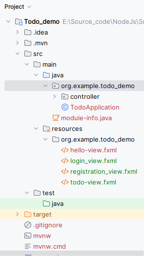
    
</div>


---

Focusing on a detailed implementation of the **Registration Page** in a JavaFX application, we'll step through creating the **UI** with **FXML**, building the controller, and setting up a comprehensive testing strategy for the registration logic.

**`TodoApplication.java`**
```java
import javafx.application.Application;
import javafx.application.Platform;
import javafx.fxml.FXMLLoader;
import javafx.scene.Scene;
import javafx.stage.Stage;
// import org.example.todo_demo.config.Configuration;

import java.io.IOException;

public class TodoApplication extends Application {
    @Override
    public void start(Stage stage) throws IOException {
        Platform.setImplicitExit(false); // Keep application running in background

        FXMLLoader fxmlLoader = new FXMLLoader(TodoApplication.class.getResource("login_view.fxml"));
        Scene scene = new Scene(fxmlLoader.load(), 750, 550);
        stage.setTitle("Todo App");
        stage.setScene(scene);
        stage.show();
    }

    public static void main(String[] args) {
        launch();
    }
}
```

---

**Step 1: Designing the UI with FXML**

`Registration.fxml`

Create an FXML file named `Registration.fxml`. This file will define the user interface for the registration page, including input fields for the `user's name`, `email`, `password`, and a `registration button`.

```xml
<?xml version="1.0" encoding="UTF-8"?>

<?import javafx.scene.control.Button?>
<?import javafx.scene.control.Label?>
<?import javafx.scene.control.PasswordField?>
<?import javafx.scene.control.TextField?>
<?import javafx.scene.layout.AnchorPane?>
<?import javafx.scene.layout.ColumnConstraints?>
<?import javafx.scene.layout.GridPane?>
<?import javafx.scene.layout.RowConstraints?>
<?import javafx.scene.text.Font?>

<AnchorPane prefHeight="400.0" prefWidth="600.0" xmlns="http://javafx.com/javafx/21" xmlns:fx="http://javafx.com/fxml/1" fx:controller="org.example.todo_demo.controller.RegistrationController">
   <children>
      <GridPane layoutX="54.0" layoutY="103.0" prefHeight="113.0" prefWidth="314.0">
        <columnConstraints>
          <ColumnConstraints hgrow="SOMETIMES" maxWidth="150.0" minWidth="10.0" prefWidth="115.0" />
          <ColumnConstraints hgrow="SOMETIMES" maxWidth="195.0" minWidth="10.0" prefWidth="195.0" />
        </columnConstraints>
        <rowConstraints>
          <RowConstraints minHeight="10.0" prefHeight="30.0" vgrow="SOMETIMES" />
          <RowConstraints minHeight="10.0" prefHeight="30.0" vgrow="SOMETIMES" />
          <RowConstraints minHeight="10.0" prefHeight="30.0" vgrow="SOMETIMES" />
            <RowConstraints minHeight="10.0" prefHeight="30.0" vgrow="SOMETIMES" />
        </rowConstraints>
         <children>
            <Label text="Name" />
            <Label text="Email" GridPane.rowIndex="1" />
            <Label text="Password" GridPane.rowIndex="2" />
            <Label text="Confirm Password" GridPane.rowIndex="3" />
            <PasswordField fx:id="passwordField" GridPane.columnIndex="1" GridPane.rowIndex="2" />
            <PasswordField fx:id="confirmPasswordField" prefHeight="43.0" prefWidth="195.0" GridPane.columnIndex="1" GridPane.rowIndex="3" />
            <TextField fx:id="nameField" GridPane.columnIndex="1" />
            <TextField fx:id="emailField" GridPane.columnIndex="1" GridPane.rowIndex="1" />
         </children>
      </GridPane>
      <Button layoutX="122.0" layoutY="237.0" mnemonicParsing="false" prefHeight="25.0" prefWidth="110.0" text="Register"
      onAction="#handleRegistrationAction"/>
      <Label layoutX="61.0" layoutY="21.0" text="Registration Page">
         <font>
            <Font name="Agency FB" size="56.0" />
         </font>
      </Label>
      <Button fx:id="backButton" layoutX="9.0" layoutY="9.0" mnemonicParsing="false" text="Back" onAction="#onBackClickButton"/>
   </children>
</AnchorPane>
```

---

`Login.fxml`

Create an FXML file named `Login.fxml` to define the user interface for the login page, including input fields for the username and password, and a login button.

```xml
<?xml version="1.0" encoding="UTF-8"?>

<?import javafx.scene.control.Button?>
<?import javafx.scene.control.Hyperlink?>
<?import javafx.scene.control.Label?>
<?import javafx.scene.control.PasswordField?>
<?import javafx.scene.control.TextField?>
<?import javafx.scene.layout.AnchorPane?>
<?import javafx.scene.layout.ColumnConstraints?>
<?import javafx.scene.layout.GridPane?>
<?import javafx.scene.layout.RowConstraints?>

<AnchorPane prefHeight="400.0" prefWidth="600.0" xmlns="http://javafx.com/javafx/21" xmlns:fx="http://javafx.com/fxml/1" fx:controller="org.example.todo_demo.controller.LoginController">
   <children>
      <GridPane layoutX="179.0" layoutY="122.0" prefHeight="61.0" prefWidth="500.0">
        <columnConstraints>
          <ColumnConstraints hgrow="SOMETIMES" maxWidth="94.0" minWidth="10.0" prefWidth="23.0" />
          <ColumnConstraints hgrow="SOMETIMES" maxWidth="233.0" minWidth="10.0" prefWidth="233.0" />
        </columnConstraints>
        <rowConstraints>
          <RowConstraints maxHeight="40.0" minHeight="10.0" prefHeight="34.0" vgrow="SOMETIMES" />
          <RowConstraints maxHeight="63.0" minHeight="10.0" prefHeight="27.0" vgrow="SOMETIMES" />
        </rowConstraints>
         <children>
            <Label text="Email" />
            <Label text="Password" GridPane.rowIndex="1" />
            <TextField fx:id="txtUsername" prefHeight="25.0" prefWidth="241.0" GridPane.columnIndex="1" />
            <PasswordField fx:id="txtPassword" GridPane.columnIndex="1" GridPane.rowIndex="1" />
         </children>
      </GridPane>
      <Button layoutX="179.0" layoutY="200.0" mnemonicParsing="false" onAction="#onSignIn" prefHeight="25.0" prefWidth="328.0" text="Sign In" />
      <Hyperlink layoutX="286.0" layoutY="298.0" onAction="#goToRegistrationPage" stylesheets="@hyperlink_stylesheet.css" text="Register" />
      <Label layoutX="338.0" layoutY="301.0" text="|" />
      <Hyperlink layoutX="343.0" layoutY="298.0" text="Forget Password" />
   </children>
</AnchorPane>
```

---

`Todo.fxml`

Create an FXML file named Todo.fxml to define the user interface for the Todo Page. This interface includes a ListView to display todo items, a TextField to enter new todos, and buttons for adding and deleting todos.

```xml
<?xml version="1.0" encoding="UTF-8"?>

<?import javafx.scene.control.Button?>
<?import javafx.scene.control.ComboBox?>
<?import javafx.scene.control.DatePicker?>
<?import javafx.scene.control.Label?>
<?import javafx.scene.control.ListView?>
<?import javafx.scene.control.TextArea?>
<?import javafx.scene.control.TextField?>
<?import javafx.scene.layout.AnchorPane?>
<?import javafx.scene.layout.ColumnConstraints?>
<?import javafx.scene.layout.GridPane?>
<?import javafx.scene.layout.HBox?>
<?import javafx.scene.layout.RowConstraints?>
<?import javafx.scene.text.Font?>

<AnchorPane prefHeight="642.0" prefWidth="656.0" xmlns="http://javafx.com/javafx/21" xmlns:fx="http://javafx.com/fxml/1" fx:controller="org.example.todo_demo.controller.TodoViewController">
   <children>
      <ListView fx:id="myListView" layoutY="343.0" prefHeight="300.0" prefWidth="656.0" AnchorPane.bottomAnchor="-1.0" AnchorPane.leftAnchor="0.0" AnchorPane.rightAnchor="0.0" AnchorPane.topAnchor="343.0" />
      <Label layoutX="271.0" layoutY="14.0" text="Todo" textAlignment="CENTER">
         <font>
            <Font name="System Bold" size="24.0" />
         </font>
      </Label>
      <HBox alignment="center" spacing="10" />
      <GridPane layoutX="74.0" layoutY="44.0" prefHeight="232.0" prefWidth="539.0">
        <columnConstraints>
          <ColumnConstraints hgrow="SOMETIMES" maxWidth="195.0" minWidth="10.0" prefWidth="72.0" />
          <ColumnConstraints hgrow="SOMETIMES" maxWidth="467.0" minWidth="10.0" prefWidth="467.0" />
        </columnConstraints>
        <rowConstraints>
          <RowConstraints maxHeight="38.0" minHeight="10.0" prefHeight="25.0" vgrow="SOMETIMES" />
          <RowConstraints maxHeight="61.0" minHeight="10.0" prefHeight="33.0" vgrow="SOMETIMES" />
          <RowConstraints maxHeight="60.0" minHeight="10.0" prefHeight="27.0" vgrow="SOMETIMES" />
            <RowConstraints maxHeight="138.0" minHeight="10.0" prefHeight="138.0" vgrow="SOMETIMES" />
        </rowConstraints>
         <children>
            <HBox prefHeight="100.0" prefWidth="200.0" GridPane.columnIndex="1" GridPane.rowIndex="2">
               <children>
                  <Label text="Hour: " />
                  <ComboBox fx:id="hourComboBox" prefWidth="70" />
                  <Label text="              " />
                  <Label text="Minute: " />
                  <ComboBox fx:id="minuteComboBox" prefWidth="70" />
               </children>
            </HBox>
            <DatePicker fx:id="datePicker" GridPane.columnIndex="1" GridPane.rowIndex="1" />
            <TextField GridPane.columnIndex="1" />
            <Label text="Title:" />
            <Label text="Day" GridPane.rowIndex="1" />
            <Label text="Time:" GridPane.rowIndex="2" />
            <TextArea prefHeight="138.0" prefWidth="467.0" GridPane.columnIndex="1" GridPane.rowIndex="3" />
            <Label text="Description:" GridPane.rowIndex="3" />
         </children>
      </GridPane>
      <Button layoutX="194.0" layoutY="293.0" mnemonicParsing="false" prefHeight="39.0" prefWidth="344.0" text="Add New Task">
         <font>
            <Font size="18.0" />
         </font>
      </Button>
      <Button fx:id="logoutButton" layoutX="597.0" layoutY="2.0" mnemonicParsing="false" text="Logout" onAction="#onlogout" />
   </children>

</AnchorPane>
```

---

**Step 2: Working in the LoginController**
The LoginController class handles user input for login actions and navigates to the Todo app upon successful authentication.

***Key Components: (关键组件)***

***TextField Inputs (文本字段输入):*** Fields to capture the username and password.
***Login Method (登录方法):*** Validates the entered credentials.
***Navigation Method (导航方法):*** Transitions the user to the Todo app interface upon successful login.

`controller/LoginController.java`

```java
// package your.package;

import javafx.event.ActionEvent;
import javafx.fxml.FXML;
import javafx.scene.control.PasswordField;
import javafx.scene.control.TextField;

public class LoginController {
    
    @FXML
    private TextField txtUsername; // 用户名输入字段 (Input field for the username)
    @FXML
    private TextField txtPassword; // 密码输入字段 (Input field for the password)

    // 点击登录按钮时处理登录的方法 (Method to handle login when the Sign In button is clicked)
    @FXML
    protected void onSignIn(ActionEvent actionEvent) {
        // 验证用户名和密码是否正确 (Check if the username and password are correct)
        if (!authenticateUser(txtUsername.getText(), txtPassword.getText())) {
            // 如果不正确，显示错误信息 (If incorrect, display an error message)
            return;
        }

        // 如果正确，进入待办事项应用 (If correct, proceed to the Todo app)
        try {
            navigateToTodoApp();
        } catch (IOException e) {
            e.printStackTrace();
        }
    }

    // 将场景更改为待办事项应用的方法 (Method to change the scene to the Todo app)
    private void navigateToTodoApp() throws IOException {
        try {
            // Go to Registration
        } catch (IOException e) {
            e.printStackTrace(); // Handle the exception as appropriate for your application
        }
    }


    // 用于检查登录凭据的辅助方法 (Helper method to check login credentials)
    private boolean authenticateUser(String username, String password) {
        // return userService.login(username, password);
    }
    
}
```


---

**Step 3: Working in the RegistrationController**
The RegistrationController class handles user input and manages the registration process.

***Key Components: (关键组件)***

***TextField and PasswordField Inputs (文本字段和密码字段输入):*** For entering user details such as `name`, `email`, and `passwords`.
***Registration Method (注册方法):*** Handles form submissions and validates input data.

`controller/RegistrationController.java`

```java
// package your.package;

import javafx.event.ActionEvent;
import javafx.fxml.FXML;
import javafx.fxml.FXMLLoader;
import javafx.scene.Parent;
import javafx.scene.Scene;
import javafx.scene.control.Button;
import javafx.scene.control.PasswordField;
import javafx.scene.control.TextField;
import javafx.stage.Stage;
import org.example.todo_demo.services.UserService;
import org.example.todo_demo.utils.AlertMessages;

import java.io.IOException;
import java.util.regex.Matcher;
import java.util.regex.Pattern;


public class RegistrationController {
    
     @FXML
    private TextField nameField; // Input field for user's name - 用户名输入字段
    @FXML
    private TextField emailField; // Input field for user's email - 用户邮箱输入字段
    @FXML
    private PasswordField passwordField; // Input field for user's password - 用户密码输入字段
    @FXML
    private PasswordField confirmPasswordField; // Input field for confirming user's password - 确认密码输入字段

    @FXML
    private Button backButton; // Button to navigate back - 返回按钮

    // Event handler for back button to return to login page - 返回按钮的事件处理，返回登录页面
    public void onBackClickButton(ActionEvent actionEvent) throws IOException {
        // Implementation
    }

    // Handles registration form submission - 处理注册表单提交
    @FXML
    protected void handleRegistrationAction(ActionEvent event) {
        String name = nameField.getText();
        String email = emailField.getText();
        String password = passwordField.getText();
        String confirmPassword = confirmPasswordField.getText();
        
        RegistrationResult result = attemptRegistration(name, email, password, confirmPassword);

    }

    // Encapsulates the registration logic - 封装注册逻辑
    protected RegistrationResult attemptRegistration(String name, String email, String password, String confirmPassword) {
    
    }
    
    // Validates the email format - 验证电子邮件格式
     private boolean isValidEmail(String email) {
        /*
        ^: Start of the string.
           [A-Za-z0-9+_.-]+: Matches one or more characters that are alphanumeric (A-Za-z0-9), plus (+), underscore (_), dot (.), or hyphen (-). This part is intended to match the user name part of the email address before the @ symbol.
           @: Matches the @ symbol itself, which is a required character in email addresses.
           [A-Za-z0-9.-]+: Matches one or more characters that are alphanumeric (A-Za-z0-9), dot (.), or hyphen (-). This part is intended to match the domain part of the email address after the @ symbol. It can match domains like example.com or subdomains like sub.example.com.
           $: End of the string.
         */
     }

     // Validates the password complexity - 验证密码复杂度
      private boolean isValidPassword(String password) {
        /*
        ^: Start of string.
        (?=.*[0-9]): At least one digit.
        (?=.*[a-z]): Ensures that there is at least one lowercase letter (not explicitly required by your rules but generally considered a good practice for password security).
        (?=.*[A-Z]): At least one uppercase letter.
        (?=.*[@#$%^&+=]): At least one special character from the set specified.
        (?=\\S+$): No whitespace allowed in the entire string.
        .{8,24}$: Between 8 to 24 characters.
         */
      }
}
```

---

**Step 4. Working in the TodoController**
The TodoViewController class manages the tasks on the Todo page, facilitating task addition, modification, and display.


***Key Components: (关键组件)***

***UI Elements (UI元素):*** Includes `DatePicker`, `ComboBoxes`, `TextField`, `TextArea`, and `Buttons` for interactive task management.
***ListView Display (ListView显示):*** Shows the list of tasks dynamically.
***Event Handling (事件处理):*** Manages actions like adding tasks and logging out.

`controller/TodoViewController.java`

```java
// package your.package;

import javafx.collections.FXCollections;
import javafx.collections.ObservableList;
import javafx.fxml.FXML;
import javafx.scene.control.ListView;
import javafx.scene.control.TextField;
import javafx.scene.control.DatePicker;
import javafx.scene.control.ComboBox;
import javafx.scene.control.TextArea;
import javafx.scene.control.Button;
import javafx.scene.input.MouseEvent;
import javafx.event.ActionEvent;

import java.io.IOException;

public class TodoViewController {

    @FXML
    private DatePicker datePicker;  // DatePicker for selecting the date - 用于选择日期的DatePicker
    @FXML
    private ComboBox<Integer> hourComboBox;  // ComboBox for selecting the hour - 用于选择小时的ComboBox
    @FXML
    private ComboBox<Integer> minuteComboBox;  // ComboBox for selecting the minute - 用于选择分钟的ComboBox
    @FXML
    private TextField txtTitleField;  // TextField for entering the title of the task - 输入任务标题的TextField
    @FXML
    private TextArea descriptionTextArea;  // TextArea for entering the description of the task - 输入任务描述的TextArea
    @FXML
    private Button addTaskButton;  // Button to add a new task - 添加新任务的按钮
    @FXML
    private Button logoutButton;  // Button for logging out - 登出按钮
    @FXML
    private ListView<Todo> myListView;  // ListView for displaying tasks - 显示任务的ListView

    @FXML
    public void initialize() {
        // Populate hours from 0 to 23 - 从0到23填充小时
        for (int hour = 0; hour < 24; hour++) {
            hourComboBox.getItems().add(hour);
        }

        // Populate minutes from 0 to 59 - 从0到59填充分钟
        for (int minute = 0; minute < 60; minute++) {
            minuteComboBox.getItems().add(minute);
        }

        // Set default selections for hour and minute - 设置小时和分钟的默认选择
        hourComboBox.getSelectionModel().select(0); // default to 00 - 默认为00
        minuteComboBox.getSelectionModel().select(0); // default to 00 - 默认为00

        // Setup an event listener for list selection to handle clicks - 设置列表选择的事件监听器以处理点击
    }

    private void handleTodoTaskClicked(MouseEvent event) {
        // Get the selected item from the list - 从列表中获取选定的项
        // Perform actions based on the selected item - 根据选定的项执行操作
    }

    @FXML
    public void onLogout(ActionEvent actionEvent) throws IOException {
        // Close the current window and show the login view - 关闭当前窗口并显示登录视图
    }

    @FXML
    public void onAddNewTask(ActionEvent actionEvent) {
        // Collect user input and add a new task - 收集用户输入并添加新任务
        // Optionally, save the new task to a local database or a server - 可选地，将新任务保存到本地数据库或服务器
        // Clear form fields after task addition - 添加任务后清除表单字段
    }
}
```

---

**Step 5: Adding Functionalities to Different Classes**

This step focuses on integrating and expanding functionalities within the application's controller classes. The implementation details are highlighted below, including specific functionalities for login and alert systems.

<div style="text-align: center;">
    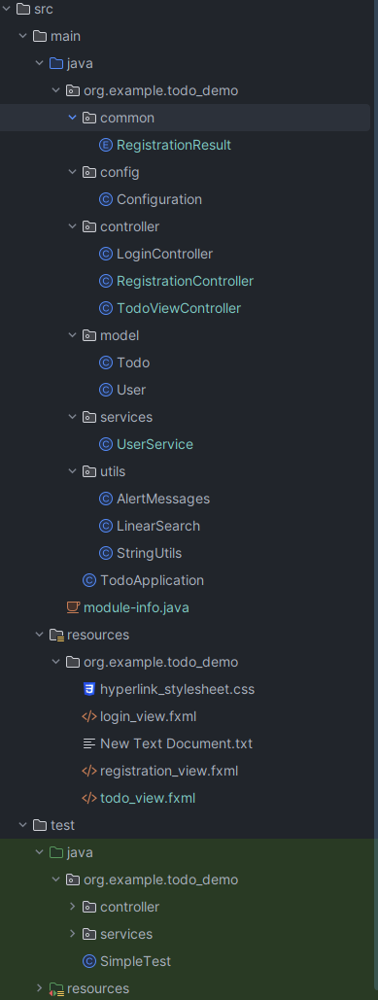
</div>

**Step 5. Enhancing the LoginController**
The `LoginController` manages the authentication process. 
- It uses methods from the `UserService` to validate user credentials and navigates to the main application upon successful login.


***Key Functionalities:***

***Authentication (认证):*** Validates user credentials.
***Navigation (导航):*** Transitions to the Todo application on successful login.
***Error Handling (错误处理):*** Displays error messages for failed logins.


```java
// Imports the necessary JavaFX and application classes

// ... 
import org.example.todo_demo.services.UserService;
import org.example.todo_demo.utils.AlertMessages;

import java.io.IOException;

public class LoginController {

    // ... Previous implementation
    // Above is the base setup for the controller. Continue from here to add or modify the code as needed.
    // 上面是控制器的基础设置。从这里开始根据需要添加或修改代码。
  

    // UserService to manage user data
    private UserService userService = new UserService();

    // 点击登录按钮时处理登录的方法 (Method to handle login when the Sign In button is clicked)
    @FXML
    protected void onSignIn(ActionEvent actionEvent) {
        // 验证用户名和密码是否正确 (Check if the username and password are correct)
        if (!authenticateUser(txtUsername.getText(), txtPassword.getText())) {
            // 如果不正确，显示错误信息 (If incorrect, display an error message)
            AlertMessages.showErrorToUser("Login Failed", "Incorrect username or password.");
            return;
        }
        // 如果正确，进入待办事项应用 (If correct, proceed to the Todo app)
        try {
            navigateToTodoApp();
        } catch (IOException e) {
            e.printStackTrace();
        }
    }

    // 用于检查登录凭据的辅助方法 (Helper method to check login credentials)
    private boolean authenticateUser(String username, String password) {
        return userService.login(username, password);
    }

    // 将场景更改为待办事项应用的方法 (Method to change the scene to the Todo app)
    private void navigateToTodoApp() throws IOException {
        Stage loginStage = getCurrentStage(); // 获取当前窗口 (Get the current window)
        loginStage.hide(); // 隐藏当前窗口 (Hide the current window)

        Parent root = loadTodoView(); // 加载待办事项应用视图 (Load the Todo app view)
        Scene todoScene = new Scene(root, 800, 600); // 设置场景大小 (Set the scene size)
        Stage todoStage = createStage(todoScene, "Todo App"); // 为待办事项应用创建一个新窗口 (Create a new window for the Todo app)
        todoStage.show(); // 显示待办事项应用窗口 (Show the Todo app window)
    }

    // 获取当前舞台（窗口）的实用方法 (Utility method to get the current stage (window))
    private Stage getCurrentStage() {
        return (Stage) txtUsername.getScene().getWindow();
    }

    // 从FXML文件加载视图的实用方法 (Utility method to load the view from an FXML file)
    private Parent loadTodoView() throws IOException {
        FXMLLoader loader = new FXMLLoader(getClass().getResource("/org/example/todo_demo/todo_view.fxml"));
        return loader.load();
    }

    // 使用给定的场景和标题创建新舞台（窗口）的实用方法 (Utility method to create a new stage (window) with the given scene and title)
    private Stage createStage(Scene scene, String title) {
        Stage stage = new Stage();
        stage.setScene(scene);
        stage.setTitle(title);
        return stage;
    }
}
```


---

**Alert Messages Utility**

The AlertMessages class provides utility methods to display user-friendly error messages using JavaFX components (AlertMessages 类提供使用 JavaFX 组件显示用户友好错误消息的实用方法). 
- This is particularly useful for showing errors or important notifications (这对于显示错误或重要通知特别有用).

***Key Functionality:***

***Error Display (显示错误):*** Shows a more user-friendly error using JavaFX components.

***AlertMessages.java***

```java
// package org.example.todo_demo.utils;

import javafx.scene.control.Alert;

public class AlertMessages {
    // Show a more user-friendly error using JavaFX components, like Alert
    // 使用 JavaFX 组件显示更友好的错误信息，比如 Alert
    public static void showErrorToUser(String title, String message) {
        Alert alert = new Alert(Alert.AlertType.ERROR); // Create an error type alert 创建一个错误类型的警告
        alert.setTitle(title); // Set the alert title 设置警告标题
        alert.setHeaderText(null); // Do not set header text 不设置头部文本
        alert.setContentText(message); // Set the message content to display 设置要显示的消息内容
        alert.showAndWait(); // Display the alert and wait for user response 显示警告并等待用户响应
    }
}
```

---

**User Service Implementation**

UserService Class

This class manages user registration and login processes. (这个类管理用户注册和登录过程)
- It provides methods to check user credentials and to register new users. 它提供了检查用户凭证和注册新用户的方法。

***Key Functionalities:***

***User Registration (用户注册):*** Registers new users, ensuring data persistence.
***Credential Validation (凭证验证):*** Validates user login credentials.

***UserService.java***

```java
public class UserService {
    
    // Constructor - 构造函数
    public UserService() {}

    // Register a new user - 注册新用户
    public boolean registerUser(String name, String email, String password) {
        // Implementation should store user data in a persistent storage
        // 实现应该将用户数据存储在持久存储中
        return true; // Return true to indicate successful registration
        // 返回true表示注册成功
    }

    // Validate login credentials - 验证登录凭证
    public boolean login(String email, String password) {
        // Check if the email and password are correct
        // 检查电子邮件和密码是否正确
        return "user@example.com".equals(email) && "Password$123".equals(password);
        // 返回值为true表示邮箱和密码匹配
    }
}
```

---

Step 6: Enhancing the RegistrationController

The RegistrationController handles user input for registration and interacts with the UserService to register new users based on provided credentials.

Key Functionalities:

User Registration (用户注册): Handles the logic for registering new users.
Input Validation (输入验证): Ensures that user inputs meet specific criteria before submission.

```java
// ...
import org.example.todo_demo.model.User;
import org.example.todo_demo.services.UserService;
import org.example.todo_demo.utils.AlertMessages;

import java.io.IOException;
import java.util.regex.Matcher;
import java.util.regex.Pattern;

public class RegistrationController {

    // ... Previous implementation
    // Above is the base setup for the controller. Continue from here to add or modify the code as needed.
    // 上面是控制器的基础设置。从这里开始根据需要添加或修改代码。

    @FXML
    private Button backButton;

    // UserService instance - 用户服务实例
    private UserService userService = new UserService();

    public void onBackClickButton(ActionEvent actionEvent) throws IOException {
        backToLoginPage();
    }

    public void backToLoginPage() throws IOException {
        // Hide or close the current todo app window - 隐藏或关闭当前待办应用窗口
        Stage todoStage = (Stage) backButton.getScene().getWindow();
        todoStage.close();

        // Load and show the login view - 加载并显示登录视图
        FXMLLoader loader = new FXMLLoader(getClass().getResource("/org/example/todo_demo/login_view.fxml"));
        Parent root = loader.load();
        Scene scene = new Scene(root);
        Stage loginStage = new Stage();
        loginStage.setScene(scene);
        loginStage.setTitle("Login");
        loginStage.show();
    }

    @FXML
    public void handleRegistrationAction(ActionEvent actionEvent) throws IOException {
        // ... Previous implementation
        // Continue coding from here for additional registration logic - 从这里继续编写额外的注册逻辑
    
        RegistrationResult result = attemptRegistration(name, email, password, confirmPassword);

        switch (result) {
            case SUCCESS:
                backToLoginPage();
                break;
            case PASSWORD_MISMATCH:
            case REGISTRATION_FAILED:
                AlertMessages.showErrorToUser("Registration", "Registration Failed");
                break;
        }
    }

    // Encapsulates the registration logic - 封装注册逻辑
    protected RegistrationResult attemptRegistration(String name, String email, String password, String confirmPassword) {
        if (!password.equals(confirmPassword)) {
            return RegistrationResult.PASSWORD_MISMATCH;
        }

        if (isValidEmail(email) && isValidPassword(password) && !name.isEmpty() && userService.registerUser(name, email, password)) {
            return RegistrationResult.SUCCESS;
        } else {
            return RegistrationResult.REGISTRATION_FAILED;
        }
    }

    // Validate email format - 验证电子邮件格式
    protected boolean isValidEmail(String email) {
        String emailRegex = "^[A-Za-z0-9+_.-]+@[A-Za-z0-9.-]+$";
        Pattern emailPart = Pattern.compile(emailRegex, Pattern.CASE_INSENSITIVE);
        Matcher matcher = emailPart.matcher(email);

        return matcher.find();
    }

    // Validate password complexity - 验证密码复杂度
    protected boolean isValidPassword(String password) {
        String passwordRegex = "^(?=.*[0-9])(?=.*[a-z])(?=.*[A-Z])(?=.*[@#$%^&+=])(?=\\S+$).{6,24}$";
        Pattern passwordPat = Pattern.compile(passwordRegex);
        Matcher matcher = passwordPat.matcher(password);

        return matcher.matches();
    }
}
```


---

**common/RegistrationResult.java**

This enum defines the potential outcomes of a registration attempt.

```java
// package org.example.todo_demo.common;

// Enum to represent possible outcomes of the registration attempt 
// 用于表示注册尝试可能的结果的枚举
public enum RegistrationResult {
    SUCCESS,               // Registration was successful - 注册成功
    PASSWORD_MISMATCH,     // Passwords provided did not match - 提供的密码不匹配
    REGISTRATION_FAILED    // Registration failed due to other reasons - 因其他原因注册失败
}
```

---

**Step 7: Implementing the TodoController**

The TodoController manages tasks, including adding, updating, and deleting items, and interfaces with UI elements to provide a dynamic user experience.


The Todo model represents tasks in the system with attributes such as title, description, date, and time.

***model/Todo.java*** 

```java
import java.time.LocalDate;
import java.time.LocalTime;

public class Todo {
    private String title; // 任务标题 - The title of the todo item
    private String description; // 任务描述 - The description of the todo item
    private LocalDate date; // 任务日期 - The date of the todo item
    private LocalTime time; // 任务时间 - The time of the todo item

    // Constructor - 构造器
    public Todo(String title, String description, LocalDate date, LocalTime time) {
        this.title = title;
        this.description = description;
        this.date = date;
        this.time = time;
    }

    // Getters and setters - 获取器和设置器
    public String getTitle() {
        return title;
    }

    public void setTitle(String title) {
        this.title = title;
    }

    public String getDescription() {
        return description;
    }

    public void setDescription(String description) {
        this.description = description;
    }

    public String getDate() {
        return date.toString();
    }

    public void setDate(LocalDate date) {
        this.date = date;
    }

    public String getTime() {
        return time.toString();
    }

    public void setTime(LocalTime time) {
        this.time = time;
    }

    // `toString()` method to display Todo attributes - `toString()` 方法用来显示待办事项的属性
    @Override
    public String toString() {
        return title + " - " + date.toString() + " " + time.toString();
    }
}
```

---


***Key Functionalities:***

***Task Management (任务管理):*** Handles adding, updating, and removing tasks.
***Event Handling (事件处理):*** Manages user interactions with the task list.

`controller/TodoViewController.java`

```java
// package your.package;

// ...

public class TodoViewController {

    // continue ...

    @FXML
    public void initialize() {
        
        // continue ...

        // Setup click listener - 设置点击监听器
        myListView.setOnMouseClicked(event -> handleTodoTaskClicked(event));
    }

    private void handleTodoTaskClicked(MouseEvent event) {
        // Get the selected item - 获取选中的项目
        Todo selectedItem = myListView.getSelectionModel().getSelectedItem();
        if (selectedItem != null) {
            // Perform your actions here with the selected item - 在这里对选中的项目执行操作
            System.out.println("Clicked on " + selectedItem);
        }
    }

    @FXML
    public void onLogout(ActionEvent actionEvent) throws IOException {
        // Hide or close the current todo app window - 隐藏或关闭当前的待办事项应用窗口
        Stage todoStage = (Stage) logoutButton.getScene().getWindow();
        todoStage.close();

        // Load and show the login view - 加载并显示登录视图
        FXMLLoader loader = new FXMLLoader(getClass().getResource("/org/example/todo_demo/login_view.fxml"));
        Parent root = loader.load();
        Scene scene = new Scene(root);
        Stage loginStage = new Stage();

        loginStage.setScene(scene);
        loginStage.setTitle("Login");
        loginStage.show();
    }

    public void onAddNewTask(ActionEvent actionEvent) {
        String title = txtTitleField.getText();
        String description = descriptionTextArea.getText();
        LocalDate date = datePicker.getValue();
        LocalTime time = LocalTime.of(Integer.parseInt(
            String.valueOf(hourComboBox.getValue())),
                Integer.parseInt(String.valueOf(minuteComboBox.getValue())));

        // New Todo object - 新建待办事项对象
        Todo newTodo = new Todo(title, description, date, time);
        // Adding to the listview - 添加到列表视图
        myListView.getItems().add(newTodo);

        // Add to local Database - 添加到本地数据库

        // Send to the server - 发送到服务器

        // Clear the form fields after adding - 添加后清除表单字段
        txtTitleField.clear();
        descriptionTextArea.clear();
        datePicker.setValue(null);
        hourComboBox.getSelectionModel().clearSelection();
        minuteComboBox.getSelectionModel().clearSelection();
    }
}
```

---

### 4. JUnit Testing Techniques

#### 4.1 Testing with Assertions

**During execution of a test case**:
> - If an assertion is `true`, 
> - - Execution continues
> - If any assertion is `false`, 
> - - Execution of the test case stops
> - - The test case ***fails***
> - If an **unexpected** exception is encountered, 
> - - The verdict of the test case is an ***error***.
> - If all assertions were true, 
> - - The test case ***passes***.
 
---
> - **Basic Assertions:** Test simple conditions. Use `assertEquals`, `assertTrue`, `assertFalse`, and `assertNull`.

- Assert two objects are equal:
```java
assertEquals(expected, actual)
```

> **True** if: `expected.equals(actual)`
Relies on the equals() method

With a failure message  
```java
assertEquals(message, expected, actual)
```

- Assert a Boolean condition is true or false
```java
assertTrue(condition)
assertFalse(condition)
```

- Optionally, include a failure message   
```java
assertTrue(condition, message)
assertFalse(condition, message)
```
   
***Examples***
```java
assertEquals(4, calculator.add(2, 2), "Optional failure message");

assertTrue(search(a, 3) == 1);
assertFalse(search(a, 2) >= 0, “Failure: 2 is not in array.”);

assertTrue('a' < 'b', () -> "Assertion messages can be lazily evaluated 
-- to avoid constructing complex messages unnecessarily.");

assertEquals("Should be equal.", "JUnit", "JUnit");

assertEquals("Should be equal.", "JUnit", "Java");
```


***Output***
```java
org.junit.ComparisonFailure: 
Should be equal. expected:<J[Unit]> but was:<J[ava]>
```

***How to fix the error ?***

---

- Assert an object references is `null` or `non-null`

```java
assertNull(object)
assertNotNull(object)
```
- With a failure message  

```java
assertNull(object, message)
assertNotNull(object, message)
```

***Examples***
```java 
assertNotNull(”Should not be null.", new Object());
assertNull(”Should be null.", null);
```


---

> - **Grouped Assertions:** Execute a group of assertions together, reporting any failures collectively after all assertions are executed.

```java
import static org.junit.jupiter.api.Assertions.assertAll;

assertAll("Multiple assertions",
    () -> assertEquals(4, calculator.multiply(2, 2)),
    () -> assertEquals(0, calculator.divide(1, 0), "Division by zero should result in zero")
);
```

---


> - **Method Assertions:** Object Identity

- Assert two object references are identical

```java
assertSame(expected, actual)
```
- ***True*** if: expected == actual

```java
assertNotSame(expected, actual)
```
- ***True*** if: expected != actual

> - The order does not affect the comparison, 
    > But, affects the message when it ***fails***  

- With a failure message  
```java
assertSame(expected, actual, message)
assertNotSame(expected, actual, message)
```

***Examples***
```java
assertNotSame(new Object(), new Object(), "Should not be same.");

Integer num1 = Integer.valueOf(2013);
assertSame(num1, num1, "Should be same.");

Integer num2 = Integer.valueOf(2014);
assertSame( num1, num2, "Should be same.");
```

***Output***
> java.lang.AssertionError:
Should be same. expected same:<2013> was not:<2014>

***Then how to fix the error?***


---

> - **Equality of Arrays Assertions:** Test that the two arrays are equal.
- Assert two arrays are equal:
```java
assertArrayEquals(expected, actual)
```
> Note: arrays must have same length

- Recursively check for each valid index i,
```java
assertEquals(expected[i],actual[i])
// or
assertArrayEquals(expected,actual)
```
- With a failure message  
```java
assertArrayEquals(message, expected, actual)
```

***Examples***
```java
int[] a1 = { 2, 3, 5, 7 };   
int[] a2 = { 2, 3, 5, 7 };   
assertArrayEquals(a1, a2, "Should be equal");
			
int[][] a11 = { { 2, 3 }, { 5, 7 }, { 11, 13 } };   
int[][] a12 = { { 2, 3 }, { 5, 7 }, { 11, 13 } };    
assertArrayEquals(a11, a12, "Should be equal");
```


---

> - **Floating Point Values**

- For comparing floating point values (`double` or `float`)
`assertEquals` requires an additional parameter ***delta***.
```java
assertEquals(expected, actual, delta)
assertEquals(expected, actual, delta, message)
```
- The assertion evaluates to true if 
	`Math.abs( expected – actual ) <= delta`

**Example:**
```java
double d1 = 100.0, d2 = 99.99995;  
assertEquals(d1, d2, 0.0001, "Should be equal within delta.");

assertEquals(2.0, 2.0009, 0.0001, "Hello");
```

***Test Result***
```java
org.opentest4j.AssertionFailedError:
```

***How to fix the error?***
```java


```

--- 

#### 4.2 Testing Exceptions
JUnit 5 provides the assertThrows method to assert that execution of a particular code snippet throws a specific exception.

> - **Exception Assertions:** Test that your code throws an expected exception.

***Example 1***
```java
public static int checkedSearch(int[] a, int x) {
  if (a == null || a.length == 0)
    throw new IllegalArgumentException("Null or empty array.");
  // …
}
```

`checkedSearch(null, 1);`


> The verdict
***Pass:*** if the expected exception is ***thrown***
***Fail:*** if no exception, or an unexpected exception

- ssertion methods
```java
fail()
fail(message)
```
- Unconditional failure
i.e., it always fails if it is executed
- Used in where it should not be reached
e.g., after a statement, in which an exception should have been thrown.  


Catch exceptions, and use `fail()` if `not thrown`

***Example 2***

```java
@Test
public void testCheckedSearch3() {
  try {
	checkedSearch(null, 1);
	fail("Exception should have occurred");
  } catch (IllegalArgumentException e) {
	assertEquals(e.getMessage(), "Null or empty array.");
  }
}
```

- Allows 
  - inspecting specific messages/details of the exception
  - distinguishing different types of exceptions

It ensures that your code not only throws an exception when expected but also fails the test when no exception is thrown, thereby alerting you to potential issues in your exception handling logic.
它确保了您的代码不仅在预期时抛出异常，而且在没有抛出异常时也会使测试失败，从而提醒您可能存在的异常处理逻辑问题。

----


> - **Basic Exception Testing:**

***Example 3***

```java
import static org.junit.jupiter.api.Assertions.assertThrows;

@Test
void whenDivideByZero_thenThrowArithmeticException() {
    Calculator calculator = new Calculator();
    assertThrows(ArithmeticException.class, () -> calculator.divide(1, 0));
}
```

---

> - **Asserting Exception Details:** Beyond simply testing for the presence of an exception, you can capture the exception and assert details about it.

***Example 4***

```java
@Test
void whenDivideByZero_thenThrowExceptionWithSpecificMessage() {
    Calculator calculator = new Calculator();
    Exception exception = assertThrows(ArithmeticException.class, () -> calculator.divide(1, 0));
    assertEquals("/ by zero", exception.getMessage());
}
```


---

> - **Timeout Assertions:** Ensure that your code completes within a specified time.

***Example 5***

```java
import static org.junit.jupiter.api.Assertions.assertTimeout;

assertTimeout(Duration.ofMillis(100), () -> {
    // Perform task that should not take more than 100 ms
});
```


---

### 5. Hands-on Practice

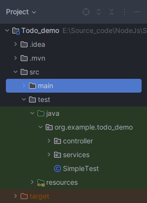


When developing a Todo application with functionalities like login, registration, and **CRUD** operations for todo items, adopting a strategic approach to testing is crucial. Here, we focus on techniques applicable to a Todo application, employing **boundary value analysis (BVA)**, **White box testing**, and **decision tables** to ensure comprehensive coverage.

> ***Equivalent Partitioning (EP)***: This testing technique divides input data into partitions of equivalent data from which test cases can be derived.

> ***Boundary Value Analysis (BVA)***: Use BVA for validating input fields like email address, password, and optional fields that have length requirements or specific formats (e.g., date fields).

> ***White Box Testing:*** Inspect the validation logic for each field. Test that the system correctly handles both valid registrations and detects invalid data (such as invalid email formats, too short/long passwords).

> ***Decision Tables:*** Use decision tables to cover different combinations of valid and invalid inputs across all registration fields. This helps ensure that your application correctly processes registrations, rejects invalid data, and provides useful feedback to the user.

---

#### 5.1 Equivalent Partitioning (EP)

To create a test case for the `authenticateUser` method in the `LoginController`, we can use the technique of Equivalence Partitioning. For the authenticateUser method, input equivalence can be considered in terms of `valid` and `invalid` credentials.

**Objective:** To ensure that authenticateUser correctly authenticates a user based on the validity of provided credentials.
**Method:** Input combinations for username and password will be derived based on their validity.
**Expected Results:** The method should return true for valid credentials and false for invalid credentials.

**Generating Test Cases:**
For authenticateUser, two main equivalence classes can be considered:

**Valid Credentials:** Username and password combinations that are known to be correct.
**Invalid Credentials:** Username and password combinations that are incorrect.

```java
// Validate login credentials - 验证登录凭证
public boolean login(String email, String password) {
    // Check if the email and password are correct
    // 检查电子邮件和密码是否正确
    return "user@example.com".equals(email) && "Password$123".equals(password);
    // 返回值为true表示邮箱和密码匹配
}
```

**Test Case Table for authenticateUser**
|Test Case ID|	username | password|	Expected Output|	
|------------|-----| ---|----------------|
|TC1	| "user@example.com" | "Password$123"	|	True |	
|TC2	|"user@wrong.com" | "Password$123" |	False	|
|TC3	|"user@example.com" |  "wrongPassword" |	False	|
|TC4	|"invalid@example.com"  | "123456"	| False|


```java
import static org.junit.jupiter.api.Assertions.assertFalse;
import static org.junit.jupiter.api.Assertions.assertTrue;
import org.junit.jupiter.api.Test;

class LoginControllerTest {

    @Test // 使用有效的凭据测试用户认证 - Test user authentication with valid credentials
    void testAuthenticateUserWithValidCredentials() {
        LoginController controller = new LoginController();
        assertTrue(controller.authenticateUser("user@example.com", "Password$123"),
                   "Authentication should succeed with correct credentials."); // 应当在凭据正确时成功认证
    }

    @Test // 使用无效用户名测试用户认证 - Test user authentication with an invalid username
    void testAuthenticateUserWithInvalidUsername() {
        LoginController controller = new LoginController();
        assertFalse(controller.authenticateUser("user@wrong.com", "Password$123"),
                    "Authentication should fail with incorrect username."); // 应当在用户名不正确时认证失败
    }

    @Test // 使用无效密码测试用户认证 - Test user authentication with an invalid password
    void testAuthenticateUserWithInvalidPassword() {
        LoginController controller = new LoginController();
        assertFalse(controller.authenticateUser("user@example.com", "wrongPassword"),
                    "Authentication should fail with incorrect password."); // 应当在密码不正确时认证失败
    }

    @Test // 使用无效用户名和密码测试用户认证 - Test user authentication with both an invalid username and password
    void testAuthenticateUserWithInvalidUsernamePassword() {
        LoginController controller = new LoginController();
        assertFalse(controller.authenticateUser("invalid@example.co", "123456"),
                    "Authentication should fail with incorrect username & password."); // 应当在用户名和密码均不正确时认证失败
    }
}
```

---


#### 5.2 White Box Testing for Input Validation

For the `attemptRegistration` method in the RegistrationController, we apply White Box Testing to assess its internal logic and validate that each conditional branch behaves as expected. 
- The primary focus is on ensuring that different branches of the method react correctly to the various combinations of input values.

**Method Overview:**
The `attemptRegistration` method checks multiple conditions:
1. Password match.
2. Email validity.
3. Password validity.
4. Non-empty name field.
5. Successful registration into the system (simulated by the registerUser method).

**Objective:** To thoroughly test all branches and ensure the method handles all expected and edge cases correctly.

**Cyclomatic Complexity:** Based on the conditions, the cyclomatic complexity is calculated as follows:

> 1 for the method entry.
4 additional for the conditional checks (if statements).
Total Complexity V(G) = 1 (method entry) + 4 (conditions) = 5 paths.

***Generating Test Cases Using White Box Testing:***
We derive test cases to cover each path and decision outcome within the `attemptRegistration` method.

***Test Case Table for attemptRegistration:***

|Test Case ID|	Name|	Email	|Password	|Confirm Password|	Expected Result|
|------------|-------|-------|-----------|-------------------|---------------------------------|
|TC1	| Lee |	lee@example.com	| Pass$1234|	Pass$1234 |	SUCCESS	All |
|TC2	| Lee |	lee@example.com|	Pass$1234|	Pass1234	|PASSWORD_MISMATCH|
|TC3	| Lee |	lee@example|	Pass$1234	|Pass$1234	|REGISTRATION_FAILED|
|TC4	| Lee |	lee@example.com|	password	| password |	REGISTRATION_FAILED|
|TC5	|	  |lee@example.com|	Pass$1234|	Pass$1234	| REGISTRATION_FAILED|

**JUnit Test Code for attemptRegistration:**
```java
Copy code
import static org.junit.jupiter.api.Assertions.assertEquals;
import org.junit.jupiter.api.Test;

class RegistrationControllerTest {

    @Test
    void testValidRegistration() {
        RegistrationController controller = new RegistrationController();
        RegistrationResult result = controller.attemptRegistration("Lee", "lee@example.com", "Pass$1234", "Pass$1234");
        assertEquals(RegistrationResult.SUCCESS, result, "Registration should succeed with correct and matching credentials.");
    }

    @Test
    void testRegistrationWithPasswordMismatch() {
        RegistrationController controller = new RegistrationController();
        RegistrationResult result = controller.attemptRegistration("Lee", "lee@example.com", "Pass$1234", "Pass1234");
        assertEquals(RegistrationResult.PASSWORD_MISMATCH, result, "Registration should fail due to password mismatch.");
    }

    @Test
    void testRegistrationWithInvalidEmail() {
        RegistrationController controller = new RegistrationController();
        RegistrationResult result = controller.attemptRegistration("Lee", "lee@example.com", "Pass$1234", "Pass$1234");
        assertEquals(RegistrationResult.REGISTRATION_FAILED, result, "Registration should fail due to invalid email.");
    }

    @Test
    void testRegistrationWithInvalidPassword() {
        RegistrationController controller = new RegistrationController();
        RegistrationResult result = controller.attemptRegistration("Lee", "lee@example.com", "password", "password");
        assertEquals(RegistrationResult.REGISTRATION_FAILED, result, "Registration should fail due to invalid password.");
    }

    @Test
    void testRegistrationWithEmptyName() {
        RegistrationController controller = new RegistrationController();
        RegistrationResult result = controller.attemptRegistration("", "john@example.com", "Pass$1234", "Pass$1234");
        assertEquals(RegistrationResult.REGISTRATION_FAILED, result, "Registration should fail due to empty name field.");
    }
}
```
These tests comprehensively cover each path determined by the cyclomatic complexity, ensuring that all branches and conditions within the `attemptRegistration` method are **validated** against expected behaviors and input validations.

---

#### 5.3 Boundary Value Analysis (BVA) for Password Length
Boundary Value Analysis is an effective testing technique that involves selecting input values at the boundaries of input domains. For a password feature in the registration or login process, assuming valid passwords are required to be between 6 and 16 characters:

- **Test Cases:**
> - **Just below the lower boundary:** Use a 5-character password to ensure it's rejected.
> - **At the lower boundary:** Use an 6-character password to ensure it's accepted.
> - **Just above the lower boundary:** Use a 7-character password to confirm acceptance.
> - **Just below the upper boundary:** Use a 15-character password to confirm acceptance.
> - **At the upper boundary:** Use a 16-character password to ensure it's accepted.
> - **Just above the upper boundary:** Use a 17-character password to ensure it's rejected.

|Test Case|	Password Length	|Expected Result|
|---------|----------------|---------------|
|Just below lower boundary|	5 characters|	Fail|
|At lower boundary|	6 characters|	Pass|
|Just above lower boundary|	7 characters|	Pass|
|Just below upper boundary|	15 characters|	Pass|
|At upper boundary|	16 characters|	Pass|
|Just above upper boundary|	17 characters|	Fail|

**Simple JUnit Test Without Parameterization**
```java
public class RegistrationControllerTest {
    private final RegistrationController registrationController = 
        new RegistrationController() ;

    @Test
    void testPasswordJustBelowLowerBoundary() {
        // This should fail because it's too short and doesn't meet other criteria
        assertFalse(registrationController.isValidPassword("Aa@5"));
    }

    @Test
    void testPasswordAtLowerBoundary() {
        // This meets all criteria, including length
        assertTrue(registrationController.isValidPassword("Aa@12345"));
    }

    @Test
    void testPasswordJustAboveLowerBoundary() {
        // This meets all criteria, including length
        assertTrue(registrationController.isValidPassword("Aa@123456"));
    }

    @Test
    void testPasswordJustBelowUpperBoundary() {
        // Construct a password that's 23 characters long and meets all criteria
        assertTrue(registrationController.isValidPassword("Aa@1234567890123456789"));
    }

    @Test
    void testPasswordAtUpperBoundary() {
        // Construct a password that's 24 characters long and meets all criteria
        assertTrue(registrationController.isValidPassword("Aa@12345678901234567890"));
    }

    @Test
    void testPasswordJustAboveUpperBoundary() {
        // This should fail because it's too long
        assertFalse(registrationController.isValidPassword("Aa@12345678901234567890a1"));
    }
}
```

---


#### 5.4 Using Decision Tables for Username and Password Validation
Decision tables are excellent for scenarios where the outcome depends on a combination of conditions. For validating usernames and passwords, a decision table can cover various combinations:

> **Conditions**:
> - C1: Username is not empty.
> - C2: Username exists in the database.
> - C3: Password is valid (meets length and character requirements).
> - C4: Password matches the database for the user.

> **Actions**:
> - A1: Allow login.
> - A2: Reject login.

You then outline rules (R1, R2, ...) that define which conditions lead to which actions. For example, only when C1, C2, C3, and C4 are true (R1) should A1 (allow login) be the outcome.

|Rule	|C1: Username & Password not empty |C2: Username exists	|C3: Password valid	|C4: Password matches	|Action|
|---|-----|-----|---|--|--------|
|R1|	True|	True|	True|	True|	A1: Allow login|
|R2	|False|	-|	-|	-|	A2: Reject login|
|R3|	True|	False|	-|	-|	A2: Reject login|
|R4	|True|	True	|False	|-|	A2: Reject login|
|R5	|True	|True	|True|	False|	A2: Reject login|

Implementing Tests in JUnit
Parameterized Tests for decision table scenario ensure efficient coverage over various input combinations. Here’s an example structure for a parameterized test using decision tables:

```java
import static org.junit.jupiter.api.Assertions.assertFalse;
import static org.junit.jupiter.api.Assertions.assertTrue;
import org.junit.jupiter.api.Test;

class LoginServiceTest {

    private static UserService service = new UserService(); // Assume this service handles login logic

    @Test
    void testAllowLogin() {
        // R1: All conditions are true
        assertTrue(service.login("example@yahoo.com", "Password123@"),
                "Should allow login when username exists, password is valid, and matches.");
    }

    @Test
    void testRejectLoginEmptyUsername() {
        // R2: Username not empty is false
        assertFalse(service.login("", "Password123@"),
                "Should reject login when username is empty.");
    }

    @Test
    void testRejectLoginUsernameDoesNotExist() {
        // R3: Username exists in the database is false
        assertFalse(service.login("example$yahoo.com", "password123@"),
                "Should reject login when username does not exist.");
    }

    @Test
    void testRejectLoginInvalidPassword() {
        // R4: Password valid is false
        assertFalse(service.login("example@yahoo.com", "pard1@"),
                "Should reject login when password is invalid.");
    }

    @Test
    void testRejectLoginPasswordDoesNotMatch() {
        // R5: Password matches the database for the user is false
        assertFalse(service.login("validUser", "wrongPassword"),
                "Should reject login when password does not match.");
    }
}
```

---

**Class Activity**

For input validation, like ensuring a password contains at least one uppercase letter and one special character, you understand and test the internal logic.

> **Example:** For a method `isValidPassword` that validates password criteria:
> - **Test for at least one uppercase letter:** Provide a password with and without an uppercase letter and assert the expected outcome.
> - **Test for at least one special character:** Provide passwords that do and do not contain a special character to test the validation logic.

```java


```

---

**Homework**

Finish implementing the jUnit vode for the remaining methods.

---

***Conclusion***
Adopting strategic testing techniques such as BVA, white box testing, and decision tables provides a structured approach to ensuring the robustness and reliability of a Todo application. By carefully designing test cases around these strategies, you can achieve comprehensive coverage, effectively catching potential issues before they impact users. Implementing these tests in JUnit, especially with the support for parameterized tests, allows for thorough and efficient validation of application logic.

---


### 6. Effective Use of JUnit Annotations
JUnit 5 introduces several annotations that can enhance your testing framework, making your tests more readable, manageable, and efficient. Understanding and utilizing these annotations effectively can significantly improve your test suites.

---

#### 6.1 Using @Disabled to Skip Tests
- `@Disabled`: If you want to temporarily disable a test case (this might come up if you have test cases for parts of your program that aren’t fully implemented yet, for instance), you can do so by putting `@Disabled` above `@Test`.

When running tests, ***JUnit*** will distinguish between tests that ***pass***, tests that ***fail*** due to an `assertion`, tests that ***fail*** due to an `unexpected` and `uncaught exception`, and ***tests*** that were `ignored`.

```java
import static org.junit.jupiter.api.Assertions.*;

import org.junit.jupiter.api.Disabled ;
import org.junit.jupiter.api.Test ;

public class IgnoredTestClass {
      @Test
       public void basicTest () {
            assertFalse (false , " false is false ");
       }
    
       @Disabled
       @Test
        public void ignoredTest () {
               fail (" ignore me");
        }
}
```

---


#### 6.2 JUnit Test Fixtures
- The context in which a test case is executed.
- Typically include:
- - Common objects or resources that are available for use by any test case.
- Activities to manage these objects 
- - ***Set-up:*** object and resource allocation
- - ***Tear-down:*** object and resource de-allocation

---

##### 6.2.1. Set-Up

Tasks that must be done prior to each test case

***Examples:***  
- Create some objects to work with
- Open a network connection
- Open a file to read/write 

##### 6.2.2. Tear-Down
Tasks to clean up after execution of each test case. 
- Ensures 
    - Resources are released
    - The system is in a known state for the next test case
- Clean up should not be done at the end of a test case,
    - since a failure ends execution of a test case at that point


---

##### 6.2.3. Method Annotations for Set-Up and Tear-Down

- `@BeforeEach` annotation: ***setup*** 
    - Code to run before each test case. 
    - It's used for **setting up test conditions or initializing objects** that are required by each test method.

- `@AfterEach`: annotation: ***teardown*** 
    - Code to run after each test case. 
    - will run regardless of the verdict, even if exceptions are thrown in the test case or an assertion fails.
    - This annotation is typically used for **cleanup activities**, ensuring that changes made by one test method do not affect others.

- Multiple annotations are allowed
    - All methods annotated with `@BeforeEach` will be run before each test case
    - But no guarantee of execution order

---

```java
public class OutputTest {
    private File output; 

    @BeforeEach
    public void createOutputFile() { 
    output = new File(...);
    }

    @AfterEach
    public void deleteOutputFile() {
        output.close(); 
        output.delete();		
    }
    @Test 
    public void test1WithFile() {
    // code for test case 
    …
    } 

    @Test 
    public void test2WithFile() {
    // code for test case 
    …
    }
}  
```

    **Method Execution Order**
    1. createOutputFile()
    2. test1WithFile()		
    3. deleteOutputFile()
    4. createOutputFile()
    5. test2WithFile()
    6. deleteOutputFile()

    > Not guaranteed: 
    `test1WithFile` runs before `test2WithFile` 

---

- `@BeforeAll` annotation on a `static` method
    - one method only
    - Run the method once only for the entire test class
        - before any of the tests, and 
        - before any `@BeforeEach` method(s)
    - It's ideal for expensive setup tasks that need to run only once, ***like initializing a database connection***. 

    ```java
    @BeforeAll 
    public static void anyName() {
        // class setup code here
    }
    ```

---

- `@AfterAll` annotation on a static method
    - one method only
    - Run the method once only for the entire test class
        - after any of the tests
        - after any @AfterEach method(s)
    - Useful for stopping servers, closing connections, etc.
    ```java
    @AfterAll 
    public static void anyName() {
        // class clean up code here
    }
    ```

---
 - `@Timeout`: Timed Tests

- Useful for simple performance test
    -  Network communication
    - Complex computation
- The `@Timeout` annotation
    - Time unit defaults to seconds but is configurable

```java
@Test
@Timeout(5)
public void testLengthyOperation() {
        ...
} 
```

- The test fails
    - if ***timeout*** occurs before the test method completes 


---

JUnit 5 Unit Testing Framework Summary

| Annotation | Description |
|------------|-------------|
|`@Test` </br>`public void method()` |  The annotation @Test identifies that a method is a test method.| 
|`@BeforeEach` </br> `public void method()` | Will execute the method before each test. Can prepare the test environment (e.g. read input data, initialize the class). |
| `@AfterEach` </br> `public void method()` | Will execute the method after each test. Can cleanup the test environment (e.g. delete temporary data, restore defaults). |
| `@BeforeAll` </br> `public void method()` | Will execute the method once, before the start of all tests. Can be used to perform time intensive activities, for example to connect to a database. |
|`@AfterAll` </br> `public void method()` | Will execute the method once, after all tests have finished. Can be used to perform clean-up activities, for example to disconnect from a database. |
|`@Timeout(5)`| Fails if the method takes longer than 5 seconds. |
| `@Timeout(value = 100, unit = TimeUnit.MILLISECONDS)`| Fails if the method takes longer than 100 milliseconds |

---

###### 6.2.3.1. Hands-on Practice Using JUnit Annotations for a Cleaner Approach

we can use JUnit's `@BeforeEach` annotation to refactor our setup process, making our test code cleaner and reducing repetition.

```java
import org.junit.jupiter.api.BeforeEach;
import org.junit.jupiter.api.Test;
import static org.junit.jupiter.api.Assertions.*;

public class UserServiceTest {

    private UserService userService;

    @BeforeEach
    public void setUp() {
        userService = new UserService(); // Initialize UserService before each test
    }

    // Include test methods here as defined in the simple example above
}
```

---

```java
import org.junit.jupiter.api.BeforeAll;
import org.junit.jupiter.api.BeforeEach;
import org.junit.jupiter.api.Test;

import static org.junit.jupiter.api.Assertions.assertFalse;
import static org.junit.jupiter.api.Assertions.assertTrue;

public class RegistrationControllerTest {
    private static RegistrationController registrationController;

    @BeforeAll
    static void setUp(){
        registrationController = new RegistrationController();
        System.out.println("Before all called");
    }

    // The rest of the method will be the same
}
```
---

```java
import static org.junit.jupiter.api.Assertions.assertTrue;
import static org.junit.jupiter.api.Assertions.assertFalse;

import org.junit.jupiter.api.AfterEach;
import org.junit.jupiter.api.BeforeAll;
import org.junit.jupiter.api.BeforeEach;
import org.junit.jupiter.api.Test;

public class UserServiceTest {
    private static UserService userService;

    @BeforeAll
    static void setUp() {
        // userService = UserService.getInstance();
        userService = new UserService();
        System.out.println("BeforeAll is called");
    }

    @AfterEach
    void testingBeforeEach() {
        userService = null;
        System.out.println("After Each is called");
    }

    @BeforeEach
    void testingAfterEach() {
        userService = UserService.getInstance();
        System.out.println("Before Each is called");
    }

    @Test
    void testPasswordJustBelowLowerBoundary() {
        assertTrue(userService.registerUser("John Doe", "john@example.com", "12345"));
    }

    @Test
    void testPasswordAtLowerBoundary() {
        assertFalse(userService.registerUser("John Doe", "john@example.com", "123456"));
    }
}
```


---

***Output***
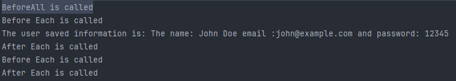

---


##### 6.2.4. Parameterized Tests

- Repeat a test case multiple times with different data 
- Define a parameterized test
    - Declared just like regular `@Test` methods but use the `@ParameterizedTest` annotation instead
    - Must declare at least one **source** that will provide the arguments for each invocation 
    - Consume the arguments in the test method
    - It's used in conjunction with sources like `@ValueSource`, `@CsvSource`, or `@MethodSource` to run the same test with different parameters.

***Example***
```java
@ParameterizedTest
@ValueSource(strings = { "racecar", "radar", "able was I ere I saw elba" })
void palindromes(String candidate) {
    assertTrue(StringUtils.isPalindrome(candidate));
}
```

---

For a more advanced and efficient approach, we utilize JUnit's parameterized tests to run the same test logic with multiple inputs, significantly reducing code duplication.

###### 6.2.4.1. Using `@CsvSource`
The `@CsvSource` annotation allows you to define your test data directly within your test class as an array of strings. Each string represents a row of CSV data, and each comma separates the columns in that row.

Here's how you could refactor the previous example to use `@CsvSource`:


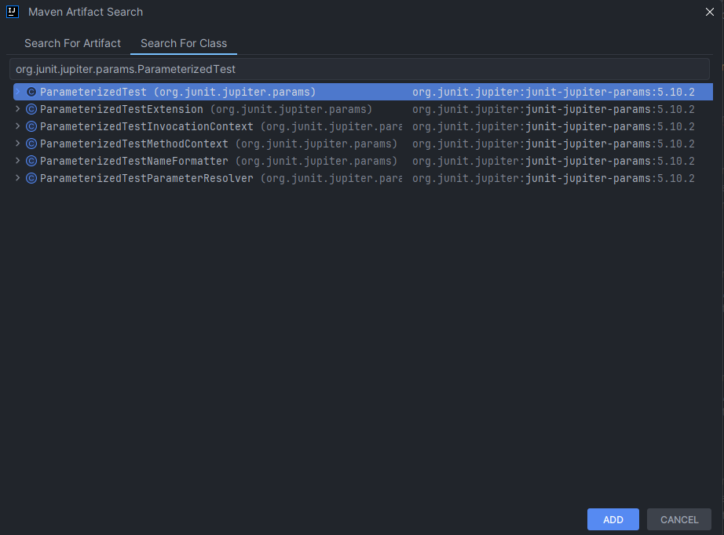


```java
import org.junit.jupiter.params.ParameterizedTest;
import org.junit.jupiter.params.provider.CsvSource;
import org.junit.jupiter.api.Assertions;

public class RegistrationControllerTest {

    private static RegistrationController registrationController;
    
    @BeforeAll
    static void setUp(){
        registrationController = new RegistrationController();
        System.out.println("Before all called");
    }

    @ParameterizedTest
    @CsvSource({
            "Aa@5, false", // Just below lower boundary
            "Aa@12345, true", // At lower boundary
            "Aa@123456, true", // Just above lower boundary
            "Aa@1234567890123456789, true", // Just below upper boundary
            "Aa@12345678901234567890, true", // At upper boundary
            "Aa@Aa@12345678901234567890a1, false" // Just above upper boundary
    })
    void testPasswordValidation(String password, boolean expectedOutcome) {
        Assertions.assertEquals(expectedOutcome, registrationController.isValidPassword(password),
                "Failed for password: " + password);
    }

}
```

---

```java
import org.junit.jupiter.params.ParameterizedTest;
import org.junit.jupiter.params.provider.MethodSource;
import static org.junit.jupiter.api.Assertions.assertEquals;

public class UserServiceTest {

    private static Stream<Arguments> providePasswordTestCases() {
        return Stream.of(
            Arguments.of("12345", false),
            Arguments.of("123456", true),
            Arguments.of("1234567", true),
            Arguments.of("123456789012345", true),
            Arguments.of("1234567890123456", true),
            Arguments.of("12345678901234567", false)
        );
    }

    @ParameterizedTest
    @MethodSource("providePasswordTestCases")
    public void testPasswordValidation(String password, boolean expectedResult) {
        UserService userService = new UserService();
        assertEquals(expectedResult, userService.registerUser("user", "user@example.com", password));
    }
}
```

---

---

###### 6.2.4.2. Using `@CsvFileSource`
Alternatively, if you have a large number of test cases or prefer to keep your test data separate from your test code, ``@CsvFileSource` allows you to load test data from a ***CSV*** file located in your resources folder.

First, create a CSV file in `src/test/resources` (assuming a standard Maven or Gradle project structure). Let's call it passwordTestData.csv, with the following content:

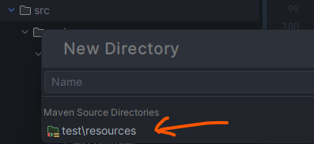

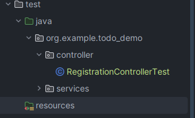

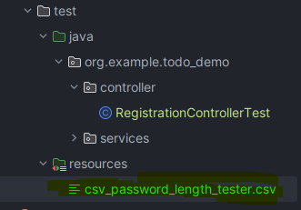

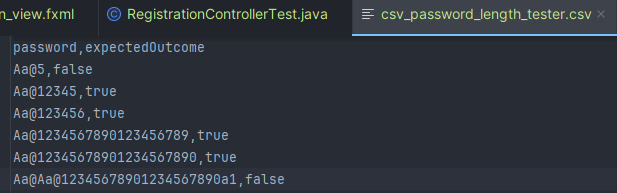

---

```java
import org.junit.jupiter.params.ParameterizedTest;
import org.junit.jupiter.params.provider.CsvFileSource;

public class RegistrationControllerTest {
    private static RegistrationController registrationController;
    @BeforeAll
    static void setUp(){
        registrationController = new RegistrationController();
        System.out.println("Before all called");
    }

    @ParameterizedTest
    @CsvFileSource(resources = "/csv_password_length_tester.csv", numLinesToSkip = 1) // Skip header row
    void testPasswordValidation(String password, boolean expectedOutcome) {
        Assertions.assertEquals(expectedOutcome, registrationController.isValidPassword(password),
                "Failed for password: " + password);
    }
}
```


---


> **Additional Useful Annotations**: 
> - `@Nested`: Allows grouping of tests within a test class into nested classes, facilitating better organization of complex test suites.
> - `@Tag`: Used for tagging tests, which can then be included or excluded in test runs based on their tags. This is especially useful in CI/CD pipelines for running different sets of tests for different environments or contexts.
> - `@RepeatedTest`: Indicates that a method is a test template for a repeated test. It's used when you want to run the same test multiple times.
> - `@TestFactory`: Indicates that a method is a test factory for dynamic tests. Dynamic tests are tests that are generated at runtime by a factory method.


---

**Step 5: Writing Test Cases for the Registration Logic**
Now, let's focus on how to test the registration logic using JUnit 5. The registerUser method checks that none of the fields are empty and that the password is at least 8 characters long.

3.2.1 Unit Testing registerUser Method

`RegistrationControllerTest.java`

We'll create a test class named RegistrationControllerTest. This class will contain test methods to verify the registration logic under various conditions.

```java
// package your.package;

import org.junit.jupiter.api.BeforeEach;
import org.junit.jupiter.api.Test;
import static org.junit.jupiter.api.Assertions.*;

class RegistrationControllerTest {

    private RegistrationController controller;

    @BeforeEach
    void setUp() {
        controller = new RegistrationController();
    }

    @Test
    void testRegisterUserWithValidData() {
        assertTrue(controller.registerUser("John Doe", "john@example.com", "password123"),
                   "Registration should succeed with valid data.");
    }

    @Test
    void testRegisterUserWithEmptyName() {
        assertFalse(controller.registerUser("", "john@example.com", "password123"),
                    "Registration should fail with an empty name.");
    }

    @Test
    void testRegisterUserWithShortPassword() {
        assertFalse(controller.registerUser("John Doe", "john@example.com", "pass"),
                    "Registration should fail with a password shorter than 8 characters.");
    }

    // Additional tests can be added to cover more cases, such as invalid email formats.
}
```

***Parameterized Testing***
For more comprehensive testing, especially to cover various input combinations efficiently, you can use JUnit 5's parameterized tests. Here's how you might extend the testing to cover multiple scenarios using @ParameterizedTest.

```java
import org.junit.jupiter.params.ParameterizedTest;
import org.junit.jupiter.params.provider.CsvSource;

class RegistrationControllerTest {

    private RegistrationController controller = new RegistrationController();

    @ParameterizedTest
    @CsvSource({
        "Lee, lee@example.com, password123, true",
        ", lee@example.com, password123, false",
        "Lee, , password123, false",
        "Lee, lee@example.com, pass, false"
    })
    void testRegisterUser(String name, String email, String password, boolean expectedOutcome) {
        assertEquals(expectedOutcome, controller.registerUser(name, email, password),
                     "Registration validation failed.");
    }
}
```


**Step 3: Writing Test Cases for the Login Logic**
Testing the authenticateUser method is crucial to ensure that only valid users can access the application.

***Unit Testing authenticateUser Method***
LoginControllerTest.java

Create a test class named LoginControllerTest for verifying the login functionality.

```java
// package your.package;

import org.junit.jupiter.api.BeforeEach;
import org.junit.jupiter.api.Test;
import static org.junit.jupiter.api.Assertions.*;

class LoginControllerTest {

    private LoginController controller;

    @BeforeEach
    void setUp() {
        controller = new LoginController();
    }

    @Test
    void testAuthenticateUserWithValidCredentials() {
        assertTrue(controller.authenticateUser("admin", "password"),
                   "Authentication should succeed with valid credentials.");
    }

    @Test
    void testAuthenticateUserWithInvalidUsername() {
        assertFalse(controller.authenticateUser("wrongUser", "password"),
                    "Authentication should fail with an invalid username.");
    }

    @Test
    void testAuthenticateUserWithInvalidPassword() {
        assertFalse(controller.authenticateUser("admin", "wrongPassword"),
                    "Authentication should fail with an invalid password.");
    }
}
```

***Parameterized Testing for Login***
Leverage parameterized tests to cover a broader range of input scenarios for the login logic efficiently.

```java
import org.junit.jupiter.params.ParameterizedTest;
import org.junit.jupiter.params.provider.CsvSource;

class LoginControllerTest {

    private LoginController controller = new LoginController();

    @ParameterizedTest
    @CsvSource({
        "admin, password, true",
        "admin, wrongPassword, false",
        "wrongUser, password, false",
        "admin, , false",
        ", password, false"
    })
    void testAuthenticateUser(String username, String password, boolean expectedOutcome) {
        assertEquals(expectedOutcome, controller.authenticateUser(username, password),
                     "Authentication validation failed.");
    }
}
```

Moving forward to the Todo Page in our JavaFX application, we'll illustrate how to design the UI with FXML, implement the functionality with a controller, and discuss testing strategies for the ***CRUD*** operations of todo items using JUnit 5. The Todo Page allows users to add, view, update, and delete todo items.

**Writing Test Cases for Todo Operations**
Testing the Todo Page functionality involves verifying that todo items can be added and deleted as expected. However, testing UI controllers directly in JUnit can be complex due to the need for initializing JavaFX components. Here, we focus on testing the logic behind adding and deleting todos, assuming these methods are made accessible (e.g., package-private or public for testing) or refactored into a separate testable class.

***Unit Testing Todo Operations***

`TodoControllerTest.java`

Create a test class named TodoControllerTest. This class will contain methods to test adding and deleting todo items.

```java
package your.package;

import org.junit.jupiter.api.BeforeEach;
import org.junit.jupiter.api.Test;
import static org.junit.jupiter.api.Assertions.*;

class TodoControllerTest {

    private TodoController controller;

    @BeforeEach
    void setUp() {
        controller = new TodoController();
        controller.initialize(); // Manually initialize to setup the todoItems list
    }

    @Test
    void testAddTodoItem() {
        controller.todoInputField.setText("New Todo");
        controller.handleAddTodoAction();
        assertFalse(controller.todoItems.isEmpty(), "Todo list should not be empty after adding an item.");
    }

    @Test
    void testDeleteTodoItem() {
        // Setup - Add an item first
        controller.todoInputField.setText("Todo to Delete");
        controller.handleAddTodoAction();
        
        // Select the item to delete
        controller.todoListView.getSelectionModel().select(0);
        controller.handleDeleteTodoAction();
        assertTrue(controller.todoItems.isEmpty(), "Todo list should be empty after deleting the item.");
    }
}
```


### 7. Data-Driven Testing (DDT) in JUnit
Data-Driven Testing (DDT) is a testing paradigm where the test logic is separated from the input and output data. It enables the execution of test cases with sets of data values that are externalized from the test itself. JUnit 5 supports DDT through its @ParameterizedTest annotation and various sources of input data, facilitating the execution of a single test method with different inputs. This approach enhances test coverage and efficiency, particularly for validating a range of conditions and inputs.

#### 7.1 Introduction to DDT
DDT is particularly useful in scenarios where the logic under test behaves differently based on various inputs. By externalizing input values (and possibly expected outcomes), tests can be made more readable and maintainable. Additionally, adding new test cases often doesn't require changes to the test code but merely the addition of new data sets.

#### 7.2 Parameterized Tests with JUnit 5
JUnit 5 introduces several annotations to support parameterized tests, allowing a single test method to be executed multiple times with different parameters. Here’s how to use some of the most common sources:

- Using `@ValueSource`: Provides a simple way to specify a single array of literal values.
```java
@ParameterizedTest
@ValueSource(strings = {"Hello", "JUnit"})
void withValueSource(String argument) {
    assertNotNull(argument);
}
```

- Using @CsvSource and @CsvFileSource: Allows specifying parameter sets as comma-separated values. @CsvSource takes strings directly, while @CsvFileSource reads from CSV files.

```java
@ParameterizedTest
@CsvSource({"1, true", "2, true", "3, false"})
void withCsvSource(int number, boolean expected) {
    assertEquals(expected, number < 3);
}
```

```java
@ParameterizedTest
@CsvFileSource(resources = "/input.csv", numLinesToSkip = 1)
void withCsvFileSource(int number, boolean expected) {
    assertEquals(expected, number < 3);
}
```

- Using @MethodSource: Enables you to specify a method that provides the parameters, allowing for more complex scenarios and data types.

```java
@ParameterizedTest
@MethodSource("stringProvider")
void withMethodSource(String argument) {
    assertNotNull(argument);
}

static Stream<String> stringProvider() {
    return Stream.of("apple", "banana");
}
```

#### 7.3 Advantages of Data-Driven Testing
DDT offers several benefits:

Efficiency: Write once, test multiple times. DDT reduces the amount of code needed for multiple test cases.
Coverage: Easily achieve high test coverage by covering a wide range of input combinations.
Maintenance: Adding new test cases usually involves just adding new data sets without modifying the test code.
Readability: Tests can be simpler and focus on the logic being tested rather than the intricacies of generating test data.

Adding okhttp & gson dependencies

```xml
<dependency>
    <groupId>com.squareup.okhttp3</groupId>
    <artifactId>okhttp</artifactId>
    <version>4.9.0</version>
</dependency>

<dependency>
    <groupId>com.fasterxml.jackson.core</groupId>
    <artifactId>jackson-databind</artifactId>
    <version>2.14.2</version>
</dependency>
```


## 8. Integrating

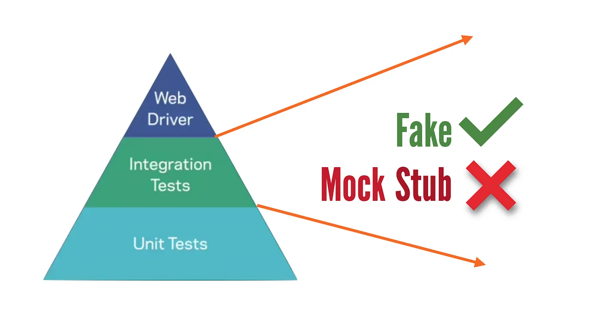

## 8.1 Test Doubles (Mocks, Mockinto Stubs and Fakes)

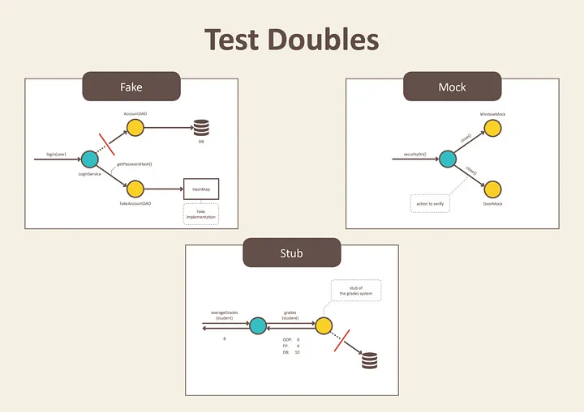

- Unit testing - smallest piece 
- Integrating testing 
  - assembles pieces into larger unit


--- 
### 8.2 Fake

Fakes are objects that have working implementations, but not same as production one. Usually they take some shortcut and have simplified version of production code.


- An example of this shortcut, can be an ***in-memory*** implementation of **Data Access Object (DAO)** or **Repository**. 
    - This fake implementation **will not** engage database, but will use a **simple collection** to store data. 
        - This allows us to do integration test of services without starting up a database and performing time consuming requests.


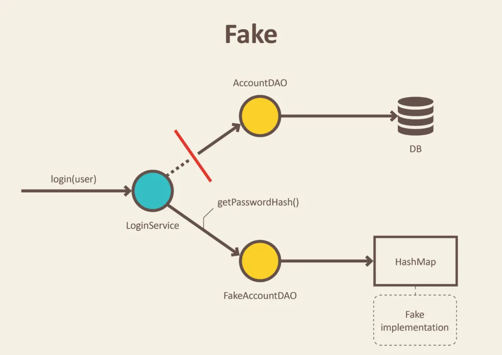

---

```JAVA
public class FakeAccountRepository implements AccountRepository {
       
       Map<User, Account> accounts = new HashMap<>();
       
       public FakeAccountRepository() {
              this.accounts.put(new User("john@bmail.com"), new UserAccount());
              this.accounts.put(new User("boby@bmail.com"), new AdminAccount());
       }
       
       String getPasswordHash(User user) {
              return accounts.get(user).getPasswordHash();
       }
}
```

---


Apart from testing, fake implementation can come handy for prototyping and spikes.
 - We can quickly implement and run our system with in-memory store, deferring decisions about database design. 
    - Another example can be also a ***fake payment system***, that will always return ***successful payments***.

---
```java
public class UserService {
    private final Map<String, User> users = new HashMap<>();

    // Singleton
    private static UserService instance;
    
    public UserService() {}

    public static synchronized UserService getInstance() {
        if (instance == null) {
            instance = new UserService();
        }
        return instance;
    }
    // Singleton Finished

    // Register a new user
    public boolean registerUser(String name, String email, String password) {
        // Check if user already exists
        if (users.containsKey(email)) {
            // User already exists
            return false;
        }

        // Create and store the new user
        User newUser = new User(name, email, password);
        // TODO: ONLY USE IT IN DEVELOPMENT
        System.out.println("The user saved information is: " + newUser.toString());
        users.put(email, newUser);
        return true;
    }

    // Validate login credentials
    public boolean login(String email, String password) {
        User user = users.get(email);
        // TODO: ONLY USE IT IN DEVELOPMENT
        System.out.println("correct email: " + user.getEmail() + " | user prompt email: " +email);
        if (user != null && user.getPassword().equals(password)) {
            return true; // Login successful
        }
        return false; // Login failed
    }
}
```


---
***Impelementation of model/User.java*** Model
```java
public class User {

    private String name;
    private String email;
    private String password;

    // Constructor
    public User(String name, String email, String password) {
        this.name =  name;
        this.email = email;
        this.password = password;
    }

    public String getName() {
        return name;
    }

    public void setName(String name) {
        this.name = name;
    }

    public String getEmail() {
        return email;
    }

    public void setEmail(String email) {
        this.email = email;
    }

    public String getPassword() {
        return password;
    }

    public void setPassword(String password) {
        this.password = password;
    }
    @Override
    public String toString() {
        return "The name: "+ this.name + " email :"+ this.email + " and password: " + this.password;
    }
}
```

---

### 8.3 Stub
Stub is an object that holds predefined data and uses it to answer calls during tests. 
- It is used when we cannot or don’t want to involve objects that would answer with real data or have undesirable side effects.

> An example can be an object that needs to grab some data from the database to respond to a method call. 
    - Instead of the real object, we introduced a ***stub*** and **defined what data should be returned**.


---

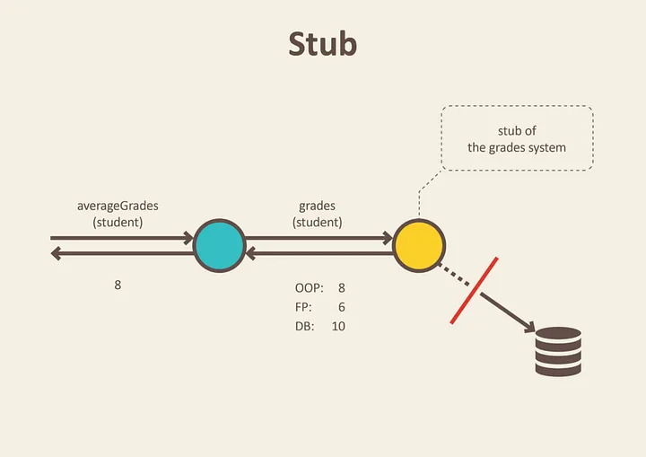

---


```java
public class GradesService {
    private final Gradebook gradebook;
    
    public GradesService(Gradebook gradebook) {
        this.gradebook = gradebook;
    }
    
    Double averageGrades(Student student) {
        return average(gradebook.gradesFor(student));
    }
}
```


Instead of calling database from **Gradebook** store to get real students grades, we preconfigure stub with grades that will be returned. We define just enough data to test average calculation algorithm.

```java
public class GradesServiceTest {
    private Student student;
    private Gradebook gradebook;

    @Before
    public void setUp() throws Exception {
        gradebook = mock(Gradebook.class);
        student = new Student();
    }

    @Test
    public void calculates_grades_average_for_student() {
        when(gradebook.gradesFor(student)).thenReturn(grades(8, 6, 10)); //stubbing gradebook
        double averageGrades = new GradesService(gradebook).averageGrades(student);
        assertThat(averageGrades).isEqualTo(8.0);
    }
}
```

---

#### 8.4 Mock

Mocks are ***objects that register calls*** they receive.
- In test assertion we can verify on Mocks that all expected actions were performed.

Why mocks? 
- What if that method depends on other things?
  - a network? a database? a servlet engine?
  - Other parts of the system? - We don't want to initialize lots of components just to get the right context for one test to run.

    - **Solution:** Using Mocks / Test doubles


#### 8.4.1. When we need mocks? 
- The real object has non-deterministic behavior (smt random, unpredictable)
  - The real object is difficult to set up 
  - The real object has behavior that is hard to trigger a network error..
  - The real object is slow
  - The real object has (or is) a user interface 
  - The test needs to ask the real object about how it was used (e.g. check to see that log message is actually logged by the object under test) 
  - The real object does not exist a common problem when interfacing

> An example can be a functionality that calls ***e-mail*** sending service.
- We don’t want to send e-mails each time we run a test. Moreover, it is not easy to verify in tests that a right email was send. 
- Only thing we can do is to verify the outputs of the functionality that is exercised in our test. In other worlds, verify that e-mail sending service was called.


---

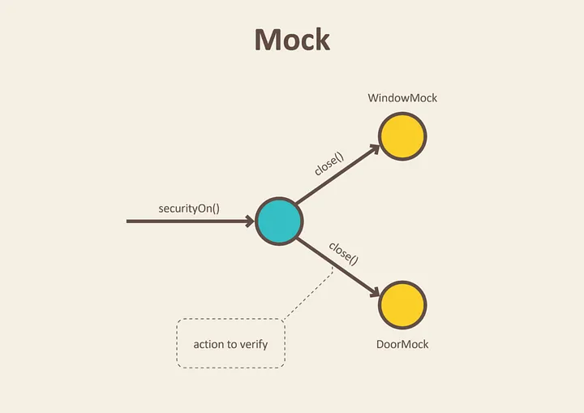

---

- Junit provide assertion over object state.
- Interaction testing
    - Did my controller correctly called my service?
  
> - **Given:** object will result in such way.
> - **When:** the object execute an action.
> - **Then:** the object behave as expected.


#### 8.4.2. Mockito Abilities
- Explicit API
- Flexible verification
- Separation of stubbing and verification.
- Annotation

##### 8.4.3. Mock framework 
- Too much trouble to write mocks? There are frameworks available.
- Java: ***JMock***, ***EasyMock***

##### 8.4.4. Import Mockito library
- Allow access to mockito method (when, verify etc) with out the mockito prefix.

```xml
<dependency>
    <groupId>org.mockito</groupId>
    <artifactId>mockito-core</artifactId>
    <version>4.0.0</version>
    <scope>test</scope>
</dependency>
```

Adding ***okhttp*** & ***jackson*** dependencies

```xml
<dependency>
    <groupId>com.squareup.okhttp3</groupId>
    <artifactId>okhttp</artifactId>
    <version>4.9.0</version>
</dependency>

<dependency>
    <groupId>com.fasterxml.jackson.core</groupId>
    <artifactId>jackson-databind</artifactId>
    <version>2.14.2</version>
</dependency>
```

---

```java
import static org.mockito.Mockito.*
```

##### 8.5 Hands-On Practices

**Faking**
Simplified implementations that ***mimic*** real ones but are not for production.
> **User Registration/Login Example:** Use an in-memory database or repository for testing without affecting the actual database.

**Mocking**
Simulates real object behavior in unit tests.
> ***User Registration/Login Example:*** Mock the database repository to verify interactions, like saving a user or fetching user details.

**Stubbing**
Provides predefined responses from class dependencies.
> ***User Registration/Login Example:*** Stub an email service or user fetch operation to return success or a specific user without real operations.


**Approach to Testing handleRegistrationAction***
**Mock Dependencies:** Use mocking frameworks like Mockito to simulate the interactions with dependencies such as UserService, AlertMessages, and UI components like TextField.

**Verify Method Calls:** Since the method executes different branches based on conditions, verify that the correct methods (like backToLoginPage and showErrorToUser) are called with expected parameters.

**Test Environment Setup**
***Mock UI Components:*** Mock the TextField components to return predefined strings when getText() is called.
***Mock UserService:** Simulate the behavior of the registerUser method depending on the test case.
***Spy on RegistrationController:*** Use a spy to verify if methods like `backToLoginPage` are called.

Example Test Cases Using Mockito

```java
Copy code
import static org.mockito.Mockito.*;
import static org.junit.jupiter.api.Assertions.*;
import org.junit.jupiter.api.BeforeEach;
import org.junit.jupiter.api.Test;
import javafx.event.ActionEvent;

class RegistrationControllerTest {

    RegistrationController controller;
    UserService mockUserService;
    ActionEvent mockActionEvent;

    @BeforeEach
    void setUp() {
        controller = spy(new RegistrationController());
        mockUserService = mock(UserService.class);
        controller.userService = mockUserService;
        mockActionEvent = mock(ActionEvent.class);

        // Setup the text fields
        controller.nameField = mock(TextField.class);
        controller.emailField = mock(TextField.class);
        controller.passwordField = mock(TextField.class);
        controller.confirmPasswordField = mock(TextField.class);
        
        // Setup AlertMessages
        mockStatic(AlertMessages.class);
    }

    @Test
    void testHandleRegistrationAction_Success() throws IOException {
        when(controller.nameField.getText()).thenReturn("John Doe");
        when(controller.emailField.getText()).thenReturn("john@example.com");
        when(controller.passwordField.getText()).thenReturn("Password123");
        when(controller.confirmPasswordField.getText()).thenReturn("Password123");
        when(mockUserService.registerUser(anyString(), anyString(), anyString())).thenReturn(true);

        controller.handleRegistrationAction(mockActionEvent);

        verify(controller).backToLoginPage(); // Verify that backToLoginPage is called
    }

    @Test
    void testHandleRegistrationAction_Failure() throws IOException {
        when(controller.nameField.getText()).thenReturn("John Doe");
        when(controller.emailField.getText()).thenReturn("john@example.com");
        when(controller.passwordField.getText()).thenReturn("Password123");
        when(controller.confirmPasswordField.getText()).thenReturn("Password123");
        when(mockUserService.registerUser(anyString(), anyString(), anyString())).thenReturn(false);

        controller.handleRegistrationAction(mockActionEvent);

        verifyStatic(AlertMessages.class); // Verify that AlertMessages.showErrorToUser is called
        AlertMessages.showErrorToUser("Registration", "Registration Failed");
    }

    @Test
    void testHandleRegistrationAction_PasswordMismatch() throws IOException {
        when(controller.nameField.getText()).thenReturn("John Doe");
        when(controller.emailField.getText()).thenReturn("john@example.com");
        when(controller.passwordField.getText()).thenReturn("Password123");
        when(controller.confirmPasswordField.getText()).thenReturn("DifferentPassword");

        controller.handleRegistrationAction(mockActionEvent);

        verifyStatic(AlertMessages.class); // Verify that AlertMessages.showErrorToUser is called
        AlertMessages.showErrorToUser("Registration", "Registration Failed");
    }
}
```


