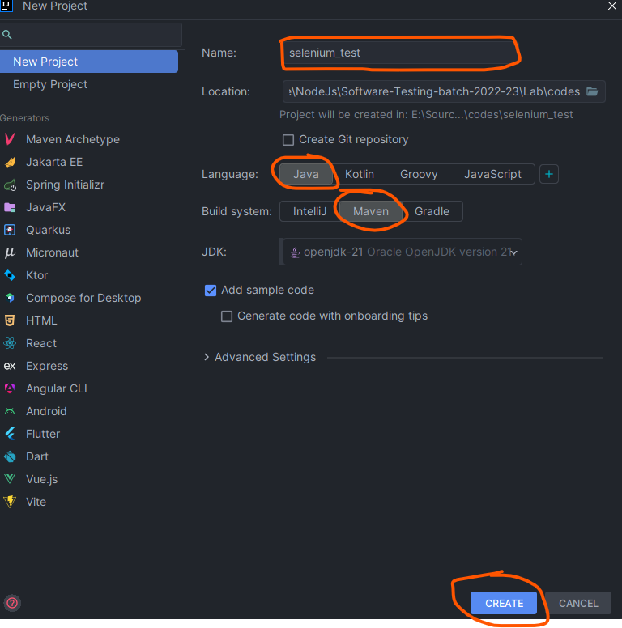
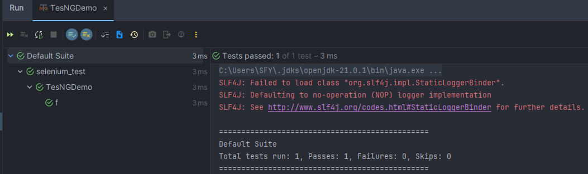

## Selenium

### Introduction

Selenium is one of the most popular automated testing suites. Selenium is designed in a way to support and encourage automation testing of functional aspects of web based applications and a wide range of browsers and platforms.

- Due to its existence in the open source community, it has become one of the most accepted tools amongst the testing professionals.

**Why Selenium?**

As the current industry trends have shown that there is mass movement towards automation testing. The cluster of repetitive manual testing scenarios has raised a demand to bring in the practice of automating these manual scenarios.

The benefits of implementing automation test are many; let us take a look at them:

* Supports execution of repeated test cases
* Aids in testing a large test matrix
* Enables parallel execution
* Encourages unattended execution
* Improves accuracy thereby reducing human generated errors
* Saves time and money

**Selenium supports a broad range of browsers, technologies and platforms.**


**Selenium Components**

Selenium is not just a single tool or a utility, rather a package of several testing tools and for the same reason it is referred to as a Suite.

Each of these tools is designed to cater different testing and test environment requirements.

***The suite package constitutes of the following sets of tools:***

* Selenium Integrated Development Environment (IDE)
* Selenium Remote Control (RC)
* Selenium WebDriver
* Selenium Grid

Selenium RC and WebDriver, in a combination are popularly known as Selenium 2. Selenium RC alone is also referred as Selenium 1.


Fig 1:-

###### 1. Selenium IDE (Integrated Development Environment)

* **Overview** : Selenium IDE is a browser extension for Firefox and Chrome that allows developers and testers to record, edit, and debug tests.
* **Features** : It provides a user-friendly interface for creating automated tests without requiring extensive programming knowledge. Tests are created using a record-and-playback technique, although users can also write tests using a scripting language called Selenese.
* **Usage** : Ideal for beginners in test automation or for creating simple test scripts quickly. However, it lacks the robustness needed for more complex test scenarios


Fig 2:-

###### 2. Selenium Remote Control (RC)

* **Overview** : Selenium RC was one of the first tools in the Selenium project that allowed testers to write automated web application UI tests in any programming language against any HTTP website using any mainstream JavaScript-enabled browser.
* **Features** : Selenium RC worked by using a server that automatically launches and kills browsers, and acts as a proxy for web requests from them.
* **Usage** : It has largely been deprecated and replaced by WebDriver due to its more modern and stable architecture.


Fig 3:-

There are a few pre-requisites to be in place before creating Selenium RC scripts:
 A Programming Language – Java, C#, Python etc.
 An Integrated Development Environment –Eclipse, Netbeans etc.
 A Testing Framework (optional) – JUnit, TestNG etc.
 And Selenium RC setup off course


Fig 4:-

###### 3. Selenium WebDriver

* **Overview** : Selenium WebDriver is the successor to Selenium RC and provides all the capabilities of RC but with better support for modern web testing needs. It does this by making direct calls to the browser using each browser’s native support for automation.
* **Features** : More realistic interaction with web pages than Selenium RC, as it does not rely on JavaScript for automation. It supports programming in various languages like Java, C#, Python, Ruby, and JavaScript.
* **Usage** : WebDriver can handle more complex and advanced web automation tasks. It is widely used in industry for creating robust, browser-based regression automation suites and tests.


Fig 5:-

###### 4. Selenium Grid

* **Overview** : Selenium Grid allows the Selenium WebDriver scripts to run on different machines and different browsers simultaneously / concurrently.
* **Features** : It supports distributed test execution. A central hub distributes the tests to multiple nodes (machines), allowing tests to run in parallel, reducing the time for test execution and providing cross-browser, cross-platform testing capabilities.
* **Usage** : Ideal for large test suites that need to be executed in multiple environments. It helps in speeding up the execution of a test suite by using multiple machines.

#### Selenium 3

Selenium 3 is an advance version of Selenium 2. It is a tool focused for automation of mobile and web applications. Stating that it supports mobile testing, we mean to say that the WebDriver API has been extended  to address the needs of mobile application testing.


Fig 6:- Selenium 3 Architecture

#### Selenium 4

Selenium 4 was introduced by Simon Stewart in 2018. However the stable version of Selenium 4 was released in October 2021. One of the major changes made in Selenium 4 was the introduction of W3C Webdriver protocol which replaced the previously used JSON wire protocol in Selenium 3. This article highlights the major differences between Selenium 3 and Selenium 4.


Fig 7:- Selenium 4 Architecture

###### Environment and Technology Stack

| Category              | Supported Technologies                                                             |
| --------------------- | ---------------------------------------------------------------------------------- |
| Operating Systems     | Windows, macOS, Linux, Unix-like systems                                           |
| Browsers (Selenium 4) | Google Chrome, Mozilla Firefox, Internet Explorer, Safari, Microsoft Edge          |
| Browser Drivers       | ChromeDriver, GeckoDriver (Firefox), IEDriverServer (IE), SafariDriver, EdgeDriver |
| Programming Languages | Java, C#, Python, Ruby, JavaScript (Node.js), Kotlin, PHP                          |
| Testing Frameworks    | JUnit, TestNG, PyTest, RSpec, NUnit, Mocha, Jasmine                                |
| CI/CD Tools           | Jenkins, Travis CI, CircleCI, GitLab CI, Bamboo                                    |
| Cloud Platforms       | Sauce Labs, BrowserStack, CrossBrowserTesting                                      |
| IDEs                  | Eclipse, IntelliJ IDEA, Visual Studio, PyCharm, WebStorm, RubyMine                 |

> Selenium 4 further enhances support for the latest browser-specific drivers, ensuring compatibility and optimized performance across the most commonly used web browsers. This includes:

- Google Chrome: Via ChromeDriver.
- Mozilla Firefox: Via GeckoDriver.
- Microsoft Edge: Via EdgeDriver.
- Safari: Integrated directly into the browser with SafariDriver.
- Internet Explorer: Though less commonly used now, still supported via IEDriverServer.

### Getting Started with Selenium IDE (Installation and its Features)

###### Selenium IDE Download and Installation

###### Configuring WebDriver

As we would be using Java as the programming language for this series and in order to create test scripts in java, we would have to introduce language- specific client drivers. Thus, let us begin with the downloading of Selenium Java Client Libraries.

***Download the Selenium Java Client Libraries***
***Step 1:*** Go to Selenium’s official website and navigate to its download page –
“http://docs.seleniumhq.org/download/”.
Refer the section in the below illustration where you can find Client Libraries listed for distinct programming languages. Click on the download link for Java Client Library.


Fig 8:-

***Step 2:*** Once downloaded, copy the folder and place it in the desired location on your file system.

***Step 3:*** Extract the zipped folder, a folder named as “Selenium-java-4.19.1.zip“can be seen. The folder embodies all the required jar files which enable users to create test scripts in Java.

Thus these libraries can be configured in Intellij IDE


Fig 9:-

***Configuring Libraries with Intellij IDE***
Step 1: Navigate towards Intellij IDE. Create a new java based project following File -> New -> Java Project.


Refer the following figure for the same



https://mvnrepository.com/artifact/org.seleniumhq.selenium/selenium-java

https://mvnrepository.com/artifact/org.seleniumhq.selenium/selenium-java/4.19.1

```xml
<dependency>
    <groupId>org.seleniumhq.selenium</groupId>
    <artifactId>selenium-java</artifactId>
    <version>4.19.1</version>
</dependency>

<dependency>
    <groupId>org.junit.jupiter</groupId>
    <artifactId>junit-jupiter-api</artifactId>
    <version>5.10.2</version>
    <scope>test</scope>
</dependency>

<-- OR -->

<dependency>
    <groupId>org.testng</groupId>
    <artifactId>testng</artifactId>
    <version>7.10.1</version>
    <scope>test</scope>
</dependency>

```

---


---


**Rename Main.java to SeleniumTest.Java**

---

Now, time to doawnload the driver

first check your browser version
edge://settings/?search=update


---


https://developer.microsoft.com/en-us/microsoft-edge/tools/webdriver/?form=MA13LH


then extract


---

Right click on test


Select Enter and click **Enter** keey

---


---

copy the drive into the resource folder


---


---


---

```java
public class SeleniumTest {

    @Test
    void setUp() {
        // Set the system property for the Microsoft Edge driver
        System.setProperty("webdriver.edge.driver", System.getProperty("user.dir") + "/src/test/resources/msedgedriver.exe");

        // Initialize the WebDriver instance using EdgeDriver
        WebDriver driver = new EdgeDriver();
    }

}
```

***Explanation:***

1. `System.setProperty(String key, String value)`:

> This method is used to set a system property, and in this case, it is setting the path to the Microsoft Edge driver executable.

2. `System.getProperty("user.dir")`:

> This method returns the current working directory of the user's project. It's a useful way to build paths that are relative to the project directory, making your code more portable.

3. `EdgeDriver`:

> This initializes a new instance of EdgeDriver, which will control the Edge browser. Make sure that the `msedgedriver.exe` matches the version of your Microsoft Edge browser and that it's located in the specified directory within your project.

```java
@Test
void setUp() {
	// Set the system property for the Microsoft Edge driver
	System.setProperty("webdriver.edge.driver", System.getProperty("user.dir") + "/src/test/resources/msedgedriver.exe");

	// Initialize the WebDriver instance using EdgeDriver
	WebDriver driver = new EdgeDriver();

	driver.get("https://www.baidu.com");
}
```

and now run

```java
@Test
void setUp() {
	// EdgeOptions options = new EdgeOptions();
	// options.addArguments("--remote-allow-origins=*");

	// Set the system property for the Microsoft Edge driver
	System.setProperty("webdriver.edge.driver", System.getProperty("user.dir") + "/src/test/resources/msedgedriver.exe");

	// Initialize the WebDriver instance using EdgeDriver
	WebDriver driver = new EdgeDriver(); // if allow origins, then EdgeDriver(allow)


	driver.get("https://www.baidu.com");
}
```

---

Now time to open and quit the browser

```java
package org.example;

import org.junit.jupiter.api.AfterAll;
import org.junit.jupiter.api.BeforeAll;
import org.junit.jupiter.api.Test;
import org.openqa.selenium.WebDriver;
import org.openqa.selenium.edge.EdgeDriver;
import org.openqa.selenium.edge.EdgeOptions;

public class SeleniumTest {

    private static EdgeOptions options;
    private static WebDriver driver;

    @BeforeAll
    static void setup() {
        options = new EdgeOptions();  // Initialize the EdgeOptions object
        options.addArguments("--remote-allow-origins=*");
        System.setProperty("webdriver.edge.driver", System.getProperty("user.dir") + "/src/test/resources/msedgedriver.exe");
        driver = new EdgeDriver(options);  // Ensure EdgeDriver is imported

        driver.get("https://www.bing.com");
    }

    @Test
    void testSteps() {
        // Implement test steps here
    }

    @AfterAll
    static void tearDown() { 
        driver.quit();  // quit to completely exit the browser session
    }
}
```

---

#### Time to test searching functionality of the Bing

##### What is Document Object Model (Dom)?


##### Locators

Identification of the correct `GUI` element on a web page is pre-requisite for creating any successful automation script. It is where locators come into the picture.

- Locators are one of the essential components of Selenium infrastructure, which help Selenium scripts in uniquely identifying the WebElements(such as `TextBox`, `Button`, etc.)


> **Attributes-based locators:**
> Attributes-based locators utilize the attributes of HTML elements to identify them on a web page. Common attributes include:
>
> - Identifier: Combines the id and name attributes for a broad match.
> - Id: Targets the unique identifier of an element.
> - Name: Selects the **first** element with a specified `name` attribute.
> - Link: Identifies links by the text they display.
> - CSS: Uses CSS selectors to define elements' styles and identify them.

> **Structure-based locators:**
> These locators depend on the web page's structural elements to locate HTML elements:
> It rely on the structure of the page to find elements.
>
> - DOM: Accesses elements based on their hierarchical relationship in the page structure.
> - XPATH:  Navigates through elements and attributes in an XML-like structure.
> - CSS: Identifies elements using style selectors which are both fast and versatile.

###### Location Techniques

```html
<html>
	<body>
		<form id="loginForm">
			<input name="email" type="text"/>
			<input name="password" type="password"/>
			<input name="continue" type="submit" value="Login"/>
			<input name="clear" type="password" value="Login"/>
			<a href="continue.html">Continue</a>
			<a href="cancel.html">Cancel</a>
		</form>
	</body>
</html>
```

**Identifier:**

- Example: `identifier=loginForm`, `identifier=password`

**Id:**

- Example: `id=loginForm`

**Name:**

- Example: `name=username`, `name=continue`.

**Link:**

- Example: `link=Continue`, `link=Cancel`

**DOM:**

- Example: `dom = document.getElementByld('loginForm')`, `</br>` `dom = document.forms['loginForm']`

**CSS:**

- Example: `css=form#loginForm > input[name='email']`..

> There are three important special characters in css selectors:

1. ‘^’: Matches elements whose attribute starts with the specified value.
2. ‘$’: Matches elements whose attribute ends with the specified value.
3. ‘*’: Matches elements containing the specified value in the attribute.
   Example: `css=input[id$='mail']`, `css=input[id*='mail']`

**XPath Locator in Selenium:**
XPath allows navigation through the HTML structure of a page using path expressions:

- XPath is defined as XML path. It is a syntax or language for finding any element on the web page using the XML path expression.

Syntax XPath

```xml
XPath = //tag_name[@Attribute_name ="Value of attribute"]
```


```xpath
//    ----> Select current node. tag_name --> Tagname of the particular node.
@ --> Select attribute. 
Attribute_name -> Attribute name of the node. 
Value of attribute -> Value of the attribute.
```

***Types of XPath:***

> **Absolute Xpath**
> Absolute XPath is the direct way of finding the element. Moreover, it starts from the first/root node of the XM4HTML document and goes all the way to the required node following one node at a time
>
> Example:
> `/html/body/div/header/a/img`

> **Relative Xpath**
> Relative XPath starts from any node inside the HTML DOM; it need not start from the root node. It beings with a double forward slash.
>
> Example:
> `//img[@src= "/images/Testerszone.jpg"]`

**Pre-defined XPath Syntax for Locators:**

> Using `text()`       : `//*[text()='testers zone']`
> Using `name()`    : `//input[@name='username']`
> Using `id()`         : `//input[@id= user-message]`
> Using `class()`     : `//input[@class='user-message]`
> `LinkText()`         : `//a[@href='http://testerszone.com/"] `

Note: We can use * in place of input, it will also work fine. Input is specific tag name but * is generic (point out all the available tags in the DOM) we can use for any tag name.


---

Use of `contains()` in Xpath

The contains() function is utilized in XPath to match elements that include partial text or attribute values. This approach is particularly useful when dealing with elements that have long or dynamic text.

Examples:

> ***Using text():***
>
> - Syntax: `//*[contains(text(), 'testers')]`

> **Using name attribute:**
>
> - Syntax: `//input[contains(@name, 'Mith')]`

> **Using id attribute:**
>
> - Syntax: `//input[contains(@id, 'user-message')]`

> **Using class attribute:**
>
> - Syntax: `//input[contains(@class, 'user-message')]`

> **Using href attribute (similar to Partial-LinkText()):**
>
> - Syntax: `//a[contains(@href, 'testerszone.com')]`

---

Use of `starts-with()`
The `starts-with()` function is employed when the initial part of an attribute value or text associated with a web element is known. This method helps in targeting elements whose attributes begin with a specified text.

Syntax:
Example: `//a[starts-with(@id, 'link-testers_')]`

**Note:** inside the '' you have to mention the partial text value, make sure you are getting unique matching element with your xpath. Simillar way we have ends with also. We use end partial part of text.

---

Logical Operators in XPath

XPath supports logical operators such as `OR` and `AND` to combine multiple conditions:

`OR:` This operator is used when at least one of the conditions must be true. It helps in selecting elements that meet any of the specified criteria.

Syntax:

> Example: //*[@type='submit' or @name='btnReset']

`AND:` This operator is used when all specified conditions must be true. It is useful for more specific element targeting.

Syntax:

> Example: //input[@type='submit' and @name='btnLogin']

Note: sometime a single parameter in xpath does not yield a unique element then we follow these approaches.

---


---


---


---


---


---


---


---


---


---

```html
<textarea id="sb_form_q" class="sb_form_q sb_form_ta" name="q" type="search" ... ></textarea>
```

get the xPath

```xml
//*[@id="sb_form_q"]
```

```java
public class SeleniumTest {

    private static EdgeOptions options;
    private static WebDriver driver;

    @BeforeAll
    static void setup() {
        options = new EdgeOptions();  // Initialize the EdgeOptions object
        options.addArguments("--remote-allow-origins=*");
        System.setProperty("webdriver.edge.driver", System.getProperty("user.dir") + "/src/test/resources/msedgedriver.exe");
        driver = new EdgeDriver(options);  // Ensure EdgeDriver is imported

        driver.get("https://www.bing.com");
    }

    @Test
    void testSteps() throws InterruptedException {
        // Implement test steps here
        WebElement textArea = driver.findElement(By.xpath("//*[@id=\"sb_form_q\"]"));
        Thread.sleep(2000);

        // Set the desired value in the textarea
        textArea.sendKeys("Neusoft institute guangdong");
		Thread.sleep(2000);

        // Simulate pressing the Enter key
        textArea.sendKeys(Keys.ENTER);

    }

    @AfterAll
    static void tearDown() {  // Renamed from tearUp to tearDown for clarity
        // driver.quit();  // Changed from close to quit to completely exit the browser session
    }

}
```

> @Timeout(//second)

```java
@Timeout(2)  // 2 seconds
@Test
void testSteps() throws InterruptedException {
	// Implement test steps here
	WebElement textArea = driver.findElement(By.xpath("//*[@id=\"sb_form_q\"]"));
	Thread.sleep(2000);

	// Set the desired value in the textarea
	textArea.sendKeys("Neusoft institute guangdong");
	Thread.sleep(2000);

	// Simulate pressing the Enter key
	textArea.sendKeys(Keys.ENTER);
}
```

***Is the test passed  / failed?***

```


```

---

#### Creating a TestNg classs

```java
package org.example;

import org.testng.annotations.Test;

public class TesNGDemo {
    @Test
    public void f() {
  
    }
}
```



Similaritites and difference annotation of JUnit and TestNG.

| JUnit 4         | JUnit 5                            | TestNG                    | Description                                                                                                                     |
| --------------- | ---------------------------------- | ------------------------- | ------------------------------------------------------------------------------------------------------------------------------- |
| @Before         | @BeforeEach                        | @BeforeMethod             | Executed before each test method.                                                                                               |
| @After          | @AfterEach                         | @AfterMethod              | Executed after each test method.                                                                                                |
| @BeforeClass    | @BeforeAll                         | @BeforeClass              | Executed once before all test methods in a class.                                                                               |
| @AfterClass     | @AfterAll                          | @AfterClass               | Executed once after all test methods in a class.                                                                                |
| @Ignore         | @Disabled                          | @Ignore                   | Marks a test method as ignored/skipped.                                                                                         |
| @Test           | @Test                              | @Test                     | Marks a method as a test method.                                                                                                |
| @Test(expected) | @Test with assertThrows            | @Test(expectedExceptions) | Specifies that a test method should throw an exception.                                                                         |
| @RunWith        | @ExtendWith                        | Not directly equivalent   | Used to customize the test execution (like using different runners or extensions). TestNG uses listeners and factories instead. |
| N/A             | @DisplayName                       | Not directly equivalent   | Provides a custom name for the test display.                                                                                    |
| N/A             | @Nested                            | Not directly equivalent   | Allows declaring nested test classes.                                                                                           |
| N/A             | @Tag                               | @Groups                   | Allows filtering tests for selective execution.                                                                                 |
| N/A             | N/A                                | @DataProvider             | Provides data for parameterized tests.                                                                                          |
| N/A             | N/A                                | @Parameters               | Allows passing parameters from XML files.                                                                                       |
| @Parameterized  | @ParameterizedTest                 | @Test with @DataProvider  | For executing parameterized tests.                                                                                              |
| @Rule           | @ExtendWith with custom extensions | Not directly equivalent   | Allows adding or overriding test behavior.                                                                                      |
| N/A             | @RepeatedTest                      | Not directly equivalent   | Specifies that a test should be run multiple times.                                                                             |

```java
import org.openqa.selenium.WebDriver;
import org.openqa.selenium.edge.EdgeDriver;
import org.openqa.selenium.edge.EdgeOptions;
import org.testng.annotations.*;

public class DemoTestNG {

    private static WebDriver driver;
    private static EdgeOptions options;

    @BeforeClass
    static void setUp() throws InterruptedException {
        options = new EdgeOptions();
        options.addArguments("--remote-allow-origins=*");
        // System.setProperty("webdriver.edge.driver", System.getProperty("user.dir") + "/src/test/resources/msedgedriver.exe");
        driver = new EdgeDriver(options);
        String appUrl = "https://www.bing.com";
        driver.get(appUrl);

        Thread.sleep(3000);
    }

    @Test
    void fo() {

    }

    @AfterClass
    static void tearDown(){
        driver.quit();;
    }

}
```

---

##### Home

For this homework, you are expected to delve into the practical usage of the ***TestNG*** framework within software testing. Begin by reading about ***TestNG*** to understand its key features and functionalities. Your primary task will be to ***not*** only study the theoretical aspects but to actively engage with the framework by setting up a real testing environment.

**Requirements:**
**Setup:** Adding testNG dependecies.
**Experimentation:** Create at least one sample project that includes multiple test cases using TestNG annotations such as @Test, @BeforeClass, @AfterClass, @DataProvider, and others you find pertinent.
**Documentation:**

1. Write a comprehensive report that includes:
2. Description of the test cases you developed, including the purpose of each test and how TestNG features were utilized.
3. Screenshots of your IDE showing the test execution results.
4. Reflection on the learning experience and how TestNG can be utilized in future projects.
5. Submission: Prepare your report and code samples for submission by [insert due date here]. Ensure your report is clear, informative, and well-organized.

***Examples***
In JUnit 5, you can control the execution order of test methods using the `@TestMethodOrder` annotation along with specific ordering methods.

For the Junit code

```java
import org.junit.jupiter.api.MethodOrderer.OrderAnnotation;
import org.junit.jupiter.api.Order;
import org.junit.jupiter.api.Test;
import org.junit.jupiter.api.TestMethodOrder;

@TestMethodOrder(OrderAnnotation.class) // Enable method ordering based on @Order
public class OrderedTests {

    @Test
    @Order(3)
    void testA() {
        System.out.println("Running testA");
    }

    @Test
    @Order(1)
    void testB() {
        System.out.println("Running testB");
    }

    @Test
    @Order(2)
    void testC() {
        System.out.println("Running testC");
    }
}
```

The TestNG code will be:

```java
import org.testng.annotations.Test;

public class PrioritizedTests {

    @Test(priority = 3)
    public void testA() {
        System.out.println("Running testA");
    }

    @Test(priority = 1)
    public void testB() {
        System.out.println("Running testB");
    }

    @Test(priority = 2)
    public void testC() {
        System.out.println("Running testC");
    }
}
```

---

###### ... more

---

```java
import org.testng.Assert;
import org.testng.annotations.DataProvider;
import org.testng.annotations.Test;

public class FactorialTest {

    @DataProvider(name = "factorialData")
    public Object[][] createFactorialTestData() {
        return new Object[][] {
            {0, 1L},   // factorial(0) should be 1
            {1, 1L},   // factorial(1) should be 1
            {2, 2L},   // factorial(2) should be 2
            {3, 6L},   // factorial(3) should be 6
            {4, 24L},  // factorial(4) should be 24
            {5, 120L}, // factorial(5) should be 120
            {6, 720L}  // factorial(6) should be 720
        };
    }

    @Test(dataProvider = "factorialData")
    public void testFactorial(int input, long expected) {
        long actual = MathUtils.factorial(input);
        Assert.assertEquals(actual, expected, "Factorial of " + input + " should be " + expected);
    }
}
```

---

```java
import org.junit.jupiter.api.Test;
import org.junit.jupiter.api.Assertions;
import java.time.Duration;

public class TimeoutExampleJUnit {

    @Test
    public void testMethodWithTimeout() {
        Assertions.assertTimeout(Duration.ofSeconds(2), () -> {
            // Code block that must complete within the specified time
            try {
                Thread.sleep(3000); // This will cause the test to fail
            } catch (InterruptedException e) {
                Thread.currentThread().interrupt();
                System.out.println("Thread was interrupted, Failed to complete operation");
            }
        });
    }
}
```

```java
import org.testng.annotations.Test;

public class TimeoutExampleTestNG {

    @Test(timeOut = 2000) // timeout in milliseconds
    public void testMethodWithTimeout() {
        try {
            // Simulating a long running process
            Thread.sleep(3000);
        } catch (InterruptedException e) {
            Thread.currentThread().interrupt();
            System.out.println("Thread was interrupted, Failed to complete operation");
        }
    }
}
```

---

##### Usage of Selenium `Select` Class for Handling `Dropdown` Elements on a Web and other Webdrive elements

```html
<!DOCTYPE html>
<html>
    <head>
        <title>Web Elements Testing</title>
    </head>
    <body>
        <!-- Navigation Links -->
        <nav id="mainNav">
            <ul>
                <li><a href="https://www.bing.com">Bing</a></li>
            </ul>
        </nav>

        <!-- Dropdowns for Testing -->
        <select id="colorSelector">
            <option value="red">Red</option>
            <option value="blue">Blue</option>
            <option value="green">Green</option>
        </select>

        <select id="fruitSelector">
            <option value="apple">Apple</option>
            <option value="orange">Orange</option>
            <option value="banana">Banana</option>
        </select>

        <!-- Input Field -->
        <input type="text" id="nameInput" placeholder="Enter your name"/>

      

	<!-- Radio Buttons for Gender Selection -->
	<fieldset>
            <legend>Gender:</legend>
            <label><input type="radio" name="gender" value="male"> Male</label>
            <label><input type="radio" name="gender" value="female"> Female</label>
        </fieldset>

        <!-- Checkboxes for Selection of Hobbies -->
        <fieldset>
            <legend>Hobbies:</legend>
            <label><input type="checkbox" name="hobby" value="sports"> Sports</label>
            <label><input type="checkbox" name="hobby" value="reading"> Reading</label>
        </fieldset>

        <!-- Simple Dropdown Menu for Country Selection -->
        <label for="countrySelect">Choose a country:</label>
        <select id="countrySelect">
			<option value="india">China</option>
			<option value="india">Ethiopia</option>
            <option value="usa">United States</option>
            <option value="uk">United Kingdom</option>
        </select>

        <br><br>
		<!-- Button -->
        <button id="submitBtn">Submit</button>
    </body>
</html>
```

```java
public class HandlingWebElementsTest {

    private static WebDriver driver;

    @BeforeAll
    static void setUp() {
        EdgeOptions options = new EdgeOptions();
		options.addArguments("--remote-allow-origins=*");
		System.setProperty("webdriver.edge.driver", System.getProperty("user.dir") + "/src/main/resources/msedgedriver.exe");
        driver = new EdgeDriver(options);

        if (driver == null) {
            throw new IllegalStateException("Driver did not initialize. Please check your WebDriver executable path and configurations.");
        }

        String appUrl = "http://127.0.0.1:3000/Lab/codes/frontend/web_elements.html";
        driver.get(appUrl);

        // maximize the window
        driver.manage().window().maximize();
    }

    @Test
    public void testDropDowns() throws InterruptedException{

        // Go to Bing, find by link
        driver.findElement(By.linkText("Bing")).click();
        Thread.sleep(2000);
        // navigate back to previous page
        driver.navigate().back();
        Thread.sleep(2000);


        // Select by visible text
        Select colorDropdown = new Select(driver.findElement(By.id("colorSelector")));
        colorDropdown.selectByVisibleText("Green");
        Thread.sleep(1000);

        // Select by value
        Select fruitDropDown = new Select(driver.findElement(By.id("fruitSelector")));
        fruitDropDown.selectByValue("banana");
        Thread.sleep(1000);

        // Fill then name Field
        WebElement nameInput = driver.findElement(By.id("nameInput"));
        nameInput.sendKeys("Neusoft Institute Guangdong");


        // Handling radio buttons
        WebElement maleRadio = driver.findElement(By.xpath("//input[@name='gender'][@value='male']"));
        maleRadio.click();
        Thread.sleep(1000);

        // Handling checkboxes
        WebElement sportsCheckbox = driver.findElement(By.xpath("//input[@name='hobby'][@value='sports']"));
        if (!sportsCheckbox.isSelected()) {
            sportsCheckbox.click();
        }
        Thread.sleep(1000);

        // select by index
        Select countryDropdown = new Select(driver.findElement(By.id("countrySelect")));
        countryDropdown.selectByIndex(1);
        Thread.sleep(1000);

        // Submitting the form
        driver.findElement(By.id("submitBtn")).click();
        Thread.sleep(1000);
    }

    @AfterAll
    static void tearDown(){
        if (driver != null) {
            driver.quit();
        }
    }

}
```

###### Class Activity

Lab/code/frontend/index.tst.html

```html
<!DOCtYPE html>
<html>
	<head>
		<title>Testing Select Class</title>
	</head>

	<body>
		<div id="header">
			<ul id="linkTabs">
				<li>
					<a href="https://www.bing.com">Bing</a>
				</li>
			</ul>
		</div>

		<div class="header_spacer"></div>

		<div id="container">
			<div id="content" style="padding-left: 185px;">
				<table id="selectTable">
					<tbody>
						<tr>
							<td>
								<div>
									<select id="SelectId_One">
										<option value="redValue">Red</option>
										<option value="greenValue">Green</option>
										<option value="yellowValue">Yellow</option>
										<option value="greyValue">Grey</option>
									</select>
								</div>
							</td>

							<td>
								<div>
									<select id="SelectID_Two">
										<option value="applevalue">Apple</option>
										<option value="orangevalue">Orange</option>
										<option value="mangovalue">Mango</option>
										<option value="limevalue">Lime</option>
									</select>
								</div>
							</td>

							<td>
								<div>
									<select id="SelectID_Three">
										<option value="selectvalue">Select</option>
										<option value="elephantvalue">Elephant</option>
										<option value="mousevalue">Mouse</option>
										<option value="dogvalue">Dog</option>
									</select>
								</div>
							</td>
						</tr>
					</tbody>
				</table>
			</div>
		</div>
	</body>
</html>
```

##### Write the WebDriver Code using Selenium Select Class

**Step 1**: Create a new java class named as “HandlingDropDown” under the “Learning_Selenium” project.
**Step 2**: Copy and paste the below code in the “HandlingDropDown.java” class.

```java
package org.example;

import org.junit.jupiter.api.AfterAll;
import org.junit.jupiter.api.BeforeAll;
import org.junit.jupiter.api.Test;
import org.openqa.selenium.By;
import org.openqa.selenium.WebDriver;
import org.openqa.selenium.edge.EdgeDriver;
import org.openqa.selenium.support.ui.Select;

public class HandlingDropDown {
    static WebDriver driver;
    @BeforeAll
    static void setUp() {
        driver = new EdgeDriver();  // Ensure EdgeDriver is imported

        driver.get("http://127.0.0.1:3000/Lab/codes/frontend/index_test.html");

        // maximize the window
        driver.manage().window().maximize();
    }

    @Test
    void testComboBox() throws InterruptedException {
        // Go to Bing
        driver.findElement(By.linkText("Bing")).click();

        // navigate back to previous page
        driver.navigate().back();
        Thread.sleep(3000);

        // Select the first operator using "select by value"
        Select selectByValue = new Select(driver.findElement(By.id("SelectId_One")));
        selectByValue.selectByValue("greenValue");
        Thread.sleep(3000);

        // Select the second operator using "select by visible text"
        Select visibleText = new Select(driver.findElement(By.id("SelectID_Two")));
        visibleText.selectByVisibleText("Lime");
        Thread.sleep(3000);

        // Select third dropDown using "select by index"
        Select selectedIndex = new Select(driver.findElement(By.id("SelectID_Three")));
        selectedIndex.selectByIndex(2);
        Thread.sleep(3000);
    }

    @AfterAll
    static void tearDown() {
        driver.quit();
    }
}
```

---

#### Example HTML Code for a Table

Handling HTML tables with Selenium WebDriver is crucial for testing applications that display data in tabular formats. Tables are commonly used to represent information succinctly / summary, and interacting with them can be necessary to verify content, perform ***CRUD*** operations, or just read data from the table.

Here's a simple HTML setup for a table which we will use to demonstrate how to interact with it using Selenium:

---


Figure: Creating an `html` file inside the `resources` test folder.


Figure: Created `taable_demo.html` file

```java
<!DOCTYPE html>
<html lang="en">
    <head>
        <meta charset="UTF-8">
        <title>Table Interaction Testing</title>
    </head>
    <body>
        <table id="data-table" border="1px solid black">
            <thead>
				<tr>
					<th>Name</th>
					<th>Age</th>
					<th>City</th>
				</tr>
            </thead>
            <tbody>
				<tr>
					<td>Carlos</td>
					<td>20</td>
					<td>Guangzhou</td>
				</tr>
				<tr>
					<td>Jane Smith</td>
					<td>25</td>
					<td>Xian</td>
				</tr>
				<tr>
					<td>Lee</td>
					<td>35</td>
					<td>Foshan</td>
				</tr>
            </tbody>
        </table>
    </body>
</html>
```

---

**Selenium WebDriver Code (Java using ***TestNG***)**
**Java class** to handle table elements:

```java
package org.example;

import org.openqa.selenium.By;
import org.openqa.selenium.WebDriver;
import org.openqa.selenium.WebElement;
import org.openqa.selenium.edge.EdgeDriver;
import org.testng.annotations.AfterClass;
import org.testng.annotations.BeforeClass;
import org.testng.annotations.Test;

import java.util.List;

public class TableHandling {

    private WebDriver driver;

    @BeforeClass
    public void setUp() {
        // System.setProperty("webdriver.edge.driver", "path_to_edgedriver");
        driver = new EdgeDriver();
        driver.get("http://localhost:63342/selenium_test/Lab/codes/selenium_test/src/test/resources/table_demo.html?_ijt=acb4345dflv9fivlmand66qimj&_ij_reload=RELOAD_ON_SAVE");
        driver.manage().window().maximize();
    }

    @Test
    public void testReadTTable() {
        // Locate the table
        WebElement table = driver.findElement(By.id("data-table"));

        // Fetch all row of the elements
        List<WebElement> rows = table.findElements(By.tagName("tr"));

        // print data from eaach row
        for (WebElement row: rows) {
            List<WebElement> cols = row.findElements(By.tagName("td"));

            for (WebElement col: cols) {
                System.out.print(col.getText() + "\t\t");
            }
            System.out.println();
        }
    }

//    @AfterClass
//    public void tearDown() {
//        driver.quit();
//    }

}
```

---

###### Output


---

**Selenium WebDriver Code (Python using unittest)**
Python class to handle table elements:

```java
import unittest
from selenium import webdriver

class TableHandlingTest(unittest.TestCase):
    @classmethod
    def setUpClass(cls):
        cls.driver = webdriver.Edge('path_to_edgedriver')
        #file:///E:/Source_code/NodeJs/Software-Testing-batch-2022-23/Lab/codes/#selenium_test/src/test/resources/table_demo.html
        cls.driver.get('file:///path_to_your_html_file.html')
        cls.driver.maximize_window()

    def test_read_table(self):
        driver = self.driver

        # Locate the table
        table = driver.find_element_by_id('data-table')

        # Fetch all rows of the table
        rows = table.find_elements_by_tag_name('tr')

        # Print data from each row
        for row in rows:
            cols = row.find_elements_by_tag_name('td')  # Get columns for each row
            for col in cols:
                print(col.text, end='\t')
            print()  # for new line after each row

    @classmethod
    def tearDownClass(cls):
        cls.driver.quit()

if __name__ == "__main__":
    unittest.main()
```


---

For Test Automation 
https://ultimateqa.com/dummy-automation-websites/

---


###### Selenium Wait Commands

In Selenium WebDriver, managing `synchronization` is crucial to ensure that web elements are fully loaded before operations are performed on them. This process is typically managed using different types of wait commands. The provided Java example demonstrates two common wait mechanisms: ***Implicit Wait*** and ***Thread.sleep()***.

> 1. Thread.sleep()
- > ***What it does:*** Pauses the entire test execution for a specified duration (in milliseconds).
- > ***Usage:*** `Thread.sleep(5000)`; // Halts for 5 seconds.
- > ***Consideration:*** It waits for the full duration, regardless of whether the element is ready earlier, which may slow down test execution unnecessarily or may cause exceptions if the element is not available within the time.

Example Usage:
```java
Thread.sleep(5000); // Pauses the execution for 5000 milliseconds or 5 seconds.
```

> 2. Implicit Wait
- > ***What it does:*** Configures the WebDriver to wait up to a specified maximum duration for an element to appear before throwing an error, but will proceed as soon as the element is found.
- > ***Usage:*** `driver.manage().timeouts().implicitlyWait(5, TimeUnit.SECONDS)`;
- > ***Benefit:*** More efficient than Thread.sleep(), as it waits only as needed up to the maximum time set.

Example Usage:
```java
driver.manage().timeouts().implicitlyWait(5, TimeUnit.SECONDS);
```
> This line of code configures the WebDriver to wait up to 5 seconds before throwing a `NoSuchElementException` if it does not find the element to interact with immediately.

***Difference from Thread.sleep():***
- `Thread.sleep()` stops the ***thread's*** execution for the specified time irrespective of any condition. After the time is up, the script executes the next line of code.
- Implicit wait tells the ***WebDriver to poll the DOM*** for a certain amount of time when trying to find any element not immediately available. This wait is not bound/restricted to any condition apart from the time.

Practical Example: ***WaitsDemo.java*** 
Here, Selenium waits up to 5 seconds when trying to find any element. This is helpful in cases where elements may take some time to appear due to page load times.

```java
WebDriver driver = new EdgeDriver(); 
// Sets an implicit wait of 5 seconds
driver.manage().timeouts().implicitlyWait(5, TimeUnit.SECONDS);
driver.get("https://www.saucedemo.com/");
// Use of implicit wait
driver.findElement(By.name("user-name")).sendKeys("mercury");
```

**Conclusion:** Effective use of wait commands in Selenium helps in creating reliable, robust tests by reducing the chances of encountering `exceptions` due to **missing elements**. 
> `Implicit waits` offer a better approach in most cases compared to `Thread.sleep()`, as they make the tests less brittle and faster, by waiting only as long as necessary.


##### Explicit Wait - Condition Based

Explicit wait in Selenium WebDriver is a targeted `synchronization` approach that waits for a specific condition to occur before proceeding. Unlike implicit waits, explicit waits are applied for particular ***instances*** and can handle various conditions. Here’s how explicit waits are used:

**Key Points of Explicit Wait:**
- > ***Condition-Based:*** Waits for a specific condition to be met before proceeding.
- > ***Customizable:*** Each wait can have different conditions and time settings.
- > ***Efficient:*** Reduces unnecessary wait times by proceeding as soon as conditions are met.

**Usage:**
To use explicit waits, you instantiate `WebDriverWait` with a timeout value, then specify the condition you want to wait for using `ExpectedConditions`.

***Example Code:***
```java
WebDriverWait myWait = new WebDriverWait(driver, 10); // Wait up to 10 seconds.
WebElement username = myWait.until(ExpectedConditions.visibilityOfElementLocated(By.name("userName")));
username.sendKeys("mercury");
```

***Practical Example:*** `ExplicitwaitDemo.java`
In the provided Java example, the WebDriver waits up to 10 seconds for specific elements to be visible before interacting with them:

```java
public class ExplicitwaitDemo {

	public static void main(String[] args) {
		System.setProperty("webdriver.chrome.driver", "C:/Drivers/chromedriver_win32/chromedriver.exe");
		WebDriver driver=new ChromeDriver(); 
		
		WebDriverWait mywait=new WebDriverWait(driver,10); // Setup with a 10-second timeout.
				
		driver.get("https://www.saucedemo.com/");
				
		// Wait until the username field is visible on the page before sending keys.
		WebElement username = myWait.until(ExpectedConditions.visibilityOfElementLocated(By.name("user-name")));
		username.sendKeys("standard_user");
		
		// Wait until the password field is visible on the page before sending keys.
		WebElement password = myWait.until(ExpectedConditions.visibilityOfElementLocated(By.name("password")));
		password.sendKeys("secret_sauce");
	}
}
```

Explicit waits are powerful tools in Selenium for handling elements that might have unpredictable timing and conditions for availability, providing a more reliable and precise way to manage dynamic content in web automation tasks.

---

Find out total links present in a web page:

https://parabank.parasoft.com/parabank/index.htm

```java
List <WebElement> links = driver.findElements(By.tagName("a"));
System.out.println(links.size());

// Reading all the Link from the Web page and Display their names
for (WebElements  e: links) {
    System.out.println(e.getText());
}
```


---
**More Practice** 

```java
import org.openqa.selenium.By;
import org.openqa.selenium.WebDriver;
import org.openqa.selenium.WebElement;
import org.openqa.selenium.edge.EdgeDriver;
import org.openqa.selenium.support.ui.ExpectedConditions;
import org.openqa.selenium.support.ui.WebDriverWait;
import org.testng.annotations.BeforeClass;
import org.testng.annotations.Test;

import java.time.Duration;

public class SauceDemoTest {
    
    private WebDriver driver;
    private WebDriverWait myWait;
    @BeforeClass
    void setUp() {
        driver = new EdgeDriver();
        myWait = new WebDriverWait(driver, Duration.ofSeconds(10));
        driver.get("https://www.saucedemo.com/");
    }

    @Test
    void testSwagLabs() {
        WebElement userName = myWait.until(ExpectedConditions.visibilityOfElementLocated(By.name("user-name")));
        userName.sendKeys("standard_user");
        WebElement password = myWait.until(ExpectedConditions.visibilityOfElementLocated(By.name("password")));
        password.sendKeys("secret_sauce");
        WebElement btnLogin = myWait.until(ExpectedConditions.visibilityOfElementLocated(By.id("login-button")));
        btnLogin.click();
    }
}
```

---

Add assertion to make sure the login is successful.

```java
 @Test
void testSwagLabs() {
	// ...
	btnLogin.click();

	// Verify that after login, the URL changes to the inventory page
	Assert.assertTrue(driver.getCurrentUrl().contains("inventory"));
}
```

---

###### Class Activity
Use the **TDD** approach and test for the remain test cases.

---


```java
public class SauceDemoTest {
    
    private WebDriver driver;
    private WebDriverWait myWait;
    @BeforeClass
    void setUp() {
        driver = new EdgeDriver();
        myWait = new WebDriverWait(driver, Duration.ofSeconds(10));
        driver.get("https://www.saucedemo.com/");
    }

    @Test
    void testSwagLabs() {
        WebElement userName = myWait.until(ExpectedConditions.visibilityOfElementLocated(By.name("user-name")));
        userName.sendKeys("standard_user");
        WebElement password = myWait.until(ExpectedConditions.visibilityOfElementLocated(By.name("password")));
        password.sendKeys("secret_sauce");
        WebElement btnLogin = myWait.until(ExpectedConditions.visibilityOfElementLocated(By.id("login-button")));
        btnLogin.click();

        // Verify that after login, the URL changes to the inventory page
        Assert.assertTrue(driver.getCurrentUrl().contains("inventory"));
    }
    
    @DataProvider(name="userCredentials")
    public static Object[][] getUserCredentials() throws IOException, CsvException {
        CSVReader reader = new CSVReader(new FileReader("/Users/nashu/Desktop/Source_code/software_testing/DB-practices/Code/jdbc_demo/Selenium_Test/src/test/resources/user_name_password.csv"));
        List<String[]> allRows = reader.readAll();
        // Remove the header, skip the first Line
        allRows.remove(0);
        // return the Array format new Object [# rows][]
        return allRows.toArray(new Object[allRows.size()][]);
    }

    // @DataProvider(name="userCredentials")
    @ParameterizedTest
    @CsvFileSource(resources = "/user_name_password.csv", numLinesToSkip = 1)
    void testUserCredentials() {
        //
    }

    @Test(dataProvider = "userCredentials")
    public void testLogin(String username, String password) {
        WebElement usernameField = myWait.until(ExpectedConditions.visibilityOfElementLocated(By.id("user-name")));
        usernameField.sendKeys(username);

        WebElement passwordField = myWait.until(ExpectedConditions.visibilityOfElementLocated(By.name("password")));
        passwordField.sendKeys(password);

        WebElement loginBtn = myWait.until(ExpectedConditions.visibilityOfElementLocated(By.id("login-button")));
        loginBtn.click();

        if ("locked_out_user".equals(username)) {
            WebElement errorMessage = myWait.until(ExpectedConditions.visibilityOfElementLocated(By.cssSelector(".error-message-container.error")));
            Assert.assertTrue(errorMessage.getText().contains("Sorry, this user has been locked out"),
                    "Expect error message for locked out user is not displayed");
        } else if () {
            // ...
        }
        else {
            // ...
        }
    }
}
```

---


***When to Use `getText()`:***
- > Textual Elements: Use `getText()` for elements that display text directly, such as `<div>`, `<span>`, `<p>`, etc.
```java
WebElement element = driver.findElement(By.id("example"));
String text = element.getText();
```

***When to Use getAttribute("value"):***
- > Form Elements: Use getAttribute("value") for elements like `<input>`, `<textarea>`, and sometimes `<select>` to get the current value of the element.

```java
WebElement inputElement = driver.findElement(By.id("input-example"));
String value = inputElement.getAttribute("value");
```

Here is a more detailed example to illustrate the differences:

Example:
Consider the following HTML snippet:

```html
<div id="message">Hello, World!</div>
<input id="username" value="JohnDoe">
```
To retrieve the text from the `<div>` and the value from the `<input>`, you would use:

```java
WebElement messageDiv = driver.findElement(By.id("message"));
String messageText = messageDiv.getText(); // Returns "Hello, World!"

WebElement usernameInput = driver.findElement(By.id("username"));
String usernameValue = usernameInput.getAttribute("value"); // Returns "JohnDoe"
```

---


```java
import io.github.bonigarcia.wdm.WebDriverManager;
import org.junit.jupiter.api.AfterEach;
import org.junit.jupiter.api.BeforeEach;
import org.junit.jupiter.params.ParameterizedTest;
import org.junit.jupiter.params.provider.CsvSource;
import org.openqa.selenium.By;
import org.openqa.selenium.WebDriver;
import org.openqa.selenium.WebElement;
import org.openqa.selenium.chrome.ChromeDriver;
import org.openqa.selenium.support.ui.ExpectedConditions;
import org.openqa.selenium.support.ui.WebDriverWait;

class BmiCalculatorTest {

    private WebDriver driver;
    private WebDriverWait wait;

    @BeforeEach
    void setUp() {
    
        driver = new EdgeDriver();
        driver.get("https://www.texasheart.org/heart-health/heart-information-center/topics/body-mass-index-bmi-calculator/");
        wait = new WebDriverWait(driver, 10);
    }

    @AfterEach
    void tearDown() {
        if (driver != null) {
            driver.quit();
        }
    }

    @ParameterizedTest
    @CsvSource({
        "180, 70, 21.6",
        "160, 80, 31.2",
        "170, 65, 22.5"
    })
    void testBmiCalculator(int height, int weight, double expectedBmi) {
        
		WebElement heightInput = wait.until(ExpectedConditions.visibilityOfElementLocated(By.id("heightInput")));
        
		WebElement weightInput = driver.findElement(By.id("weightInput"));
        
		WebElement calculateButton = driver.findElement(By.xpath("//input[@value='Calculate']"));

        heightInput.clear();
        weightInput.clear();

        heightInput.sendKeys(String.valueOf(height));
        weightInput.sendKeys(String.valueOf(weight));
        calculateButton.click();

        WebElement bmiResult = wait.until(ExpectedConditions.visibilityOfElementLocated(By.id("bmiSpan")));

        double result = Double.parseDouble(bmiResult.getAttribute("value"));

        assert Math.abs(result - expectedBmi) < 0.1 : "Expected BMI close to " + expectedBmi + ", but got " + result;
    }
}
```

---

```java
// myWait.until((WebDriver d) -> !result.getAttribute("value").isEmpty());
```
 
---

###### Choosing WebElement Locators and Using `tearDown()`

(a)

 ```java
WebElement result = myWait.until(ExpectedConditions.visibilityOfElementLocated(By.xpath("//*[@id=\"post-601\"]/div/div/form/fieldset/div[2]/div[2]/input")));
```

> **Pros**: Precise
**Cons**: Brittle (sensitive to changes), complex, errors if `tearDown()` runs too early

(b)
```java
WebElement result = myWait.until(ExpectedConditions.visibilityOfElementLocated(By.xpath("//input[@class='result-input'")));
```

> **Pros**: Readable, flexible
**Cons**: Potential ambiguity


(c) 

```java
WebElement result = myWait.until(ExpectedConditions.visibilityOfElementLocated(By.cssSelector("input.result-input")));
```

> **Pros**: Simple, fast
**Cons**: Potential ambiguity

---


###### Class Activity: More practice

https://practicetestautomation.com/practice-test-login/


---

###### Using `test suite`

(a) Let's create a TestNG test suite to test the login functionality of the page at "https://practicetestautomation.com/practice-test-login/". We'll cover the following scenarios:

> ***Valid Login***: Correct username and password.
***Invalid Login***: Incorrect username.
***Invalid Login***: Incorrect password.
***Empty Fields***: Both fields are empty.

Step-by-Step Guide
1. Add TestNG Dependency

Ensure you have the TestNG dependency in your project.

Maven
```xml
<dependencies>
    <dependency>
        <groupId>org.testng</groupId>
        <artifactId>testng</artifactId>
        <version>7.4.0</version>
        <scope>test</scope>
    </dependency>

    <dependency>
        <groupId>org.seleniumhq.selenium</groupId>
        <artifactId>selenium-java</artifactId>
        <version>4.1.0</version>
    </dependency>
</dependencies>
```

---

2. Create Test Class  - (TDD based)

`/auth/LoginTest.java`

```java

import org.openqa.selenium.By;
import org.openqa.selenium.WebDriver;
import org.openqa.selenium.WebElement;
import org.openqa.selenium.chrome.ChromeDriver;
import org.testng.Assert;
import org.testng.annotations.AfterMethod;
import org.testng.annotations.BeforeMethod;
import org.testng.annotations.DataProvider;
import org.testng.annotations.Test;

public class LoginTest {
    WebDriver driver;

    @BeforeMethod
    public void setUp() {
        // Setup the WebDriver (assuming ChromeDriver for this example)
        driver = new EdgeDriver();
        driver.get("https://practicetestautomation.com/practice-test-login/");
    }

    @AfterMethod
    public void tearDown() {
        if (driver != null) {
            driver.quit();
        }
    }

    @Test(dataProvider = "loginData")
    public void testLogin(String username, String password, String expectedError) {
        WebElement usernameField = driver.findElement(By.id("username"));
        WebElement passwordField = driver.findElement(By.id("password"));
        WebElement submitButton = driver.findElement(By.id("submit"));

        usernameField.clear();
        passwordField.clear();
        usernameField.sendKeys(username);
        passwordField.sendKeys(password);
        submitButton.click();

        if (expectedError.isEmpty()) {
            // Check for successful login (e.g., checking URL or logout button presence)
            WebElement logoutButton = driver.findElement(By.id("logout"));
            Assert.assertTrue(logoutButton.isDisplayed(), "Logout button should be displayed on successful login");
        } else {
            // Check for error message
            WebElement errorMessage = driver.findElement(By.id("error"));
            Assert.assertEquals(errorMessage.getText(), expectedError, "Error message should match expected");
        }
    }

    @DataProvider(name = "loginData")
    public Object[][] loginData() {
        return new Object[][]{
                {"student", "Password123", ""}, // Valid login
                {"invalidUser", "Password123", "Your username is invalid!"}, // Invalid username
                {"student", "invalidPass", "Your password is invalid!"}, // Invalid password
                {"", "", "Both username and password must be present!"} // Empty fields
        };
    }
}
```

---

3. Create TestNG XML ***Suite*** File
   
`resource\testng-suite.xml`

```xml
<!DOCTYPE suite SYSTEM "https://testng.org/testng-1.0.dtd">
<suite name="AuthTestSuite">
    <test name="AuthTests">
        <classes>
            <class name="org.example.auth.LoginTest"/>
			<class name="org.example.BMICalculatorTest"/>
        </classes>
    </test>
</suite>
```

---

4. Run the Test Suite

In IntelliJ IDEA or Eclipse, right-click on the ***testng-suite.xml*** file and select "Run".

---

case1: locator matches multiple elements, `findElement()` ----> this can be located single element
case2: locator mathces multiple elements, `findElements()` --> this can be located multiple elements
case3: locator matches single element, `findElements()` ---> this can be located single element

---

###### Class Activity 
Discuss the Difference between `findElement()` & `findElements()` and show case with the implementation

---

##### Practice

https://testautomationpractice.blogspot.com/
https://mail.rediff.com/cgi-bin/login.cgi


###### WebElement: Basic Syntax

```java
public class MoreWebElements {
    WebDriver driver;
    //WebDriverWait myWait;
    @BeforeMethod
    void setUp(){
        driver = new EdgeDriver();
        //myWait = new WebDriverWait(driver, Duration.ofSeconds(10));

        driver.get("https://testautomationpractice.blogspot.com/");
    }
    @AfterMethod
    void tearDown() {
        if (driver!=null) {
            driver.quit();
        }
    }

	// ... Another test cases goes here
}
```
---

######  Form WebElements (Recap)

```java

@BeforeMethod
void setUp(){
  // driver.get("https://testautomationpractice.blogspot.com/");
}

@AfterMethod
void tearDown() {
	// ...
}

@Test
public void testFormElements() {
	
	// Name
	WebElement nameField = driver.findElement(By.id("name"));
	nameField.sendKeys("Gemachis");
	Assert.assertEquals(nameField.getAttribute("value"), "Gemachis");

	// Email
	WebElement emailField = driver.findElement(By.id("email"));
	emailField.sendKeys("gem@example.com");
	Assert.assertEquals(emailField.getAttribute("value"), "gem@example.com");

	// Phone
	WebElement phoneField = driver.findElement(By.id("phone"));
	phoneField.sendKeys("1234567890");
	Assert.assertEquals(phoneField.getAttribute("value"), "1234567890");

	// Address
	WebElement addressField = driver.findElement(By.id("textarea"));
	addressField.sendKeys("123 Main St");
	Assert.assertEquals(addressField.getAttribute("value"), "123 Main St");

	// Gender
	WebElement genderMale = driver.findElement(By.id("male"));
	genderMale.click();
	Assert.assertTrue(genderMale.isSelected());

	//WebElement genderFemale = driver.findElement(By.id("female"));
	//genderFemale.click();
	//Assert.assertTrue(genderFemale.isSelected());

	// Days
	WebElement dayMonday = driver.findElement(By.id("monday"));
	dayMonday.click();
	Assert.assertTrue(dayMonday.isSelected());

	// Country
	Select countryDropdown = new Select(driver.findElement(By.id("country")));
	countryDropdown.selectByValue("china");
	Assert.assertEquals(countryDropdown.getFirstSelectedOption().getText(), "China");

	// Colors
	Select colorRed = new Select(driver.findElement(By.id("colors")));
	colorRed.selectByVisibleText("Green");
	Assert.assertEquals(colorRed.getFirstSelectedOption().getText(), "Green");

	// Date
	WebElement dateField = driver.findElement(By.id("datepicker"));
	dateField.sendKeys("05/17/2024");
	Assert.assertEquals(dateField.getAttribute("value"), "05/17/2024");

	// link
	WebElement openCartLink = driver.findElement(By.linkText("open cart"));
	openCartLink.click();
	Assert.assertTrue(driver.getCurrentUrl().contains("opencart"));
	driver.navigate().back();
}
```

---

###### Test orangeHRM Link
```java
//...

@Test
public void testFormElements() {
	// ...
}

@Test
public void testOrangeHRMLink() throws InterruptedException{
	String preOriginWindow = driver.getWindowHandle();
	Thread.sleep(3000);
	System.out.println(driver.getCurrentUrl());
	// Orange HRM link
	WebElement orangeHRMLink = driver.findElement(By.linkText("orange HRM"));
	orangeHRMLink.click();
	Thread.sleep(2000);
	// Switch to the new OrangeHRM page
	//for (String handle : driver.getWindowHandles()) {
	//    if (!handle.equals(preOriginWindow)) {
	//        driver.switchTo().window(handle);
	//        break;
	//    }
	//}
	// Wait for the page to load
	Thread.sleep(3000);
	System.out.println(driver.getCurrentUrl());

	// Wait for the login elements to be present
	//wait.until(ExpectedConditions.presenceOfElementLocated(By.xpath("//input[@name='username']")));
	// Perform login on OrangeHRM
	WebElement usernameField = driver.findElement(By.xpath("//input[@name='username']"));
	WebElement passwordField = driver.findElement(By.xpath("//input[@name='password']"));
	WebElement loginButton = driver.findElement(By.xpath("//*[@id='app']/div[1]/div/div[1]/div/div[2]/div[2]/form/div[3]/button"));

	usernameField.sendKeys("Admin");
	passwordField.sendKeys("admin123");
	loginButton.click();

	System.out.println("On Login: "+ driver.getCurrentUrl());

	// wait.until(ExpectedConditions.urlContains("dashboard"));
	// Verify login by checking the URL contains 'dashboard'
	Assert.assertTrue(driver.getCurrentUrl().contains("dashboard"));
	Thread.sleep(3000);
	//List<WebElement> links = driver.findElements(By.tagName("a"));
	//for (WebElement link: links){
	//    System.out.println(link.getText());
	//}
	// logout
	WebElement userAccount = driver.findElement(By.xpath("//*[@id=\"app\"]/div[1]/div[1]/header/div[1]/div[2]/ul/li"));
	userAccount.click();
	Thread.sleep(1000);

	WebElement logoutBtn = driver.findElement(By.xpath("/html/body/div/div[1]/div[1]/header/div[1]/div[2]/ul/li/ul/li[4]/a"));
	logoutBtn.click();
	Thread.sleep(2000);
	System.out.println("After logout: " + driver.getCurrentUrl());

	// Close the OrangeHRM window and switch back to the original window
	// driver.close();
	driver.switchTo().window(preOriginWindow);
	System.out.println("After switched window: "+driver.getCurrentUrl());
	// Thread.sleep(5000);
	Thread.sleep(1000);
	driver.navigate().back(); // stack
	driver.navigate().back();  // stack
	driver.navigate().back(); // stack
}
```
---

######  SearchBox

```java
// ...

@Test
public void testOrangeHRMLink() {
	// ...
}

@Test
public void testSearchBox() throws InterruptedException {
	WebElement searchBox = driver.findElement(By.id("Wikipedia1_wikipedia-search-input"));
	searchBox.sendKeys("Selenium");
	WebElement searchButton = driver.findElement(By.className("wikipedia-search-button"));
	searchButton.click();
	WebElement searchResult = driver.findElement(By.className("wikipedia-search-results"));
	Thread.sleep(5000);
	Assert.assertTrue(searchResult.isDisplayed(), "Search results should be displayed.");

	List<WebElement> search_results = driver.findElements(By.xpath("//*[@id='wikipedia-search-result-link']/a"));

	System.out.println(search_results.size());

	for(WebElement e:search_results)
	{
		String link=e.getText();
		System.out.println(link);
		driver.findElement(By.linkText(link)).click();
		System.out.println(driver.getTitle());
	}
}
```

---

###### Handle New Browser Windows / Tabs

```java

// ...

@Test
void testAlert() throws InterruptedException {
	// ...
}

@Test
public void testNewBrowser() throws InterruptedException {
	WebElement btn = driver.findElement(By.xpath("//*[@id=\"HTML4\"]/div[1]/button"));
	// get current window , unique identifier (window handle) for the current browser window or tab.
	String originalWindow = driver.getWindowHandle();

	btn.click();
	Thread.sleep(2000);
	//  wait.until(ExpectedConditions.numberOfWindowsToBe(2))
	// New Window/Tab:
	Set<String> allWindows = driver.getWindowHandles();
	for (String windowHandle: allWindows) {

		if (!windowHandle.equals(originalWindow)) {
			driver.switchTo().window(windowHandle);
			//String title = driver.getTitle();
			//System.out.println(title);
			break;
		}
	}
	Thread.sleep(2000);
	Assert.assertTrue(driver.getCurrentUrl().contains("opencart"));
	driver.close();
	Thread.sleep(2000);
	driver.switchTo().window(originalWindow);
}
```

---

###### Alerts/popus (switch between alerts)

> driver.switchTo().alert().accept();//closes popup by using OK button
> driver.switchTo().alert().dismiss();//closes popup by using Cancel button

```java
// ...

@Test
public void testFormElements() {
	// ...
}

@Test
void testAlert() throws InterruptedException {
	// WebElement btnAlert = myWait.until(ExpectedConditions.visibilityOfElementLocated(By.xpath("//*[@id=\"HTML9\"]/div[1]/button[1]")));
	WebElement btnAlert = driver.findElement(By.xpath("//*[@id=\"HTML9\"]/div[1]/button[2]"));
	btnAlert.click();
	Thread.sleep(2000);

	driver.switchTo().alert().accept(); // closes popup by using OK button
	//driver.switchTo().alert().dismiss();//closes popup by using Cancel button
	Thread.sleep(5000);
	Assert.assertTrue(true, "Alert was successfully handled");
}
```

---


###### Actions

```java

// ...

@Test
void testNewBrowser() throws InterruptedException {
	// ...
}
@Test
void actions() throws InterruptedException {
	//WebElement field1 = driver.findElement(By.id("field1"));
	//Thread.sleep(2000);

	Actions actions = new Actions(driver);

	// Double click
	WebElement field2  = driver.findElement(By.id("field2"));
	WebElement doubleClickBtn  = driver.findElement(By.xpath("/html/body/div[4]/div[2]/div[2]/div[2]/div[2]/div[2]/div[2]/div/div[4]/div[3]/div/aside/div/div[4]/div[1]/button"));
	actions.doubleClick(doubleClickBtn).perform();
	Assert.assertTrue(field2.getAttribute("value").contains("Hello"));
	Thread.sleep(3000);

	// Drag and Drop interaction
	WebElement source = driver.findElement(By.xpath("/html/body/div[4]/div[2]/div[2]/div[2]/div[2]/div[2]/div[2]/div/div[4]/div[3]/div/aside/div/div[5]/div[1]/div[1]"));
	WebElement target = driver.findElement(By.xpath("/html/body/div[4]/div[2]/div[2]/div[2]/div[2]/div[2]/div[2]/div/div[4]/div[3]/div/aside/div/div[5]/div[1]/div[2]"));
	actions.dragAndDrop(source, target).perform();
	Thread.sleep(3000);

	// Slider interaction
	WebElement slider = driver.findElement(By.id("slider"));
	actions.clickAndHold(slider).moveByOffset(50, 0).release().perform();

	// Resizable
	WebElement resizableBtn = driver.findElement(By.id("resizable"));
	actions.clickAndHold(resizableBtn).moveByOffset(20, 50).release().perform();
}
```

---

###### Frame 


```java
// ...

@Test
void actions() throws InterruptedException {
	//...
}

@Test
void frame() throws InterruptedException {
	// Switch to and interact with a frame
	driver.switchTo().frame(driver.findElement(By.id("frame-one796456169")));
	Thread.sleep(3000);
	WebElement frameButton = driver.findElement(By.id("FSsubmit"));
	frameButton.click();
	Thread.sleep(3000);
	driver.switchTo().defaultContent();
	Thread.sleep(3000);
}
```


---

***Happy Coding :)***
***Thanks for your time,*** Wish u all z best :)

---

###### More on Frames/iFrames(switch between frames)


https://seleniumhq.github.io/selenium/docs/api/java/index.html


driver.switchTo().frame(name)
driver.switchTo().frame(index)
driver.switchTo().frame(WebElement)

driver.switchTo().defaultContent();

packageListFrame
packageFrame
classFrame

driver.switchTo().frame(0);

```java
public class FramesDemo {

	public static void main(String[] args) {
		
		System.setProperty("webdriver.chrome.driver","C://Drivers/chromedriver_win32/chromedriver.exe");
		WebDriver driver=new ChromeDriver();
		
		driver.get("https://seleniumhq.github.io/selenium/docs/api/java/index.html");
		
		driver.manage().window().maximize();
				
		driver.switchTo().frame("packageListFrame");
		driver.findElement(By.linkText("org.openqa.selenium")).click(); //1 frame 
		
		driver.switchTo().defaultContent(); // go back to page/focus on the page
		
		driver.switchTo().frame("packageFrame");
		driver.findElement(By.linkText("WebDriver")).click(); //2 frame
		
		driver.switchTo().defaultContent(); // go back to page/focus on the page
		
		driver.switchTo().frame("classFrame");
		driver.findElement(By.xpath("/html/body/div[1]/ul/li[5]")).click(); // 3rd frame
	}

}
```

---

###### NestedIframe

```java
public class NestedIframe {

	public static void main(String[] args) {
	
		System.setProperty("webdriver.chrome.driver","C://Drivers/chromedriver_win32/chromedriver.exe");
		WebDriver driver=new ChromeDriver();
		
		driver.get("http://demo.automationtesting.in/Frames.html");
		
		driver.findElement(By.xpath("/html/body/section/div[1]/div/div/div/div[1]/div/ul/li[2]/a")).click();//button
		
		WebElement outerframe=driver.findElement(By.xpath("//*[@id=\"Multiple\"]/iframe"));
		driver.switchTo().frame(outerframe);//swicth to outer frame
		
		
		WebElement innerframe=driver.findElement(By.xpath("/html/body/section/div/div/iframe"));
		driver.switchTo().frame(innerframe);
		
		
		driver.findElement(By.xpath("/html/body/section/div/div/div/input")).sendKeys("Testing");
		

	}

}
```

---

###### NestedIframe

```java
public class NestedIframe {

	public static void main(String[] args) {
	
		System.setProperty("webdriver.chrome.driver","C://Drivers/chromedriver_win32/chromedriver.exe");
		WebDriver driver=new ChromeDriver();
		
		driver.get("http://demo.automationtesting.in/Frames.html");
		
		driver.findElement(By.xpath("/html/body/section/div[1]/div/div/div/div[1]/div/ul/li[2]/a")).click();//button
		
		WebElement outerframe=driver.findElement(By.xpath("//*[@id=\"Multiple\"]/iframe"));
		driver.switchTo().frame(outerframe);//swicth to outer frame
		
		
		WebElement innerframe=driver.findElement(By.xpath("/html/body/section/div/div/iframe"));
		driver.switchTo().frame(innerframe);
		
		
		driver.findElement(By.xpath("/html/body/section/div/div/div/input")).sendKeys("Testing");
		

	}

}
```


---


```

```java
import java.util.Set;

import org.openqa.selenium.By;
import org.openqa.selenium.WebDriver;
import org.openqa.selenium.chrome.ChromeDriver;

public class HandleWindows {

	public static void main(String[] args) {
	
		System.setProperty("webdriver.chrome.driver","C://Drivers/chromedriver_win32/chromedriver.exe");
		WebDriver driver=new ChromeDriver();
		
		driver.get("http://demo.automationtesting.in/Windows.html");
		
		//String handleValue=driver.getWindowHandle();
		//System.out.println(handleValue); //CDwindow-45FEE686DED3D844347AB3AC2E7F5E41
		
		driver.findElement(By.xpath("//*[@id=\"Tabbed\"]/a/button")).click();
		
		Set <String> handlevalues=driver.getWindowHandles();
		
		for(String h:handlevalues)
		{
			//System.out.println(h);
			String title=driver.switchTo().window(h).getTitle();
			//System.out.println(title);
			
			if(title.equals("Sakinalium | Home") )
			{
				driver.findElement(By.xpath("//*[@id=\"container\"]/header/div/div/div[2]/ul/li[4]/a")).click(); //contact menu
			}
		}
	
	}

}
```


---


###### Date Picker
```java
import java.util.Calendar;

import org.openqa.selenium.By;
import org.openqa.selenium.WebDriver;
import org.openqa.selenium.chrome.ChromeDriver;

public class DatePicker {

	public static WebDriver driver;
	
	public static void main(String[] args) {
		
		driver=new EdgeDriver();
		
		driver.get("https://goo.gl/RVdKM9");
		
		driver.manage().window().maximize();
		
		//String year="2018";
		String month="June";
		String date="25";
		
		driver.findElement(By.xpath("//*[@id=\"q20\"]/img")).click();//Click on date picker element
		
		//selectCurrentDate();
		//selectFutureDate(date,month);
		selectPastDate(date,month);
	}

	
	static void selectCurrentDate()
	{
		Calendar cal=Calendar.getInstance();
		
		int d=cal.get(Calendar.DATE); // return the current date in int format
		String date=String.valueOf(d); //convert int to string
		
		driver.findElement(By.linkText(date)).click();
	}
	
		
	static void selectFutureDate(String d,String m)
	{
		
		Calendar cal=Calendar.getInstance();
		
		int currentmonth=cal.get(Calendar.MONTH)+1; // return the current date in int format
		
		for(int i=currentmonth;i>=1;i++)
		{
			
			driver.findElement(By.xpath("//*[@id=\"ui-datepicker-div\"]/div/a[2]/span")).click();//Next arrow
			
			String mon=driver.findElement(By.xpath("//*[@id=\"ui-datepicker-div\"]/div/div/span")).getText();
			
			if(mon.equals(m))
			{
				driver.findElement(By.linkText(d)).click();
				break;
			}
		}
	}
	
	
	static void selectPastDate(String d,String m)
	{
		
		Calendar cal=Calendar.getInstance();
		
		int currentmonth=cal.get(Calendar.MONTH)+1; // return the current date in int format
		
		for(int i=currentmonth;i>=1;i--)
		{
			
			driver.findElement(By.xpath("//*[@id=\"ui-datepicker-div\"]/div/a[1]/span")).click();//Prev arrow
			
			String mon=driver.findElement(By.xpath("//*[@id=\"ui-datepicker-div\"]/div/div/span")).getText();
			
			if(mon.equals(m))
			{
				driver.findElement(By.linkText(d)).click();
				break;
			}
		}
	}
	
	
}
```


---


WebTable

```java
public class Webtable1 {

	public static void main(String[] args) {
		
		System.setProperty("webdriver.chrome.driver","C://Drivers/chromedriver_win32/chromedriver.exe");
		WebDriver driver=new ChromeDriver();
		
		driver.get("file:///C:/SeleniumPractice/sample.html");
		
		//int rows=driver.findElements(By.tagName("tr")).size();
		
		int rows=driver.findElements(By.xpath("/html/body/table/tbody/tr")).size();
		System.out.println(rows);
				
		int columns=driver.findElements(By.xpath("/html/body/table/tbody/tr[1]/th")).size();
		System.out.println(columns);
		
		System.out.println("Product"+"    "+"Article"+"    "+"Price");
		
		for(int r=2;r<=rows;r++)
		{
			for(int c=1;c<=columns;c++)
			{
				
	String value=driver.findElement(By.xpath("/html/body/table/tbody/tr["+r+"]/td["+c+"]")).getText();
				System.out.print(value+"    ");
				
			}
			System.out.println();
		}
		
	}
}
```

---

```java
public class WebTable2 {

	public static void main(String[] args) throws InterruptedException {
		
		System.setProperty("webdriver.chrome.driver", "C://Drivers/chromedriver_win32/chromedriver.exe");
		WebDriver driver=new ChromeDriver(); 
		
		driver.get("https://opensource-demo.orangehrmlive.com/");
		
		driver.manage().window().maximize();
		
		//login
		
		driver.findElement(By.id("txtUsername")).sendKeys("Admin");
		driver.findElement(By.id("txtPassword")).sendKeys("admin123");
		driver.findElement(By.id("btnLogin")).click();
		
		Thread.sleep(3000);
		
		//Admin-->Usermanagement-->Users
		
		driver.findElement(By.xpath("//*[@id=\"menu_admin_viewAdminModule\"]")).click();
		driver.findElement(By.xpath("//*[@id=\"menu_admin_UserManagement\"]")).click();
		driver.findElement(By.xpath("//*[@id=\"menu_admin_viewSystemUsers\"]")).click();
		
		//Table
		
		int rows=driver.findElements(By.xpath("//*[@id='resultTable']/tbody/tr")).size();
		System.out.println(rows);
		
		int count=0;
		
		for(int r=1;r<=rows;r++)
		{
	String status=driver.findElement(By.xpath("//*[@id=\"resultTable\"]/tbody/tr["+r+"]/td[5]")).getText();
			
			if(status.equals("Enabled"))
			{
				count++; //1 2 3........
			}		
		}
		
		System.out.println("Number of enabled employees:"+ count);
		System.out.println("Number of disabled employees:"+ (rows-count));
		
		driver.quit();
	}
}
```

---

webpagination 

```java
public class WebTable3_Pagination {

	public static void main(String[] args) throws InterruptedException {
	
		System.setProperty("webdriver.chrome.driver", "C://Drivers/chromedriver_win32/chromedriver.exe");
		WebDriver driver = new ChromeDriver();
		
		driver.get("http://www.seleniumeasy.com/test/table-pagination-demo.html");
		
		driver.manage().window().maximize();
		
		Thread.sleep(3000);
		
		WebElement Paging_Element=driver.findElement(By.xpath("//*[@id=\"myPager\"]"));
		
		
		List <WebElement> sub_links=Paging_Element.findElements(By.tagName("a"));
		
		System.out.println("Total number of paging links:"+ sub_links.size());
		
		if(sub_links.size()>0)
		{
			System.out.println("Links are present");
			
			for(int i=1;i<sub_links.size()-1;i++)
			{
				WebElement link=driver.findElement(By.xpath("//a[contains(text(),'"+i+"')]"));
							
				link.click();
				
				Thread.sleep(3000);
				
				int rows=driver.findElements(By.xpath("//*[@id=\"myTable\"]/tr")).size();
				
				for(int r=1;r<=rows;r++)
				{
					
					String col1=driver.findElement(By.xpath("//*[@id=\"myTable\"]/tr["+r+"]/td[1]")).getText();
					String col2=driver.findElement(By.xpath("//*[@id=\"myTable\"]/tr["+r+"]/td[2]")).getText();
					String col3=driver.findElement(By.xpath("//*[@id=\"myTable\"]/tr["+r+"]/td[3]")).getText();
					String col4=driver.findElement(By.xpath("//*[@id=\"myTable\"]/tr["+r+"]/td[4]")).getText();
					String col5=driver.findElement(By.xpath("//*[@id=\"myTable\"]/tr["+r+"]/td[5]")).getText();
					String col6=driver.findElement(By.xpath("//*[@id=\"myTable\"]/tr["+r+"]/td[6]")).getText();
					String col7=driver.findElement(By.xpath("//*[@id=\"myTable\"]/tr["+r+"]/td[7]")).getText();
					
					System.out.println(col1+"  "+col2+"  "+col3+"  "+col4+"  "+col5+"  "+col6+"  "+col7);
				}
			}
			
		}
		
		else
		{
			System.out.println("Links not Present");
		}
	}

}
```

```java
public class DoubleClickDemo2 {

	public static void main(String[] args) throws InterruptedException {
	
		System.setProperty("webdriver.chrome.driver", "C://Drivers/chromedriver_win32/chromedriver.exe");
		WebDriver driver=new ChromeDriver(); 
		
		driver.get("http://api.jquery.com/dblclick/");
		
		driver.manage().window().maximize();
		
		driver.switchTo().frame(0); //switch to frame
		
		WebElement ele=driver.findElement(By.xpath("/html/body/div"));
		
		Thread.sleep(5000);
		
		Actions act=new Actions(driver);
		
		act.doubleClick(ele).build().perform(); // Double click on element
		
		Thread.sleep(3000);
		
		act.doubleClick(ele).build().perform(); // Double click on element
		
		Thread.sleep(3000);
		
		act.doubleClick(ele).build().perform(); // Double click on element	
	}
}
```

---

###### KeyboardActions

```java
public class KeyboardActions {

	public static void main(String[] args) throws InterruptedException {
		
		System.setProperty("webdriver.chrome.driver", "C://Drivers/chromedriver_win32/chromedriver.exe");
		WebDriver driver=new ChromeDriver(); 
		
		driver.get("http://the-internet.herokuapp.com/key_presses");
		
		driver.manage().window().maximize();
		
		Thread.sleep(5000);
		
		Actions act=new Actions(driver);
		
		act.sendKeys(Keys.ENTER).build().perform();
		
		Thread.sleep(3000);

		act.sendKeys(Keys.ESCAPE).build().perform();
		
		Thread.sleep(3000);
		
		act.sendKeys(Keys.SPACE).build().perform();
		
		Thread.sleep(3000);
		
		act.sendKeys(Keys.DELETE).build().perform();
	}

}
```


---


###### MouseHover

```java
public class MouseHover {

	public static void main(String[] args) throws InterruptedException {
	
		System.setProperty("webdriver.chrome.driver", "C://Drivers/chromedriver_win32/chromedriver.exe");
		WebDriver driver=new ChromeDriver(); 
		
		driver.get("https://opensource-demo.orangehrmlive.com/");
		
		driver.manage().window().maximize();
		
		//login
		
		driver.findElement(By.id("txtUsername")).sendKeys("Admin");
		driver.findElement(By.id("txtPassword")).sendKeys("admin123");
		driver.findElement(By.id("btnLogin")).click();
		
		Thread.sleep(3000);
		
		//Admin-->Usermanagement-->Users
		
		WebElement admin=driver.findElement(By.xpath("//*[@id=\"menu_admin_viewAdminModule\"]"));
		WebElement usermgnt=driver.findElement(By.xpath("//*[@id=\"menu_admin_UserManagement\"]"));
		WebElement users=driver.findElement(By.xpath("//*[@id=\"menu_admin_viewSystemUsers\"]"));
		
		Actions act=new Actions(driver);
		
		
		act.moveToElement(admin).moveToElement(usermgnt).moveToElement(users).click().build().perform();
		
		

	}

}
```

---


###### MultipleKeyPressDemo

```java
public class MultipleKeyPressDemo {

	public static void main(String[] args) throws InterruptedException {

    	WebDriver driver=new ChromeDriver(); 
		
		driver.get("http://newtours.demoaut.com/");

		driver.manage().window().maximize();
		
		Thread.sleep(5000);
		
		Actions act=new Actions(driver);
		
		act.sendKeys(Keys.CONTROL+"a").build().perform();

	}

}
```


---


---

###### RightClickDemo

```java
public class RightClickDemo {

	public static void main(String[] args) throws InterruptedException {
	

		WebDriver driver=new ChromeDriver(); 
		
		driver.get("http://swisnl.github.io/jQuery-contextMenu/demo.html");
		
		driver.manage().window().maximize();
		
		Actions act=new Actions(driver);
		
		WebElement button=driver.findElement(By.xpath("/html/body/div/section/div/div/div/p/span"));

		act.contextClick(button).build().perform(); //Right click on button
		
			
		driver.findElement(By.xpath("/html/body/ul/li[3]/span")).click();
		
		Thread.sleep(5000);
		
		Alert alert=driver.switchTo().alert();
		
		System.out.println("Text present on alert window is:" +alert.getText());
		alert.accept(); // this closes alert window
		
	}

}
```


---

###### ScrollingDemo

```java
public class ScrollingDemo {

	public static void main(String[] args) throws InterruptedException {

		WebDriver driver=new ChromeDriver(); 
		
		driver.get("https://www.countries-ofthe-world.com/flags-of-the-world.html");
		
		driver.manage().window().maximize();
		
		Thread.sleep(5000);
		
		
		//Create JavascriptExecor variable
		JavascriptExecutor js=(JavascriptExecutor)driver;
		
		//Approach1 - number of pixels
			//	js.executeScript("window.scrollBy(0,2000)","");
		
		//Approach2 - till we found certain element on the web page
		
			//WebElement flag=driver.findElement(By.xpath("//*[@id=\"content\"]/div[2]/div[2]/table[1]/tbody/tr[86]/td[1]/img"));
			//js.executeScript("arguments[0].scrollIntoView();",flag);
		
		//Appraoch3 - till end of the page
		
			js.executeScript("window.scrollBy(0,document.body.scrollHeight)");
		
	}

}
```


---

###### SliderDemo

```java
public class SliderDemo {

	public static void main(String[] args) throws InterruptedException {

		WebDriver driver=new ChromeDriver(); 
		
		driver.get("https://jqueryui.com/slider/");
		
		driver.manage().window().maximize();
		
		driver.switchTo().frame(0);
		
		WebElement slider=driver.findElement(By.xpath("//*[@id=\"slider\"]/span"));
		
		Thread.sleep(3000);
		
		Actions act=new Actions(driver);
		
		act.moveToElement(slider).dragAndDropBy(slider,400, 0).build().perform(); //moving the slider

	}

}
```


---

###### TooltipDemo

```java
public class TooltipDemo {

	public static void main(String[] args) {
	

		WebDriver driver=new ChromeDriver();
		
		driver.get("https://jqueryui.com/tooltip/");
		
		driver.manage().window().maximize();
		
		driver.switchTo().frame(0);
		
		WebElement agebox=driver.findElement(By.id("age"));
		String tooltiptext=agebox.getAttribute("title");
		
		System.out.println(tooltiptext);
		
		if(tooltiptext.equals("We ask for your age only for statistical purposes."))
		{
			System.out.println("Tooltip test passed");
		}
		else
		{
			System.out.println("Tooltip test failed");
		}
		
		
	}

}
```


---

##### Data Driver Testing (DDT) Using csv format (excel)

Agenda

- Read data from CSV
- Write data into CSV
- Data Driven Testing


---

Apache POI API

```java
public class XLUtils {
	
	public static FileInputStream fi;
	public static FileOutputStream fo;
	public static XSSFWorkbook wb;
	public static XSSFSheet ws;
	public static XSSFRow row;
	public static XSSFCell cell;

	
	public static void setExcelFile(String xlfile,String xlsheet) throws Exception {
		 
			try {

   			FileInputStream ExcelFile = new FileInputStream(xlfile);
			wb = new XSSFWorkbook(ExcelFile);
			ws = wb.getSheet(xlsheet);
			} catch (Exception e){
				throw (e);
			}
	}

	public static int getRowCount(String xlfile,String xlsheet) throws IOException 
	{
		fi=new FileInputStream(xlfile);
		wb=new XSSFWorkbook(fi);
		ws=wb.getSheet(xlsheet);
		int rowcount=ws.getLastRowNum();
		wb.close();
		fi.close();
		return rowcount;		
	}
	
	
	public static int getCellCount(String xlfile,String xlsheet,int rownum) throws IOException
	{
		fi=new FileInputStream(xlfile);
		wb=new XSSFWorkbook(fi);
		ws=wb.getSheet(xlsheet);
		row=ws.getRow(rownum);
		int cellcount=row.getLastCellNum();
		wb.close();
		fi.close();
		return cellcount;
	}
	
	
	public static String getCellData(String xlfile,String xlsheet,int rownum,int colnum) throws IOException
	{
		fi=new FileInputStream(xlfile);
		wb=new XSSFWorkbook(fi);
		ws=wb.getSheet(xlsheet);
		row=ws.getRow(rownum);
		cell=row.getCell(colnum);
		String data;
		try 
		{
			DataFormatter formatter = new DataFormatter();
            String cellData = formatter.formatCellValue(cell);
            return cellData;
		}
		catch (Exception e) 
		{
			data="";
		}
		wb.close();
		fi.close();
		return data;
	}
	
	public static void setCellData(String xlfile,String xlsheet,int rownum,int colnum,String data) throws IOException
	{
		fi=new FileInputStream(xlfile);
		wb=new XSSFWorkbook(fi);
		ws=wb.getSheet(xlsheet);
		row=ws.getRow(rownum);
		cell=row.createCell(colnum);
		cell.setCellValue(data);
		fo=new FileOutputStream(xlfile);
		wb.write(fo);		
		wb.close();
		fi.close();
		fo.close();
	}
	
	
}
```

---


```java
public class ReadingExcel {

	public static void main(String[] args) throws IOException {
		
		FileInputStream file=new FileInputStream("C://SeleniumPractice/data3.xlsx");
		
		XSSFWorkbook workbook=new XSSFWorkbook(file);
		
		XSSFSheet sheet=workbook.getSheet("Sheet1");
		
		//Counting rows
		int rownum=sheet.getLastRowNum();// retuns number of rows
		int colcount=sheet.getRow(0).getLastCellNum(); // returns number of cells present in a row
		
		System.out.println(rownum);
		System.out.println(colcount);
		
		for(int r=0;r<=rownum;r++)
		{
			
			XSSFRow row=sheet.getRow(r);
			
			for(int c=0;c<colcount;c++)
			{
				//XSSFCell cell=row.getCell(c);
				// value=cell.toString();
				String value=row.getCell(c).toString();
				System.out.print(value+"   ");
			}
			
			System.out.println();
			
		}
		

	}

}
```

---

```java
public class WritingExcel {

	public static void main(String[] args) throws IOException {
		
		FileOutputStream file=new FileOutputStream("C://SeleniumPractice/testdata123.xlsx");

		XSSFWorkbook workbook=new XSSFWorkbook();
		
		XSSFSheet sheet=workbook.createSheet("data");
		
		for(int i=0;i<=5;i++)
		{
			XSSFRow row=sheet.createRow(i);
			
			for(int j=0;j<3;j++)
			{
				row.createCell(j).setCellValue("welcome");
			}
		}
		
		workbook.write(file);
		
		System.out.println("Writing excel is completed");
		
	}

}
```


---

```java
public class UserRegistration {

	public static void main(String[] args) throws Exception {
		
		System.setProperty("webdriver.gecko.driver","C://Drivers/geckodriver-v0.19.1-win64/geckodriver.exe");
		WebDriver driver=new FirefoxDriver(); /// opens the browser
		
		driver.get("http://newtours.demoaut.com/mercuryregister.php");
		
		String path="C://SeleniumPractice/Registration.xlsx";
		
		XLUtils.setExcelFile(path,"Sheet1");
		
		int noofrows=XLUtils.getRowCount(path, "Sheet1");
		
		for(int row=1;row<=noofrows;row++)
		{
			String First_name=XLUtils.getCellData(path, "Sheet1", row, 0);
			String Last_name= XLUtils.getCellData(path, "Sheet1", row, 1);
			String phone=XLUtils.getCellData(path, "Sheet1", row, 2);
			String email=XLUtils.getCellData(path, "Sheet1", row, 3);
			String address=XLUtils.getCellData(path, "Sheet1", row, 4);
			String city=XLUtils.getCellData(path, "Sheet1", row, 5);
			String state=XLUtils.getCellData(path, "Sheet1", row, 6);
			String pincode=XLUtils.getCellData(path, "Sheet1", row, 7);
			String country=XLUtils.getCellData(path, "Sheet1", row, 8);
			String username=XLUtils.getCellData(path, "Sheet1", row, 9);
			String password=XLUtils.getCellData(path, "Sheet1", row, 10);
						
			driver.findElement(By.linkText("REGISTER")).click();
					
			//registration process start
			driver.findElement(By.linkText("REGISTER")).click();
			
			//contact information
			driver.findElement(By.name("firstName")).sendKeys(First_name);
			driver.findElement(By.name("lastName")).sendKeys(Last_name);
			driver.findElement(By.name("phone")).sendKeys(phone);
			driver.findElement(By.name("userName")).sendKeys(email);
						
			//mailing information
			driver.findElement(By.name("address1")).sendKeys(address);
			driver.findElement(By.name("address2")).sendKeys(address);
			driver.findElement(By.name("city")).sendKeys(city);
			driver.findElement(By.name("state")).sendKeys(state);
			driver.findElement(By.name("postalCode")).sendKeys(pincode);
			Select dropcountry=new Select(driver.findElement(By.name("country")));
			dropcountry.selectByVisibleText(country);
			
			//user information
			driver.findElement(By.name("email")).sendKeys(username);
			driver.findElement(By.name("password")).sendKeys(password);
			driver.findElement(By.name("confirmPassword")).sendKeys(password);
			
			driver.findElement(By.name("register")).click(); //submit
			
			Thread.sleep(2000);
			
			//validation
			
			if (driver.getPageSource().contains("Thank you for registering")) {
				System.out.println(" Registration Completed for  " + row + " record");

			}

			else
			{
				System.out.println(" Registration Failed for " + row + " record");

			}
			
			
		}
		
	
	
	
	}

}
```


---


```java
public class FixedDepositCalculator {

	public static void main(String[] args) throws Exception {
		

		WebDriver driver=new ChromeDriver();
		
		driver.get("https://www.moneycontrol.com/fixed-income/calculator/state-bank-of-india-sbi/fixed-deposit-calculator-SBI-BSB001.html");

		driver.manage().window().maximize();
		
		String path="C://SeleniumPractice/caldata.xlsx";
		
		XLUtils.setExcelFile(path, "Sheet1");
		
		int rowcount=XLUtils.getRowCount(path, "Sheet1");
		
		
		for(int i=1;i<=rowcount;i++)
		{
			
			int princ=Integer.parseInt(XLUtils.getCellData(path, "Sheet1", i, 0));
			int rateofinterest= Integer.parseInt(XLUtils.getCellData(path,"Sheet1",i, 1));
			int per= Integer.parseInt(XLUtils.getCellData(path,"Sheet1",i, 2));
			String fre=XLUtils.getCellData(path, "Sheet1", i,3);
			double exp_mvalue=Double.parseDouble(XLUtils.getCellData(path,"Sheet1",i,4));
			
			driver.findElement(By.id("principal")).sendKeys(String.valueOf(princ));
			driver.findElement(By.id("interest")).sendKeys(String.valueOf(rateofinterest));
			driver.findElement(By.id("tenure")).sendKeys(String.valueOf(per));
			
			Select perioddrp=new Select(driver.findElement(By.id("tenurePeriod")));
			perioddrp.selectByVisibleText("year(s)");
			
			Select frequency=new Select(driver.findElement(By.id("frequency")));
			frequency.selectByVisibleText(fre);
			
			driver.findElement(By.xpath("//*[@id='fdMatVal']/div[2]/a[1]/img")).click();
			
			String act_mvalue=driver.findElement(By.xpath("//*[@id='resp_matval']/strong")).getText();
			
			if(exp_mvalue==Double.parseDouble(act_mvalue))
			{
				System.out.println("test passed");
			}
			else
			{
				System.out.println("test failed");
			}
			
			driver.findElement(By.xpath("//*[@id='fdMatVal']/div[2]/a[2]/img")).click(); // clear button
			
			Thread.sleep(3000);
		}
		
	}

}
```


---


### Hands on Practice


---

---

```java
public class AutomationTestingPracticeForm {
	public static void main(String[] args) throws InterruptedException {
		

		WebDriver driver = new ChromeDriver();
	    
		driver.get("https://testautomationpractice.blogspot.com/");
	    
	    driver.manage().timeouts().implicitlyWait(10,TimeUnit.SECONDS);
	    
	    driver.switchTo().frame(0);//Switch to frame
	   
	    driver.manage().window().maximize();
	    driver.findElement(By.xpath("//*[@id='RESULT_TextField-1']")).sendKeys("Oliver");//Enter FirstName
	    driver.findElement(By.xpath("//*[@id='RESULT_TextField-2']")).sendKeys("Twist");//Enter LName
	    driver.findElement(By.id("RESULT_TextField-3")).sendKeys("12345678");//Enter Phone Number
	    driver.findElement(By.id("RESULT_TextField-4")).sendKeys("Canada");//Enter Country
	    driver.findElement(By.id("RESULT_TextField-5")).sendKeys("Toronto");//Enter City
	    driver.findElement(By.id("RESULT_TextField-6")).sendKeys("Oliver@gmail.com");//Enter Email
	    
	    Select Options = new Select(driver.findElement(By.id("RESULT_RadioButton-7")));//Select dropdown
	   
	    List <WebElement> list = Options.getOptions();//Print all options
	    	for(WebElement e:list) {
	    		System.out.println(e.getText());
		   
	    	}
	    System.out.println(Options.getOptions().size());// Get the number of options of dropdown
	    Options.selectByVisibleText("Morning"); // Select an option 
	    
   	    driver.findElement(By.id("RESULT_RadioButton-8_1")).click();//Select Gender Radio button 
	        	    
	    driver.findElement(By.xpath("//*[@id='RESULT_CheckBox-9_2']")).click();//Select Check box
	    driver.findElement(By.xpath("//*[@id='RESULT_CheckBox-9_4']")).click();// Select another Check box
	   
	    driver.switchTo().defaultContent(); //Here You have to come out of first frame to continue rest of the elements
	    
	  	    
		driver.findElement(By.xpath("//div[@id='HTML4']/div/div/fieldset/label[3]/span")).click();//Radio button, Location => London
		
		driver.findElement(By.xpath("//*[@id=\"HTML4\"]/div[1]/div/fieldset[2]/label[4]/span[1]")).click(); //Check box Hotel Ratings: 5 star
		
		driver.findElement(By.xpath("//*[@id=\"HTML4\"]/div[1]/div/fieldset[3]/label[4]/span[1]")).click(); //Check box Bed Type=> King
		
		
		//Tool Tip Capture
		
		String tooltip1=driver.findElement(By.xpath("//*[@id=\"HTML8\"]/div[1]/p[1]/a")).getAttribute("title");
		System.out.println(tooltip1);
		
		String tooltip2=driver.findElement(By.xpath("//*[@id=\"HTML8\"]/div[1]/p[2]/a")).getAttribute("title");
		System.out.println(tooltip2);
		
		//Alert
		
		driver.findElement(By.xpath("//*[@id=\"HTML9\"]/div[1]/button")).click();
		driver.switchTo().alert().accept(); //close alert by using OK button
		//driver.switchTo().alert().dismiss(); //close alert by using cancel button
		
		
		//Date Picker - Current Date
		driver.findElement(By.id("datepicker")).click();
		driver.findElement(By.linkText("19")).click();
		
				
		//Select menu
			
			//Select class wont work here
			//Select speed=new Select(driver.findElement(By.id("speed")));
			//speed.selectByVisibleText("Fast");
		
		driver.findElement(By.xpath("//*[@id=\"speed-button\"]/span[1]")).click(); //Click on Combo =>Select a speed
		driver.findElement(By.xpath("//*[@id=\"ui-id-4\"]")).click(); //Click on Fast option
				
		driver.findElement(By.xpath("//*[@id=\"files-button\"]/span[1]")).click(); //click on Combo => Select a file
		driver.findElement(By.xpath("//*[@id=\"ui-id-8\"]")).click(); //click on option 'Doc file'
		
		driver.findElement(By.xpath("//*[@id=\"number-button\"]/span[1]")).click();//Click on combo => Select a number
		driver.findElement(By.xpath("//*[@id=\"ui-id-14\"]")).click(); //click on option 5
		
		//HTML Table
		
		int rows=driver.findElements(By.xpath("//*[@id=\"HTML1\"]/div[1]/table/tbody/tr")).size();
		
		System.out.println("BookName"+"       "+"Author"+"       "+"Subject"+"      "+"Price"); //Header
		System.out.println("-------------------------------------------"); //Header
		
		for(int r=2;r<=rows;r++)
		{
			String bookname=driver.findElement(By.xpath("//*[@id=\"HTML1\"]/div[1]/table/tbody/tr["+r+"]/td[1]")).getText(); //Book Name
			String author=driver.findElement(By.xpath("//*[@id=\"HTML1\"]/div[1]/table/tbody/tr["+r+"]/td[2]")).getText(); //Book Name
			String subject=driver.findElement(By.xpath("//*[@id=\"HTML1\"]/div[1]/table/tbody/tr["+r+"]/td[3]")).getText(); //Book Name
			String price=driver.findElement(By.xpath("//*[@id=\"HTML1\"]/div[1]/table/tbody/tr["+r+"]/td[4]")).getText(); //Book Price
			System.out.println(bookname+"     "+author+"        "+subject+"      "+price);
		}
		
	 //Drag and Drop	
		
		WebElement source=driver.findElement(By.xpath("//*[@id=\"draggable\"]"));
		WebElement target=driver.findElement(By.xpath("//*[@id=\"droppable\"]"));
		
		Actions act=new Actions(driver);
		act.dragAndDrop(source, target).build().perform();;
	
	//Resizable
	
		WebElement resize=driver.findElement(By.xpath("//*[@id=\"resizable\"]/div[3]"));
		act.dragAndDropBy(resize, 300, 300).build().perform();
	
	//Slider
		WebElement slider=driver.findElement(By.xpath("//*[@id=\"slider\"]/span"));
		act.dragAndDropBy(slider, 400, 0).build().perform();
		
	}
	
}
```


---

---

```java
public class DownloadFilesusingchrome {

	public static void main(String[] args) throws InterruptedException {
	
		
		//download files in required location using chrome
		
		HashMap<String, Object> chromePrefs = new HashMap<String, Object>();

		chromePrefs.put("profile.default_content_settings.popups", 0);
		chromePrefs.put("download.prompt_for_download", "false");
		chromePrefs.put("download.default_directory","C:\\Downloadedfiles"); //configure path

		ChromeOptions options = new ChromeOptions();
		options.setExperimentalOption("prefs", chromePrefs);

		DesiredCapabilities cap = DesiredCapabilities.chrome();
		cap.setCapability(CapabilityType.ACCEPT_SSL_CERTS, true);
		cap.setCapability(ChromeOptions.CAPABILITY, options);  // end of code
		
			
		System.setProperty("webdriver.chrome.driver","C://Drivers/chromedriver_win32/chromedriver.exe");
		WebDriver driver=new ChromeDriver(cap);
		
		driver.get("http://demo.automationtesting.in/FileDownload.html");
		
		driver.manage().window().maximize();
		
		//download text file
		driver.findElement(By.id("textbox")).sendKeys("testing txt file download");
		driver.findElement(By.id("createTxt")).click();
		driver.findElement(By.id("link-to-download")).click();
		
		Thread.sleep(5000);
		
		if(isFileExist("C://Downloadedfiles/info.txt"))
		{
			System.out.println(" file exists");
		}
		else
		{
			System.out.println("file not exists");
		}
		
		//download pdf file
		driver.findElement(By.id("pdfbox")).sendKeys("testing pdf downlaod");
		driver.findElement(By.id("createPdf")).click();
		driver.findElement(By.id("pdf-link-to-download")).click();
		
		Thread.sleep(5000);
		
		if(isFileExist("C://Downloadedfiles/info.pdf"))
		{
			System.out.println(" file exists");
		}
		else
		{
			System.out.println("file not exists");
		}
		
	}

	
	static boolean isFileExist(String path)
	{
		File f=new File(path);
		
		if(f.exists())
		{
			return true;
		}
		else
		{
			return false;
		}
	}
	
	
	
}
```


---


```java
public class DownloadFilesusingfirefox {

	public static void main(String[] args) throws InterruptedException {
		
		FirefoxProfile profile=new FirefoxProfile();
		
		profile.setPreference("browser.helperApps.neverAsk.saveToDisk", "text/plain,application/pdf"); // set Mime type according to your file format
		profile.setPreference("browser.download.manager.showWhenStarting", false);
				
		//download files in desired location
		profile.setPreference("browser.download.dir","C:\\Downloadedfiles");
		profile.setPreference("browser.download.folderList", 2); 
		profile.setPreference("pdfjs.disabled", true); // only for pdf file
		
		FirefoxOptions option=new FirefoxOptions();
		option.setProfile(profile);
				
		
		System.setProperty("webdriver.gecko.driver","C://Drivers/geckodriver-v0.19.1-win64/geckodriver.exe");
		WebDriver driver=new FirefoxDriver(option);
		
		driver.get("http://demo.automationtesting.in/FileDownload.html");
		
		driver.manage().window().maximize();
		
		//download text file
		driver.findElement(By.id("textbox")).sendKeys("testing txt file download");
		driver.findElement(By.id("createTxt")).click();
		driver.findElement(By.id("link-to-download")).click();
		
		Thread.sleep(5000);
		
		if(isFileExist("C://Downloadedfiles/info.txt"))
		{
			System.out.println(" file exists");
		}
		else
		{
			System.out.println("file not exists");
		}
		
		//download pdf file
		driver.findElement(By.id("pdfbox")).sendKeys("testing pdf downlaod");
		driver.findElement(By.id("createPdf")).click();
		driver.findElement(By.id("pdf-link-to-download")).click();
		
		Thread.sleep(5000);
		
		if(isFileExist("C://Downloadedfiles/info.pdf"))
		{
			System.out.println(" file exists");
		}
		else
		{
			System.out.println("file not exists");
		}
	}

	static boolean isFileExist(String path)
	{
		File f=new File(path);
		
		if(f.exists())
		{
			return true;
		}
		else
		{
			return false;
		}
	}
	
	
	
}
```

---

```java
public class FileUpload {

	public static void main(String[] args) throws InterruptedException, FindFailed {
		
		System.setProperty("webdriver.chrome.driver","C://Drivers/chromedriver_win32/chromedriver.exe");
		WebDriver driver=new ChromeDriver();
		
		driver.get("http://demo.automationtesting.in/Register.html");
		
		driver.manage().window().maximize();
		
		driver.findElement(By.xpath("//*[@id='imagesrc']")).click();
		
		String imagesFilepath="C:\\SeleniumPractice\\Fruites\\";
		String inputFilepath="C:\\SeleniumPractice\\Fruites\\inputfiles\\";
		
		 Screen s = new Screen();
		 
	     Pattern fileInputTextBox = new Pattern(imagesFilepath + "FileTextBox.PNG");
	     Pattern openButton = new Pattern(imagesFilepath + "OpenButton.PNG");
		
		Thread.sleep(5000);
		
		s.wait(fileInputTextBox, 20);
		s.type(fileInputTextBox,inputFilepath+"apple.jpg");
		s.click(openButton);
		
	}

}
```